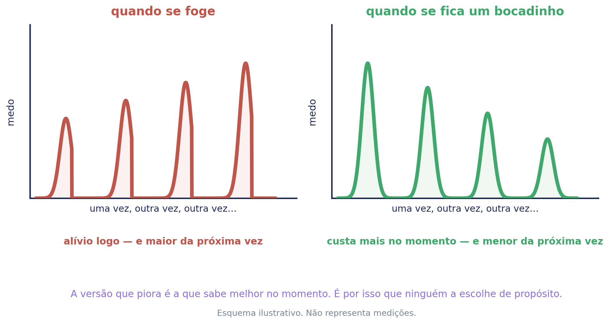

# Assustado — Caderno de aplicação

**ColorHugs · Ricardina Correia** · Material licenciado · Versão 0.1 (rascunho)

Acompanha o baralho *Como Me Sinto?*. Trata de uma família — o medo — e do que
se faz quando ele chega.

**Licença de saúde.** Este caderno destina-se a psicólogos e terapeutas. A
licença de educação dá acesso às sete famílias e às palavras derivadas, mas não
a este caderno: contém perguntas exploratórias e dinâmicas que abrem, e material
que abre precisa de quem o receba (D-154, D-163).

**Três camadas, um documento.** O caderno é de quem aplica. A secção de
orientação a pais também é — é o que dizer aos pais, não material para lhes
entregar. Só o anexo se entrega: folhas que se fecham sozinhas e que a família
leva.

---

## 1. Enquadramento

**Sem referências bibliográficas.** Esta secção é síntese, não revisão. As
afirmações estão escritas de forma a poderem ser verificadas uma a uma antes de
o material ser licenciado, e nenhuma referência é dada por verificada enquanto
o não estiver.

### O medo é preciso, e o problema nunca é ele

O medo é das emoções mais antigas e mais úteis que existem: sinaliza ameaça e
prepara o corpo para agir. Uma criança sem medo nenhum não é uma criança
saudável.

**Os medos da infância têm calendário.** Estranhos e separação primeiro, escuro
e monstros a seguir, animais e altura por volta da escola, e mais tarde o
julgamento dos outros e o que possa acontecer amanhã. Um medo na idade em que
costuma aparecer é desenvolvimento, e não sintoma.

**O objectivo do material não é reduzir o medo.** É que ele deixe de decidir por
ela.

### O medo não manda ficar parado

É a distinção que sustenta tudo o resto neste caderno, e é a única de todas as
famílias que assenta em terreno estabelecido.

Tem a mesma estrutura da distinção da zanga: **sentir não é fazer.** Ali, sentir
zanga não é bater. Aqui, sentir medo não é fugir. O medo aparece — o que se faz
a seguir escolhe-se.

**Foi recusada a distinção mais óbvia**, que seria *medo não é perigo*. É
verdade, e leva a material errado: se o eixo for *isto não é assim tão
perigoso*, todas as fichas acabam a pedir à criança que avalie a probabilidade
de uma ameaça — e isso é reavaliação cognitiva, que este material exclui por
estar desenvolvimentalmente fora do alcance de uma criança pequena. A distinção
mais evidente desta família aponta directamente para a única técnica que
prometemos não fazer.

### O que mantém o medo é a fuga

**É o achado mais sólido de todo este projecto.** Que a evitação alivia no
momento e agrava a prazo é das coisas mais bem estabelecidas da psicologia
infantil — mais do que qualquer coisa que sustente as seis opções da família da
tristeza ou as cinco da zanga.

E é também o que quase todas as famílias fazem ao contrário, sem má intenção
nenhuma: **a versão que piora é a que sabe melhor no momento.**

### O erro desta família chama-se acomodação

Responder por ela ao balcão. Dispensá-la da festa. Deixar de ir onde há cães.
Dormir no quarto dela mais uma noite. Cada uma destas coisas resolve a tarde e
agrava o mês, e cada uma delas é feita por alguém que gosta dela.

**Dizê-lo aos pais sem os culpar é metade da intervenção**, e é a razão pela qual
a acomodação tem secção própria na orientação a pais em vez de aparecer como
crítica de passagem.

### As quatro do ecrã, e a que não pode lá estar

Quatro das cinco estratégias da zanga atravessam intactas, porque o medo também
sobe e tem de descer: ir ter com alguém, contar devagar, respirar devagar, mexer
o corpo.

**A quinta está barrada, e é *sair dali*.** Na zanga, sair da situação é
modificação da situação e é boa estratégia. No medo, sair da situação **é a
evitação** — é exactamente o que este caderno diz aos pais para não fazerem.
Oferecê-la no ecrã seria o produto a propor à criança a coisa que agrava.

### Onde isto assenta

Psicologia do desenvolvimento, no que respeita ao calendário dos medos.
Aprendizagem e condicionamento, no que respeita ao papel da evitação. A tradição
comportamental, no que respeita à aproximação por passos. E princípios de
interacção pais-criança, no que respeita à acomodação familiar.

**Não é psicoterapia.** É material psicoeducativo, para ser usado por quem tem
formação para o enquadrar.

---

## 2. O que a criança encontra

Escolhe a carta do coração roxo. Ouve ou lê uma linha sobre o medo em geral.
Escolhe uma de quatro coisas para experimentar, se quiser. Fica com um desenho
para pintar, no ecrã ou impresso.

**A linha que ela lê:**

> O medo aparece para nos dizer para termos cuidado. Não quer dizer que a coisa
> seja perigosa, e não quer dizer que tenhas de ficar sem te mexer. O medo fica mais
> pequeno quando nos aproximamos devagar — não quando fugimos.

**É a primeira linha do produto que enuncia um mecanismo** em vez de descrever o
sentimento, e só pode fazê-lo porque a distinção desta família é estabelecida e
não razoável. Nas outras, uma frase destas seria promessa a mais.

**A escada não está no ecrã, e isso é uma decisão e não uma falta.** Ela abre:
pede que a criança ordene o que a assusta e que se aproxime de alguma coisa no
mundo real. Material que abre precisa de quem o receba, e uma criança sozinha ao
telemóvel não tem ninguém. A escada vive aqui, no caderno, onde está uma pessoa.

**O que o ecrã leva no lugar dela é uma página que se vê e não se faz** — a das
pedras. A criança olha, e não lhe é pedido nada. As pedras são de tamanhos
diferentes de propósito: cinco pedras iguais em fila são uma escala, e uma escala
é o que esta família tem de conseguir evitar (secção 4).

---

## 3. As quatro, e o que as sustenta

O material distingue três níveis de sustentação. A distinção é do material, não
da literatura, e existe para que quem o usa saiba o que pode afirmar.

**Nenhuma destas quatro é a peça principal desta família.** São formas de baixar
a activação, e a activação não é o problema — a fuga é. Servem para tornar
possível ficar, e é assim que devem ser apresentadas: **não para o medo passar,
mas para aguentar o bocadinho.**

### Ir ter com alguém e dizer

**Base estabelecida, aplicação razoável.** Que a criança pequena regula com um
adulto e não sozinha é das coisas mais consistentes da psicologia do
desenvolvimento.

**Com uma cautela própria desta família.** Ir ter com alguém pode ser
aproximação — pedir companhia para conseguir ficar — ou pode ser fuga com outro
nome, quando é a maneira de sair da situação. **A mesma acção, e as duas leituras
opostas.** É a pergunta que a orientação da ficha 4 obriga a fazer.

### Contar devagar, olhar para outra coisa

**Razoável.** Desvio da atenção, que é a família de regulação com melhor apoio
especificamente em crianças pequenas.

**Cautela:** desviar a atenção *para conseguir ficar* é aproximação; desviar a
atenção *para não ter de estar ali* é evitação por dentro. A diferença não está
na técnica, está no que acontece a seguir.

### Respirar devagar, a soltar o ar mais tempo do que a apanhá-lo

**Prática em crianças, razoável em adultos.** A lógica fisiológica é boa e os
estudos são sobretudo com adultos.

Nesta família tem uma vantagem que não tem nas outras: **é a única que a criança
pode fazer sem sair do sítio e sem ninguém reparar** — dentro da sala de aula,
à porta da festa, na cadeira do dentista.

### Mexer o corpo

**Prática.** Descarrega a activação que o medo prepara e que não foi usada.

**Cautela:** não deve tornar-se a maneira de não estar. Uma criança que corre
para longe está a fugir, e a mesma criança a saltar no sítio está a ficar.

### O que falta nesta lista, de propósito

A aproximação por passos, que é a única coisa aqui com base estabelecida. Não é
uma estratégia de ecrã: é trabalho de sessão, e está na ficha 8 e na secção 4.

---

## 4. O esquema do evitamento

**Não é a curva da activação nem os dois caminhos.** A figura da zanga mostra um
episódio; a da tristeza mostra um episódio carregado de duas maneiras. **O
problema do medo não está dentro de um episódio** — está no que acontece entre
eles, e nenhum desenho de uma vez só o mostra.

Por isso esta mostra **quatro encontros com a mesma coisa, duas vezes**. Fugir dá
alívio dentro de cada um e um pico maior no seguinte. Ficar — mesmo um
bocadinho, mesmo mal — dá um minuto pior e um pico menor da próxima vez.

**A linha que resume tudo está por baixo:** *a versão que piora é a que sabe
melhor no momento. É por isso que ninguém a escolhe de propósito.* É a frase que
retira a culpa da conversa com os pais sem retirar a informação.

Os eixos não têm números nem escala. **Nesta família isso importa mais do que nas
outras**, porque a aproximação por passos é a única coisa deste projecto que se
parece com uma escala, e a figura não pode dar-lhe cobertura.

Duas formas de o usar. Com a criança, tapar o painel da direita e perguntar o que
acha que acontece se ficar. Com os pais, mostrar os dois antes de qualquer
conversa sobre o que têm feito.

---

## 5. Perguntas exploratórias

Agrupadas pela figura que as puxa. **São para o clínico, não para o material da
criança** — na aplicação nada é perguntado além do que sente, porque uma pergunta
abre e uma criança sozinha não tem quem a receba. Aqui há.

### Depois de *ir ter com alguém*

- Quem é a pessoa a quem vais quando tens medo?
- Quando vais ter com ela, ficas onde estavas ou vais-te embora com ela?
- Já houve alguma vez em que conseguiste ficar por ela estar lá?

### Depois de *contar devagar*

- Enquanto contas, continuas no sítio ou sais?
- Isso ajuda a esperar, ou ajuda a não pensar?

### Depois de *respirar devagar*

- Já fizeste isso à frente de outras pessoas sem ninguém dar por nada?
- Onde é que te lembraste de o fazer?

### Depois de *mexer o corpo*

- Quando mexes o corpo, ficas perto ou vais para longe?
- O que é que o corpo faz primeiro quando o medo chega?

### Sobre cada uma das palavras finas

**Nervoso**

- É antes de uma coisa acontecer ou durante?
- Onde é que sentes isso no corpo?
- Há coisas que te deixam nervosa e de que gostas na mesma?

> ***Nervoso* é a única das três que também aparece antes de coisas boas** — o
> aniversário, a apresentação, o primeiro dia. Uma criança que só o associa a
> coisas más está a perder a metade da palavra que lhe seria útil.

**Preocupado**

- Preocupas-te com coisas que ainda não aconteceram?
- Há alguma que te apareça muitas vezes?
- Costumas contar a alguém, ou ficas com elas?

> **A preocupação é o medo com tempo futuro**, e é a que mais se parece com
> pensar. **Reparar se ela verifica** — se pergunta a mesma coisa muitas vezes, se
> confirma, se pede garantias. A garantia dada alivia e alimenta, exactamente
> como a fuga.

**Tímido**

- Custa-te mais falar com miúdos ou com adultos?
- Há sítios onde falas à vontade?
- Alguém já te disse que és tímida? O que achaste?

> ***Tímido* é a única das três que os outros usam para a descrever**, e muitas
> vezes à frente dela. **Distinguir timidez de medo social**: a primeira é
> temperamento e não pede intervenção nenhuma; o segundo evita, e evitar é o que
> se trabalha. **Uma criança tímida que tem amigos não tem problema nenhum.**

### Sobre o medo em geral

- O que é que fazes quando ele chega?
- Há coisas que já não fazes por causa dele?
- Alguém em tua casa tem medo de alguma coisa? Como é que se percebe?
- Há alguma coisa que já tenhas conseguido fazer com medo à mesma?

**O que não está aqui, e não deve estar:** perguntas sobre se aquilo é mesmo
perigoso. Discutir a probabilidade da ameaça com uma criança pequena é a
reavaliação que este material não faz — e na prática produz uma discussão que ela
perde e que não muda nada.

---

## 6. Dinâmicas

Prática clínica. Nada nesta secção tem estudo que a sustente neste uso concreto.

### Com a criança

**As quatro em cima da mesa.** Imprimir as quatro páginas e deixar pegar, sem
dizer nada.

**Fugir ou ficar.** Escrever seis situações e separá-las em duas pilhas: as que
ela faz e as que já não faz. A segunda pilha é o material da intervenção.

**Tapar o painel da direita.** Mostrar só o lado do evitamento e perguntar o que
acha que acontece do outro lado.

**A vez em que conseguiu.** Procurar uma coisa que já tenha feito com medo à
mesma. Costuma haver, costuma ter sido esquecida, e vale mais do que qualquer
explicação nossa.

**As três palavras em cima da mesa.** Nervoso, preocupado, tímido, e uma vez para
cada. A que falta diz alguma coisa.

### Com a família na sala

**O que deixámos de fazer.** Perguntar à família que coisas deixaram de fazer por
causa do medo dela. É a pergunta que mede a acomodação sem usar a palavra, e a
lista costuma surpreender quem a faz.

**Quem responde por ela.** Reparar, ali mesmo, se um adulto responde às perguntas
feitas à criança. Acontece à frente de quem aplica com uma frequência que vale a
pena notar.

**Mostrar os dois painéis aos pais.** Antes de qualquer conversa sobre o que têm
feito, e com a frase de baixo lida em voz alta.

**Combinar o que se deixa de fazer.** Escolher com eles **uma** acomodação para
retirar, e só uma. Retirar tudo de uma vez não se aguenta e ninguém volta.

### Entre sessões

**Um degrau, uma vez.** Não uma lista, não uma semana inteira: um degrau, uma
vez, e contar como correu.

**Levar a página escolhida impressa**, para pintar durante a semana.

**A mesma escada numa sessão posterior.** O que interessa é se algum degrau
mudou de sítio.

---

## 7. Ficha clínica

Para as notas de quem aplica. **Não é instrumento, não pontua, e não se preenche
com a criança à frente como se fosse um teste.** Não substitui o processo
clínico: é uma folha de trabalho por sessão, para não se perder o que se viu.

**Sem nome.** Identifique por código ou pelo seu próprio processo.

### Sessão

| Campo | Registo |
| --- | --- |
| Código / processo | |
| Data | |
| Sessão n.º | |
| Presentes | criança · adulto(s) · outro |

### O que foi usado

| Campo | Registo |
| --- | --- |
| Actividade digital | sim · não |
| Fichas aplicadas | |
| Páginas para colorir | |
| Carta entregue aos pais | sim · não |

### Observação

| Área | Registo |
| --- | --- |
| Estratégias que escolheu | |
| Serviram para ficar ou para sair | |
| Situações que já não faz | |
| Acomodações nomeadas pela família | |
| Degrau escolhido | |
| Palavras finas que reconheceu | |
| Palavra que evitou ou não conhecia | |
| Pede garantias — sim · não | |
| Zona do corpo assinalada | |
| Postura durante a tarefa | |

### Leitura

| Campo | Registo |
| --- | --- |
| Hipótese de trabalho | |
| O que confirma | |
| O que contraria | |
| A verificar na próxima | |

### Plano

| Campo | Registo |
| --- | --- |
| Degrau combinado | |
| Acomodação a retirar | |
| Combinado com os adultos | |
| Próxima sessão — foco | |

**Quatro blocos, e a ordem não é arbitrária:** o que se fez, o que se viu, o que
disso se lê, e o que fica combinado. A leitura fica separada da observação de
propósito.

**Duas linhas são próprias desta família e não existem nas outras:** *serviram
para ficar ou para sair* — porque a mesma estratégia é aproximação ou fuga
conforme o que aconteceu a seguir — e *pede garantias*, porque a garantia dada
alivia e alimenta.

---

## 8. As palavras derivadas

Dentro da família do medo, o vocabulário fino em português europeu é **nervoso ·
preocupado · tímido**.

Na aplicação, esta camada é opcional e só aparece depois de a actividade já ter
fechado. No material profissional está incluída por inteiro.

**O que cada uma carrega:**

*Nervoso* é medo antes de alguma coisa acontecer, e é a única das três que também
serve para coisas boas — o aniversário, a apresentação, o primeiro dia. É a mais
próxima do corpo: uma criança que não sabe dizer *nervoso* costuma dizer a
barriga.

*Preocupado* é medo com tempo futuro, e é o que mais se parece com pensar. É
também o que traz consigo a procura de garantias, que é a forma de evitação mais
difícil de ver porque parece conversa.

*Tímido* é a única das três **que os outros usam para a descrever**, muitas vezes
à frente dela, e a única que descreve uma pessoa em vez de um momento. Cuidado
com isso: uma criança a quem chamam tímida à frente dos outros recebe uma
identidade, não uma palavra.

**Uma tensão diferente das outras famílias.** Aqui a diferença entre as três não é
de tamanho nem de causa — é de **tempo**. *Nervoso* é antes e perto; *preocupado*
é antes e longe; *tímido* é permanente e sobre quem se é. Ordená-las por
intensidade não faria sentido nenhum, o que torna esta a família em que a recusa
de escalas custa menos.

**Falta uma palavra**, e é a mesma falta que a zanga tem noutro sítio: **não há
uma palavra de criança para o medo social**. *Tímido* descreve o temperamento,
não a evitação, e uma criança de sete anos não diz *envergonhado de falar*. Fica
sem nome exactamente a coisa que mais se trabalha nesta idade.

---

## 9. Fichas — orientação de aplicação

Uma página por ficha. **As fichas em si não estão aqui**: vivem no caderno de
exploração da criança, e uma licença dá acesso aos dois ficheiros — imprimi-las
duas vezes só produz duas cópias que podem ficar desencontradas.

Cada página diz para que serve a ficha, como se aplica, o que perguntar, o que
notar e o que evitar, e tem espaço para o registo da sessão em que foi usada.
**Por código, nunca por nome.**

### Ficha 1 — O Medo

| Orientação | |
| --- | --- |
| **Idade** | 6 aos 9 anos |
| **Base** | Psicoeducação. Sem nível próprio: reformula em linguagem infantil o que a secção 1 sustenta. |
| **Objectivo** | Dar-lhe o enquadramento antes de lhe pedir seja o que for, e mostrar-lhe o esquema dos dois painéis. Nada para preencher. |
| **Como aplicar** | Ler com ela em voz alta. Tapar o painel da direita e perguntar o que acha que acontece se ficar — é a única pergunta desta página, e é para adivinhar, não para responder certo. |
| **A notar** | **O Medo diz cuidado — não diz não vás** costuma ser a que provoca reacção. Em crianças que já ouviram muitas vezes *não tenhas medo*, a que alivia é a segunda: toda a gente tem. |
| **Cuidados** | Não acrescentar *e não há nada a temer*. Discutir se aquilo é mesmo perigoso é a reavaliação que este material não faz. |

**Questões de exploração**

- Achas que as pessoas mais corajosas também têm medo?
- O que achas que acontece se ficarmos um bocadinho?

**Dinâmicas a partir desta ficha**

| | |
| --- | --- |
| 4–6 | **A carta e o espelho.** Pôr a carta do assustado ao lado do espelho da primeira página e perguntar se são parecidos. |
| 6–8 | **Tapar o painel da direita.** Mostrar só o lado do evitamento e pedir que adivinhe o outro. Descobre-o em vez de o ler. |
| 8–9 | **Quem é que também tem.** Pedir que nomeie três pessoas corajosas e adivinhe o medo de cada uma. Costuma desarmar a ideia de que ter medo é falha. |
| qualquer | **Guardar para o fim.** Reler esta página na última sessão e perguntar se mudou alguma coisa. |

| Aplicação | |
| --- | --- |
| Código / processo | |
| Idade | |
| Data | |

| Registo da sessão |
| --- |
| |
| |
| |

### Ficha 2 — O Medo vem visitar

| Orientação | |
| --- | --- |
| **Idade** | 4 aos 7 anos |
| **Base** | Externalização, terapia narrativa. **Prática**, com pouca investigação controlada. |
| **Objectivo** | Pôr o Medo fora dela, como personagem, para que se possa falar dele sem falar dela. |
| **Como aplicar** | Desenho primeiro, perguntas depois. A última pergunta — *o que faz ele quando tu ficas na mesma* — é a que liga ao esquema, e vale a pena guardá-la para o fim. |
| **A notar** | O tamanho que ela lhe dá, e se ele muda de tamanho conforme a situação. **E se ele tem voz**: crianças que lhe dão frases costumam repetir frases ouvidas em casa. |
| **Cuidados** | Externalizar não é entregar-lhe a responsabilidade. Se ela disser *o Medo não me deixou ir*, a resposta é que **o Medo apareceu e os pés eram dela** — as duas coisas ao mesmo tempo, sem escolher. |

**Questões de exploração**

- Como é que sabes que ele está a chegar?
- O que é que ele te diz ao ouvido?
- E o que é que ele faz quando tu ficas na mesma?

**Dinâmicas a partir desta ficha**

| | |
| --- | --- |
| 4–6 | **Dar-lhe voz.** Perguntar o que o Medo diria se pudesse falar, e escrever isso ao lado do desenho. |
| 4–7 | **Onde é que ele mora.** Pedir que desenhe onde o Medo fica quando não está com ela. |
| 6–8 | **O Medo de outra pessoa.** Pedir que desenhe o Medo de um adulto da casa. Costuma dizer mais do que o dela. |
| 7–9 | **O que ele quer.** Perguntar o que o Medo está a tentar conseguir. Aproxima da função sem usar a palavra. |

| Aplicação | |
| --- | --- |
| Código / processo | |
| Idade | |
| Data | |

| Registo da sessão |
| --- |
| |
| |
| |

### Ficha 3 — O que o meu corpo faz

| Orientação | |
| --- | --- |
| **Idade** | 5 aos 8 anos |
| **Base** | Consciência interoceptiva. **Razoável** quanto à ligação entre reconhecer sinais e regular; a aplicação nesta forma é prática. |
| **Objectivo** | Reconhecer o aviso do corpo, que no medo é o mais claro de todas as famílias — e descobrir que ele desce sozinho. |
| **Como aplicar** | Com o mapa corporal ao lado, se estiver a usá-lo. A segunda pergunta é a importante: **se ficares, o corpo continua igual?** |
| **A notar** | Se ela consegue nomear alguma coisa. Uma criança que não sente nada no corpo ou não está a olhar, ou está a evitar olhar — e são coisas diferentes. |
| **Cuidados** | Não transformar isto em vigilância dos sintomas. Uma criança que passa a monitorizar o corpo encontra sempre alguma coisa, e isso alimenta em vez de aliviar. |

**Questões de exploração**

- O que é que o corpo faz primeiro?
- Se ficares ali um bocadinho, continua igual?
- Já houve uma vez em que o corpo se assustou e afinal não era nada?

**Dinâmicas a partir desta ficha**

| | |
| --- | --- |
| 5–7 | **O mapa do corpo.** Marcar no mapa corporal onde é o aviso, e comparar com o da zanga se já o tiver feito. Não costumam ser o mesmo sítio. |
| 5–8 | **Contar o que desce.** Ficar ali um minuto de relógio e ver o que o corpo faz. **Sem pedir nota nenhuma** — só o que mudou. |
| 8–9 | **O falso alarme.** Procurar duas vezes em que o corpo avisou e não era nada. Serve o mecanismo sem discutir probabilidades. |
| com a família | **O aviso dos adultos.** Perguntar-lhes o que os corpos deles fazem. As crianças costumam supor que os adultos não sentem. |

| Aplicação | |
| --- | --- |
| Código / processo | |
| Idade | |
| Data | |

| Registo da sessão |
| --- |
| |
| |
| |

### Ficha 4 — O que eu faço quando ele chega

| Orientação | |
| --- | --- |
| **Idade** | 6 aos 9 anos |
| **Base** | Comportamental — análise da resposta. **Estabelecido** quanto ao papel da evitação; esta aplicação é razoável. |
| **Objectivo** | Ver o que ela faz, e sobretudo se o que faz a deixa ficar ou a leva embora. **É a distinção transformada em coluna.** |
| **Como aplicar** | Sem julgar nenhuma linha. A terceira coluna — *fico ou saio* — é para ela assinalar, não para nós decidirmos. |
| **A notar** | **A mesma acção pode ser as duas coisas.** Ir ter com alguém para conseguir ficar é aproximação; ir ter com alguém para sair dali é fuga. A diferença nunca está na técnica, está no que aconteceu a seguir. |
| **Cuidados** | A última pergunta — o que já não faz — costuma trazer mais do que a tabela toda, e é onde a acomodação da família aparece sem ninguém a nomear. |

**Questões de exploração**

- Isso que fazes deixa-te ficar ou leva-te embora?
- Há alguma coisa que já não fazes por causa do medo?
- Quem decide, quando isso acontece — tu ou o medo?

**Dinâmicas a partir desta ficha**

| | |
| --- | --- |
| 6–8 | **Duas pilhas.** Escrever seis situações e separá-las: as que ela faz e as que já não faz. A segunda pilha é a intervenção. |
| 6–9 | **A mesma acção, duas leituras.** Pegar numa linha da tabela e perguntar o que aconteceu logo a seguir. É como se distingue aproximação de fuga. |
| 8–9 | **Quem decidiu.** Percorrer as linhas e perguntar, em cada uma, se quem decidiu foi ela ou o medo. |
| com a família | **O que deixámos de fazer.** Perguntar à família que coisas deixaram de fazer por causa disto. Mede a acomodação sem usar a palavra, e a lista surpreende quem a faz. |

| Aplicação | |
| --- | --- |
| Código / processo | |
| Idade | |
| Data | |

| Registo da sessão |
| --- |
| |
| |
| |

### Ficha 5 — As palavras finas

| Orientação | |
| --- | --- |
| **Idade** | 7 aos 9 anos |
| **Base** | Vocabulário emocional. **Razoável** quanto a diferenciação emocional; o conjunto é do ColorHugs. |
| **Objectivo** | Mostrar que as três se distinguem **por tempo** e não por tamanho: nervoso é antes e perto, preocupado é antes e longe, tímido é sobre quem se é. |
| **Como aplicar** | Uma caixa por palavra, sem ordem. Se uma ficar vazia, deixá-la vazia. |
| **A notar** | Se usa *nervoso* só para coisas más. Metade da utilidade da palavra está em ela também aparecer antes das boas. |
| **Cuidados** | **Não ordenar por tamanho**, nem sugeri-lo. Aqui a ordenação por intensidade não faz sentido nenhum, e propô-la ensinaria uma coisa falsa sobre as palavras. |

**Questões de exploração**

- Qual destas dizes mais vezes?
- Qual delas é antes de acontecer, e qual é durante?
- Alguma delas é uma palavra que os outros usam sobre ti?

**Dinâmicas a partir desta ficha**

| | |
| --- | --- |
| 7–9 | **Antes, durante, sempre.** Distribuir as três cartas por estes três tempos. É a estrutura desta família em vez de uma ordenação por tamanho. |
| 7–9 | **A que os outros usam.** Perguntar qual das três já ouviu alguém dizer sobre ela. |
| 8–9 | **O nervoso bom.** Procurar três coisas boas que dão nervoso. Se não encontrar nenhuma, ficou material para a ficha 6. |
| com a família | **Cada um escolhe a sua.** Os adultos escolhem também, e contam uma vez em que a sentiram. |

| Aplicação | |
| --- | --- |
| Código / processo | |
| Idade | |
| Data | |

| Registo da sessão |
| --- |
| |
| |
| |

### Ficha 6 — Nervoso

| Orientação | |
| --- | --- |
| **Idade** | 6 aos 9 anos |
| **Base** | Vocabulário e antecipação. **Prática** nesta forma. |
| **Objectivo** | Recuperar a metade boa da palavra: nervoso aparece antes do aniversário e antes da apresentação, e não só antes do que corre mal. |
| **Como aplicar** | As duas caixas juntas, e por esta ordem — a de que não gosta primeiro, porque é a que lhe vem à cabeça. |
| **A notar** | Se consegue preencher a segunda. **Uma criança que não encontra nenhuma coisa boa que a deixe nervosa está a evitar mais do que parece** — as coisas boas com nervoso dentro são as primeiras a desaparecer. |
| **Cuidados** | Não tratar o nervoso como coisa a eliminar antes de uma apresentação ou de um teste. Serve para preparar. |

**Questões de exploração**

- Uma coisa que te deixa nervosa e de que gostas na mesma?
- Onde é que sentes o nervoso no corpo?
- Ele vai-se embora quando a coisa começa?

**Dinâmicas a partir desta ficha**

| | |
| --- | --- |
| 6–8 | **Antes e depois.** Desenhar como estava antes de uma coisa começar e como estava a meio. O nervoso quase sempre desce quando a coisa começa. |
| 6–9 | **A lista das coisas boas.** Cinco coisas de que gosta e ver em quantas há nervoso à mistura. |
| 8–9 | **O nervoso dos outros.** Perguntar como é que se percebe que outra pessoa está nervosa. Treina o reconhecimento fora de si própria. |
| com a família | **A véspera.** Combinar com os adultos o que se diz na véspera de uma coisa grande. *Vai correr tudo bem* costuma ser o que menos ajuda. |

| Aplicação | |
| --- | --- |
| Código / processo | |
| Idade | |
| Data | |

| Registo da sessão |
| --- |
| |
| |
| |

### Ficha 7 — Preocupado

| Orientação | |
| --- | --- |
| **Idade** | 7 aos 9 anos |
| **Base** | Antecipação e procura de garantias. **Razoável** quanto ao papel da procura de garantias na manutenção; a ficha é prática. |
| **Objectivo** | Ver a preocupação como medo com tempo futuro — e **descobrir, por ela própria, que a garantia dura pouco.** |
| **Como aplicar** | A terceira pergunta é a ficha toda: *quanto tempo é que a preocupação fica quieta?* Deixá-la responder sem sugerir. Quase todas dizem *pouco*. |
| **A notar** | A quem pede garantias e com que frequência. **Se um adulto responde a isto por ela na sessão, acabou de mostrar o padrão.** |
| **Cuidados** | Não retirar as garantias de repente e sem combinar. O que se combina é responder uma vez e depois responder à pergunta e não à ansiedade — e isso combina-se com os adultos, não com ela. |

**Questões de exploração**

- Costumas perguntar a alguém se vai correr bem?
- Quanto tempo é que a preocupação fica quieta depois?
- Há alguma preocupação que já não te aparece?

**Dinâmicas a partir desta ficha**

| | |
| --- | --- |
| 7–9 | **Quanto tempo dura.** Cronometrar, a brincar, quanto tempo a preocupação fica quieta depois de alguém garantir. É a demonstração inteira. |
| 7–9 | **A preocupação que já se foi.** Procurar uma que a preocupava o ano passado e já não. Mostra que passam, sem lho dizermos. |
| 8–9 | **Adiar.** Combinar guardar as preocupações para um bocadinho do dia, em vez de as perseguir quando chegam. Simples de explicar e difícil de fazer. |
| com a família | **Responder uma vez.** Combinar com os adultos como respondem à segunda e à terceira vez. **Isto combina-se com eles, não com ela.** |

| Aplicação | |
| --- | --- |
| Código / processo | |
| Idade | |
| Data | |

| Registo da sessão |
| --- |
| |
| |
| |

### Ficha 8 — Tímido

| Orientação | |
| --- | --- |
| **Idade** | 6 aos 9 anos |
| **Base** | Temperamento e evitação social. **Estabelecido** quanto à distinção entre os dois; a ficha é prática. |
| **Objectivo** | Separar ser tímida — que não é problema nenhum — de deixar de fazer coisas por causa disso, que é o que se trabalha. |
| **Como aplicar** | Começar pelos sítios onde fala à vontade, e não pelos outros. A ficha abre a dizer que ser tímida não é um problema, e essa frase é para ser lida em voz alta. |
| **A notar** | A terceira pergunta. **Uma criança a quem chamam tímida à frente dos outros recebe uma identidade e não uma palavra**, e o que ela diz sobre isso costuma ser a coisa mais útil da página. |
| **Cuidados** | **Uma criança tímida com amigos não tem problema nenhum**, e esta ficha não deve ser aplicada como se tivesse. Se houver ausência de fala em contextos específicos, isso é sinal para avaliar e não para aplicar mais fichas. |

**Questões de exploração**

- Onde é que falas à vontade sem pensar nisso?
- Há alguma coisa que gostavas de fazer e não fazes por vergonha?
- Alguém já te chamou tímida à frente dos outros?

**Dinâmicas a partir desta ficha**

| | |
| --- | --- |
| 6–8 | **Os sítios onde falo.** Desenhar ou nomear os sítios onde fala à vontade, antes de tocar nos outros. |
| 6–9 | **Uma coisa pequena com gente.** Escolher uma coisa social do tamanho de um degrau — pedir uma coisa ao balcão, dizer bom dia. Liga esta ficha à nona. |
| 8–9 | **A palavra dos outros.** Perguntar o que sente quando lhe chamam tímida, e o que preferia que dissessem. |
| com a família | **Não a apresentar como tímida.** Pedir aos adultos que deixem de o dizer à frente dela e de responder por ela. É a acomodação desta ficha. |

| Aplicação | |
| --- | --- |
| Código / processo | |
| Idade | |
| Data | |

| Registo da sessão |
| --- |
| |
| |
| |

### Ficha 9 — Chegar devagar

| Orientação | |
| --- | --- |
| **Idade** | 6 aos 9 anos |
| **Base** | Aproximação gradual. **Estabelecido** — o achado mais sólido de todo este material. **Não é um protocolo de exposição.** |
| **Objectivo** | Transformar uma coisa evitada numa série de bocadinhos, escolhidos por ela, com companhia combinada e com a falha prevista. |
| **Como aplicar** | **O primeiro degrau tem de dar para fazer hoje.** É o que mais corre mal: um degrau ambicioso não se dá, e ninguém volta a tentar. Se ela propuser um grande, aceitar e pôr um menor antes. |
| **A notar** | Se a ordem é dela e não a nossa ideia do que é mais difícil. **E se preenche a caixa da falha**: quem não consegue imaginar não conseguir é quem mais precisa de a ter escrita. |
| **Cuidados** | **Nunca perguntar quanto medo tem em cada degrau.** A ficha ordena situações, não níveis. E sem prémio nem castigo: aproximação com castigo em cima deixa de o ser. |

**Questões de exploração**

- Qual seria o bocadinho mais pequeno de todos?
- Quem vai contigo nesse?
- E se tentares e não conseguires, o que fazemos?

**Dinâmicas a partir desta ficha**

| | |
| --- | --- |
| 6–8 | **O degrau de hoje.** Fazer o primeiro degrau ali mesmo, na sessão, se for possível. Um degrau dado vale mais do que quatro escritos. |
| 6–9 | **Cortar ao meio.** Pegar no primeiro degrau que ela propôs e fazer um mais pequeno antes. Quase sempre é preciso, e é melhor fazê-lo agora. |
| 8–9 | **Onde é que dá.** Verificar onde e quando o degrau é possível — na escola, no recreio, ao fim do dia. Muitos não são. |
| com a família | **Quem acompanha e o que faz.** A pessoa escolhida tem de saber que foi escolhida, e tem de saber que **não retira a coisa se ela ficar aflita**. |

| Aplicação | |
| --- | --- |
| Código / processo | |
| Idade | |
| Data | |

| Registo da sessão |
| --- |
| |
| |
| |

---

## 10. Limites

**A distinção é estabelecida; as quatro estratégias do ecrã não são.** É a
primeira vez neste projecto que o enquadramento assenta melhor do que o que se
oferece, e vale a pena dizê-lo assim: **a coisa que funciona é a aproximação por
passos, e essa não está na aplicação.**

**Aproximação por passos não é exposição.** A ficha 8 é psicoeducação e
planeamento, feita numa sessão com quem tem formação. Não é um protocolo, não
tem dose, não tem duração e não substitui um. Material vendido em linha não pode
implicar que traz um tratamento dentro.

**Este material não distingue medo comum de perturbação de ansiedade e não faz
rastreio.** Não tem escalas, não conta episódios e não produz nada comparável ao
longo do tempo. Um medo que impede a escola, que impede dormir, que ocupa a maior
parte dos dias, ou que faz a criança deixar de fazer coisas que fazia, é matéria
de avaliação clínica e não deste caderno.

**Mutismo selectivo, fobia específica incapacitante e ansiedade de separação
grave não estão aqui.** A ficha do *tímido* pode aproximar-se do primeiro; é sinal
para avaliar, não para aplicar mais fichas.

**Medo que tem uma causa real não se trabalha assim.** Uma criança com medo de
alguém em casa não tem um problema de evitação — tem uma razão. **É a única
família deste conjunto em que a coisa que a criança evita pode ser a coisa de que
devia afastar-se**, e nenhuma ficha deve ser aplicada antes de isso estar
excluído.

> **Antes de licenciar:** as referências que sustentam os níveis *estabelecido* e
> *razoável* devem ser verificadas e citadas nominalmente. Este rascunho descreve
> o estado da evidência sem as listar.

---

## 11. O que este material não faz

Não avalia, não classifica, não pontua e não guarda nada. Não há resposta certa e
não há escala de intensidade — e nesta família em particular **não há graus de
medo em lado nenhum**, nem no ecrã, nem nas fichas, nem na escada.

Não discute com a criança se aquilo que a assusta é mesmo perigoso.

Não é um protocolo de exposição e não substitui um.

Nada do que a criança faz é visível aos pais e nada fica registado. O que pinta
no ecrã perde-se quando sai; o PDF descarrega-se em branco, para ser pintado à
mão.

Não serve para rastreio, triagem, classificação diagnóstica ou monitorização de
sintomas.

---

## Anexo — o baralho

Trinta e uma cartas para imprimir, cortar e manusear: as sete famílias e as vinte
e quatro palavras finas. `docs/materials/baralho/baralho-pt-PT.pdf`.

**90 × 120 mm**, maiores do que uma carta de jogar, porque quem as segura são
mãos pequenas. **O verso é igual em todas** — se variasse por família, uma criança
distinguia uma carta virada para baixo.

**Sobre ordenar por intensidade**, ver a secção 8: as três palavras desta família
distinguem-se por tempo e não por tamanho. Ordenações que este caderno propõe:

- **Por quando.** Antes, durante, ou sempre.
- **Por quem lá está.** Quais acontecem com gente à volta, quais sozinha.
- **Por facilidade de dizer.** Qual custa mais admitir em voz alta.
- **Por reconhecimento.** Quais reconhece no corpo, quais só de nome.

## Anexo — as cinco páginas para colorir

Para imprimir de uma vez: no banco · a minha mão · pena · aos saltos · as pedras.
**As fichas da criança não estão em anexo** — estão no caderno de exploração, que
acompanha este.

Quatro delas são partilhadas com a família da zanga. **A das almofadas não
pertence a esta família**, e a razão está na secção 1.

---

*Criado e revisto clinicamente por Ricardina Correia. Ferramenta psicoeducativa:
não diagnostica, não avalia e não substitui acompanhamento psicológico.*
