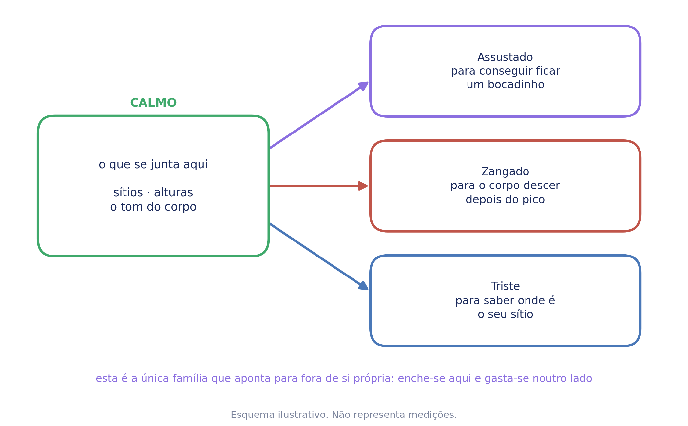

# Calmo — Caderno de aplicação

**ColorHugs · Ricardina Correia** · Material licenciado · Versão 0.1 (rascunho)

Acompanha o baralho *Como Me Sinto?*. Trata de uma família que não é um problema
— e que existe para as outras.

**Licença de saúde.** Este caderno destina-se a psicólogos e terapeutas.

> **Este é o caderno que se aplica primeiro.** Não é o mais fácil nem o mais
> leve: é o que constrói o depósito de que as outras famílias vão precisar. Se
> for aplicado no fim, chega tarde.

---

## 1. Enquadramento

**Sem referências bibliográficas.** Esta secção é síntese, não revisão.

### Uma família que não é um problema

O calmo e o feliz são diferentes das outras cinco em tudo o que interessa à
estrutura de um caderno.

**Não têm um erro da família a nomear** — ninguém traz uma criança ao consultório
porque está calma. **Não têm um mecanismo que as mantenha** — a fuga mantém o
medo, o esconder mantém a vergonha, e aqui não há nada a corrigir. **E não têm
opções a oferecer**, porque não há o que dar a quem está bem.

**O que estas duas famílias têm é outra coisa: não se trabalham quando aparecem,
trabalham-se para poderem aparecer.**

### As três camadas, e a ordem é o argumento

1. **Reconhecimento** — onde, com quem, e o que o corpo faz. Uma criança com
   palavras só para o que corre mal tem metade do vocabulário.
2. **Saboreio** — demorar-se no bom em vez de passar por ele. **É a única das três
   com base identificável**, e é razoável e não estabelecida.
3. **Recurso** — o que se junta nos dias bons é o que os dias maus vão buscar.

**O reconhecimento é o que se recolhe, o saboreio é como, e o recurso é para
quê.**

### A calma não faz barulho

É a frase que governa esta família, e não tem a forma das outras porque não há
erro nenhum a separar.

**As outras seis famílias anunciam-se.** O corpo acelera, aperta, pesa,
esconde-se. **A calma é a ausência de anúncio, e uma ausência não se nota.** Uma
criança que não se lembra de nenhuma vez em que esteve calma não tem má memória —
não houve nada para memorizar.

**Foi recusada uma formulação que parecia melhor**, e a razão vale para todo o
material: *já estiveste calma antes — e isso serve* pressupõe a resposta. **A
criança que não consegue confirmar é precisamente a criança de que esta família
trata**, e a frase deixá-la-ia a começar por uma afirmação sobre si própria que
não reconhece.

**A versão da criança:** *a calma não faz barulho — por isso às vezes ela está lá
e a gente nem dá por ela.*

**A consequência prática é a ordem do trabalho.** A primeira ficha não pergunta
por memórias: pergunta pelo corpo **agora**, na sala, com quem aplica ali. Só
depois disso faz sentido perguntar por sítios e por outras alturas — porque só
então ela sabe o que anda a procurar.

### A calma não tem sítio no corpo

**É desactivação geral.** Nas outras seis famílias o corpo avisa num ponto — o
peito, a barriga, a garganta, as pernas. Aqui o que muda é o **tom do corpo
inteiro**: mais mole, mais quieto, mais devagar, mais solto.

É a razão de fundo por que a calma não faz barulho. Não é só que seja discreta —
**é que não tem onde ser apontada.**

Por isso a pergunta desta família é sobre o estado e não sobre a zona, e as
palavras que se procuram são de tom: *mole, pesado, quieto, solto, devagar*.

**Mas o mapa corporal continua a aparecer no ecrã**, como em todas as sete. Nunca
obrigou ninguém a apontar, e tem sempre saída ao lado. **Uma criança que localiza
a calma não está enganada — está a dizer alguma coisa sobre ela própria**, e um
material que lhe tivesse tirado o mapa nunca teria ficado a saber. A ausência de
localização é o esperado; a presença é o achado.

### Nada de respiração nesta família

A respiração já vive no zangado e no assustado, onde é modulação da resposta e
existe para **descer** uma activação. **Aqui não há nada a descer.**

Se entrasse, este caderno passava a ser um manual de relaxamento — e a coisa que
o distingue, que é recolher em vez de treinar, perdia-se na primeira página.

### O que a separa do feliz

As duas são positivas e distinguem-se pela **activação**.

| | Corpo | Depósito que constrói |
| --- | --- | --- |
| **Feliz** | activado — quer partilhar, mexer, contar | memórias e pessoas |
| **Calmo** | desactivado — quer ficar, que nada mude | sítios e o tom do corpo |

**E não são intermutáveis clinicamente**, que é a razão de haver dois cadernos e
não um: **uma criança ansiosa precisa do calmo; uma criança em baixo precisa do
feliz.**

### Onde isto assenta

Psicologia do desenvolvimento e da emoção, no que respeita à distinção entre
afecto positivo activado e desactivado. A investigação sobre saboreio, no que respeita a demorar-se. Nos restantes
pontos, a fundamentação é de prática clínica.

**Não é psicoterapia.**

---

## 2. O que a criança encontra

Escolhe a carta do coração verde. Ouve ou lê uma linha sobre a calma. Escolhe
figuras onde reconhece o seu corpo assim, se quiser.

**A pergunta do ecrã é a mais longa das sete**, e nesta família justifica-se:

> **O teu corpo fica assim em que sítios, ou em que alturas?**

**Duas portas de entrada em vez de uma.** *Quando* pede um momento, e um momento
pede memória — que é exactamente o que esta família não pode pressupor. *Onde* é
mais fácil, porque o sítio existe hoje e ela pode lá ir. Mas uma criança cuja
resposta é *ao colo da minha mãe* ou *quando alguém me lê uma história* não pode
ficar a achar que respondeu ao lado. A pergunta dá as duas e ela usa a que tiver.

**As figuras servem as duas leituras** — cada uma é um sítio e uma altura ao mesmo
tempo, e não há razão para separar nas palavras o que a imagem não separa.

---

## 3. O que se recolhe

**Os três níveis de sustentação usados neste caderno.** A graduação é do
material e não da literatura, e existe para que quem o usa saiba o que pode
afirmar e o que não pode.

| | O que significa |
| --- | --- |
| **Estabelecido** | O mecanismo está descrito por investigação replicada e há consenso sobre a sua direcção. Pode ser afirmado a pais e a professores como facto. |
| **Razoável** | O mecanismo geral tem sustentação; **a aplicação concreta deste material não foi testada**. Apresenta-se como fundamentado, nunca como demonstrado. |
| **Prática** | Não há investigação directa nesta aplicação. Está no material por experiência clínica e por coerência com o que os outros níveis sustentam. **Não se afirma eficácia.** |

**Um nível diz respeito à afirmação, e não à utilidade.** Uma opção graduada como
prática pode ser a mais útil numa sessão concreta; o que a graduação limita é o
que se diz sobre ela.

**Não há estratégias nesta família e não há evidência a graduar por opção**, o que
a torna a mais curta das secções 3 de todo o material.

O que se recolhe são três coisas, e são as mesmas em todas as fichas:

- **Onde.** Sítios concretos, e de preferência sítios a que ela tem acesso.
- **Com quem.** Incluindo sozinha, que é uma resposta e não uma falta.
- **O que o corpo faz.** Palavras de tom, nunca de zona.

**O que interessa clinicamente:**

- **Se ela consegue nomear alguma coisa.** A criança que não consegue nomear
  nenhum sítio calmo está a dizer o mais importante que esta actividade pode
  ouvir, e é a que mais precisa de a repetir noutra sessão.
- **Se todos os sítios dependem de outra pessoa** — ou se nenhum depende.
- **Se algum é acessível hoje.** Um depósito feito de sítios de férias não serve
  na terça-feira.
- **Se localiza a calma no corpo.** É o achado desta família, e é o oposto do que
  se procura em todas as outras.

---

## 4. O esquema do depósito

**É o único esquema deste material que não é sobre uma família.** Os outros cinco
explicam um mecanismo — a curva, os dois caminhos, o evitamento, o círculo, a
tira do tempo. **A calma não tem mecanismo para explicar.**

O que tem é o que nenhuma outra tem: **aponta para fora de si própria.** Enche-se
aqui e gasta-se noutro lado. Por isso a figura mostra o depósito ao centro e as
setas a sair — para o assustado, que precisa do corpo calmo para conseguir ficar;
para o zangado, que precisa dele para descer depois do pico; para o triste, que
precisa de saber onde é o seu sítio.

**É o único sítio de todo o material onde se vê que isto é um sistema** e não sete
coisas separadas.

**Um mapa corporal foi considerado e recusado** para esta figura: a calma não tem
localização, e desenhar um corpo pedia à criança que apontasse uma coisa que não
tem sítio.

**As duas versões estão mais afastadas do que nas outras famílias**, e é
deliberado: um mapa é abstracto, e a versão da criança leva menos palavras e
nenhuma explicação. Com ela, seguir uma seta de cada vez, e só as que fizerem
sentido para o que ela já viveu.

---

## 5. Perguntas exploratórias

**São para o clínico, não para o material da criança.**

### Sobre o corpo, agora

- Neste momento, o teu corpo está a fazer o quê?
- Está mais mole ou mais duro do que há bocado?
- Se tivesses de escolher uma palavra para como ele está, qual era?

> **Estas fazem-se na sala e no momento, antes de qualquer pergunta sobre outras
> vezes.** É a única família em que o trabalho começa no presente, e é por isso
> que começa: ela precisa de saber o que anda a procurar antes de o procurar.

### Sobre os sítios

- Há algum sítio onde o teu corpo fica sempre assim?
- Consegues lá ir esta semana?
- Há algum sítio em tua casa que seja mesmo teu?

### Sobre quem lá está

- Com quem é que costuma acontecer?
- E acontece quando estás sozinha?
- Há alguém ao pé de quem nunca acontece?

### Sobre cada uma das palavras finas

**Tranquilo**

- Tranquilo é o mesmo que calmo, ou é diferente?
- Quando dizes tranquilo, o que é que já passou?

> **É a palavra mais frágil de todo o baralho, e o caderno assume-o.** *Tranquilo*
> é praticamente a família outra vez com outro nome, e não uma palavra mais fina
> dentro dela. **A arte resolveu-a e o vocabulário não:** é a única carta do
> conjunto do calmo que está acordada e a olhar para fora. Fica registada como
> por resolver (D-161), e *satisfeito* está proposto como substituta. Até lá,
> usá-la como a calma **depois** de alguma coisa — que é o que a distingue na
> prática.

**Descansado**

- Descansado do quê?
- É preciso ter feito alguma coisa para se ficar descansado?

> **Descansado tem um antes.** É a única das três que aponta para um esforço
> anterior, e por isso a mais fácil de reconhecer: **uma criança sabe quando
> descansou, mesmo que não saiba quando esteve calma.** É muitas vezes a melhor
> porta de entrada nesta família.

**Seguro**

- Onde é que te sentes segura?
- E há sítios onde não te sentes?
- É por causa do sítio ou de quem lá está?

> ***Seguro* é a mais importante das três e a que menos parece.** É o oposto exacto
> do assustado, e a resposta a *onde é que não te sentes segura* pertence a esta
> família tanto como à outra. **Se aparecer um sítio ou uma pessoa concreta,
> isso deixa de ser vocabulário e passa a ser matéria de avaliação** — ver a
> secção 10.

### Em geral

- O que é que faz o teu corpo ficar assim?
- Alguém em tua casa fica assim? Como é que se percebe?
- Há alguma coisa que costumava deixar-te assim e já não deixa?

---

## 6. Dinâmicas

Prática clínica.

### Com a criança

**Um minuto de nada, na sala.** Sem instrução, sem respiração, sem contar. Só
estar, e depois perguntar o que o corpo fez. É a dinâmica de abertura desta
família.

**O mapa dos sítios.** Desenhar uma planta grosseira da casa e marcar onde o
corpo fica assim. Costuma haver um, e costuma não ser o quarto.

**Duas palavras para o corpo.** Pedir duas palavras para como está agora, e duas
para como estava quando chegou.

**Demorar-se.** Escolher uma coisa boa recente e ficar nela dois minutos —
contá-la devagar, com pormenores. É o saboreio, e é a única parte desta família
com base própria.

**Levar para as outras.** Quando uma das outras famílias estiver a ser trabalhada,
voltar a esta ficha e ir buscar o sítio. **É para isso que ela existe.**

### Com a família na sala

**Onde é que ela fica assim.** Perguntar aos adultos antes de ela responder. As
diferenças são o material, e costuma haver.

**O tom da casa.** Perguntar quando é que a casa está calma, e quem é que costuma
estar presente nesses momentos.

**Um sítio dela.** Combinar, se não existir, um sítio pequeno que seja mesmo dela
— e que não seja usado como castigo. **Um sítio que serve de castigo não serve de
depósito.**

### Entre sessões

**Ir ao sítio uma vez.** Só ir, sem tarefa.

**Reparar numa altura.** Uma por semana, sem registo e sem tabela.

---

## 7. Ficha clínica

Para as notas de quem aplica. **Não é instrumento e não pontua.**

**Sem nome.** Identifique por código ou pelo seu próprio processo.

### Sessão

| Campo | Registo |
| --- | --- |
| Código / processo | |
| Data | |
| Sessão n.º | |
| Presentes | criança · adulto(s) · outro |

### O que foi usado

| Campo | Registo |
| --- | --- |
| Actividade digital | sim · não |
| Fichas aplicadas | |
| Páginas para colorir | |
| Carta entregue aos pais | sim · não |

### Observação

| Área | Registo |
| --- | --- |
| Palavras que usou para o corpo | |
| Conseguiu nomear sítios — quantos | |
| Algum acessível esta semana | sim · não |
| Sítios que dependem de outra pessoa | |
| Acontece sozinha | sim · não |
| Localizou a calma no corpo | sim · não · onde |
| Sítios ou pessoas onde **não** se sente segura | |
| Palavras finas que reconheceu | |
| Qual foi a porta de entrada | |

### Leitura

| Campo | Registo |
| --- | --- |
| Hipótese de trabalho | |
| O que confirma | |
| O que contraria | |
| A verificar na próxima | |

### Plano

| Campo | Registo |
| --- | --- |
| Sítio combinado | |
| Família a que este depósito vai servir | |
| Combinado com os adultos | |
| Próxima sessão — foco | |

**Três linhas são próprias desta família.** *Localizou a calma no corpo* — porque
aqui é o achado e não o esperado. *Sítios ou pessoas onde não se sente segura* —
porque é a única linha deste caderno que pode apontar para fora dele. E *família a
que este depósito vai servir*, que existe para que o trabalho não fique fechado
aqui dentro.

---

## 8. As palavras derivadas

Dentro da família do calmo, o vocabulário fino em português europeu é **tranquilo
· descansado · seguro**.

*Tranquilo* é a mais frágil de todo o baralho, e está registada como por resolver:
é a família outra vez com outro nome, e não uma palavra mais fina dentro dela. Na
prática distingue-se por ser a calma **depois** de alguma coisa.

*Descansado* tem um antes. Aponta para um esforço anterior, e por isso é a mais
fácil de reconhecer — **uma criança sabe quando descansou, mesmo que não saiba
quando esteve calma.**

*Seguro* é o oposto exacto do assustado, e é a que mais pesa. Não é um grau de
calma: é a condição que a torna possível.

**A tensão desta família é diferente de todas as outras.** No zangado as palavras
distinguiam-se por intensidade; no triste por causa e alvo; no assustado por
tempo; no envergonhado por alcance; no tédio pelo que falta. **Aqui distinguem-se
por *o que veio antes*:** a tranquilidade vem depois de uma coisa que passou, o
descanso depois de esforço, e a segurança depois de não haver ameaça. **Nenhuma
delas é uma quantidade de calma.**

**Falta uma palavra**, e é a mais curiosa das sete famílias: **não há em português
uma palavra de criança para a calma que não veio depois de nada.** Todas as três
pressupõem um antes. Fica sem nome exactamente o estado de base — aquele em que
uma criança passa a maior parte dos dias bons, e que por não ter nome não é
notado. **É a versão linguística de *a calma não faz barulho*.**

---

## 9. Fichas — orientação de aplicação

Uma página por ficha. **As fichas em si não estão aqui**: vivem no caderno de
exploração da criança, e uma licença dá acesso aos dois ficheiros — imprimi-las
duas vezes só produz duas cópias que podem ficar desencontradas.

Cada página diz para que serve a ficha, como se aplica, o que perguntar, o que
notar e o que evitar, e tem espaço para o registo da sessão em que foi usada.
**Por código, nunca por nome.**

### Ficha 1 — A Calma

| Orientação | |
| --- | --- |
| **Idade** | 6 aos 9 anos |
| **Base** | Psicoeducação. Sem nível próprio. |
| **Objectivo** | Dizer-lhe que a calma não faz barulho, e mostrar-lhe para onde vai o que aqui se junta. Nada para preencher. |
| **Como aplicar** | Ler com ela. **O esquema é um mapa e é abstracto** — seguir uma seta de cada vez, e só as das famílias que ela já conhece. |
| **A notar** | Se percebe que isto é para depois. **É a única família cujo sentido está fora dela**, e algumas crianças acham isso estranho até verem a última ficha. |
| **Cuidados** | Não transformar a página numa promessa de que se vai sentir melhor. O que se promete é ter onde ir buscar, e mais nada. |

**Questões de exploração**

- Achas que isto é para hoje ou para depois?
- Já te aconteceu lembrares-te de um sítio bom num dia mau?

**Dinâmicas a partir desta ficha**

| | |
| --- | --- |
| 4–6 | **A carta e o espelho.** Pôr a carta do calmo ao lado do espelho da primeira página e perguntar se são parecidos. |
| 6–8 | **Uma seta de cada vez.** Seguir só a família que ela conhece melhor e deixar as outras para depois. |
| 8–9 | **Desenhar a seta que falta.** Perguntar-lhe que outra família ia buscar coisas aqui, e porquê. |
| qualquer | **Guardar para o fim.** Voltar a esta página na última sessão, com a ficha 9 ao lado. |

| Aplicação | |
| --- | --- |
| Código / processo | |
| Idade | |
| Data | |

| Registo da sessão |
| --- |
| |
| |
| |

### Ficha 2 — O meu corpo agora

| Orientação | |
| --- | --- |
| **Idade** | 5 aos 8 anos |
| **Base** | Consciência interoceptiva. **Razoável** quanto a reconhecer estados; esta aplicação é prática. |
| **Objectivo** | **Começar no presente e não na memória.** Uma criança que não repara na calma não tem o que recordar — por isso o trabalho começa com o corpo que ela tem agora. |
| **Como aplicar** | Na sala, sem instrução e sem respiração. A lista de palavras é para assinalar, não para escolher uma. |
| **A notar** | As palavras que escolhe, e **se alguma delas é de tom em vez de zona**. Se ela responder com um sítio do corpo, anotar: é o achado desta família e não um engano. |
| **Cuidados** | **Não é preciso que ela esteja calma**, e a ficha di-lo. Pedir-lhe que fique transforma isto num exercício, que é exactamente o que esta família não é. |

**Questões de exploração**

- O teu corpo, neste momento, está como?
- E quando chegaste hoje, estava igual?
- Se tivesses de escolher uma palavra só, qual era?

**Dinâmicas a partir desta ficha**

| | |
| --- | --- |
| 5–7 | **Um minuto de nada.** Estar em silêncio um minuto de relógio, sem instrução nenhuma, e depois perguntar o que o corpo fez. |
| 5–8 | **Duas palavras, duas vezes.** Uma no princípio da sessão e outra no fim, e comparar. Costuma haver diferença e ela costuma não ter reparado. |
| 8–9 | **As palavras que faltam.** Pedir-lhe que acrescente palavras à lista. As dela costumam ser melhores do que as nossas. |
| com a família | **Os adultos também.** Cada um diz duas palavras para o próprio corpo naquele momento. Mostra que isto se faz, e não só se pede. |

| Aplicação | |
| --- | --- |
| Código / processo | |
| Idade | |
| Data | |

| Registo da sessão |
| --- |
| |
| |
| |

### Ficha 3 — Onde e quando

| Orientação | |
| --- | --- |
| **Idade** | 4 aos 7 anos |
| **Base** | Sem base própria. **Prática.** |
| **Objectivo** | Recolher o depósito: sítios, alturas, quem lá está, e o que o corpo faz. **Só depois da ficha 2**, porque só então ela sabe o que anda a procurar. |
| **Como aplicar** | Uma linha de cada vez. A última pergunta — a qual consegue ir esta semana — é a que torna isto utilizável. |
| **A notar** | **Se todos os sítios dependem de outra pessoa, ou se nenhum depende.** E se algum é acessível hoje: um depósito feito de sítios de férias não serve na terça-feira. |
| **Cuidados** | **Uma criança que não consegue nomear nenhum sítio calmo pode não ter esse sítio.** Não é falha de vocabulário e não se resolve insistindo — ver a secção 10. |

**Questões de exploração**

- Há algum sítio onde o teu corpo fica sempre assim?
- Acontece quando estás sozinha?
- A qual consegues ir esta semana?

**Dinâmicas a partir desta ficha**

| | |
| --- | --- |
| 4–6 | **A planta da casa.** Desenhar a casa por cima e marcar onde o corpo fica assim. Costuma haver um sítio, e costuma não ser o quarto. |
| 4–7 | **Ir lá e voltar.** Se o sítio existir no edifício, ir lá durante a sessão. |
| 6–9 | **Sozinha ou acompanhada.** Separar os sítios em duas pilhas e ver qual é maior. |
| com a família | **Onde é que ela fica assim.** Perguntar aos adultos antes de ela responder. As diferenças são o material, e costuma haver. |

| Aplicação | |
| --- | --- |
| Código / processo | |
| Idade | |
| Data | |

| Registo da sessão |
| --- |
| |
| |
| |

### Ficha 4 — Demorar-me

| Orientação | |
| --- | --- |
| **Idade** | 6 aos 9 anos |
| **Base** | Saboreio. **Razoável** — é a única das três camadas desta família com investigação própria, e essa é sobretudo com adultos. |
| **Objectivo** | Ficar mais tempo numa coisa boa em vez de passar por ela. **Pequena de propósito**: uma coisa boa grande não precisa de ajuda nenhuma para ser notada. |
| **Como aplicar** | Contar devagar, com pormenores sensoriais. Se ela despachar em duas frases, pedir outra vez mais devagar — **é a lentidão que é o exercício, não a história.** |
| **A notar** | Se consegue demorar-se sem ficar desconfortável. E a terceira pergunta — se alguém sabe que aquilo foi bom para ela — costuma render mais do que as outras duas. |
| **Cuidados** | Não elogiar a história. **Elogiar transforma o saboreio em desempenho**, e a criança passa a contar para agradar. |

**Questões de exploração**

- O que é que se via, o que é que se ouvia?
- O que é que o corpo fez nessa altura?
- Alguém sabe que aquilo foi bom para ti?

**Dinâmicas a partir desta ficha**

| | |
| --- | --- |
| 6–8 | **Contar duas vezes.** A mesma coisa boa, a segunda vez mais devagar do que a primeira. A diferença é o exercício. |
| 6–9 | **Dizer a quem lá estava.** Se a pessoa estiver na sala, contar-lhe a ela. Se não, combinar dizer-lhe durante a semana. |
| 8–9 | **A coisa pequena.** Procurar deliberadamente a coisa boa mais pequena da semana. As grandes não precisam de ajuda para serem notadas. |
| com a família | **Uma coisa boa cada um.** À vez, e devagar. É das poucas dinâmicas deste material que uma família consegue repetir sozinha. |

| Aplicação | |
| --- | --- |
| Código / processo | |
| Idade | |
| Data | |

| Registo da sessão |
| --- |
| |
| |
| |

### Ficha 5 — As palavras finas

| Orientação | |
| --- | --- |
| **Idade** | 7 aos 9 anos |
| **Base** | Vocabulário emocional. **Razoável** quanto a diferenciação; o conjunto é do ColorHugs. |
| **Objectivo** | Mostrar que as três se distinguem **pelo que veio antes** — uma coisa que passou, esforço, ou ausência de ameaça. **Nenhuma é uma quantidade de calma.** |
| **Como aplicar** | Uma caixa por palavra, sem ordem. |
| **A notar** | Qual fica por preencher. E se ela distingue *tranquilo* de *calmo* — a maioria não distingue, e tem razão. |
| **Cuidados** | ***Tranquilo* é a palavra mais frágil do baralho** e está registada como por resolver (D-161). Não insistir se ela não a distinguir: o problema é da palavra e não dela. |

**Questões de exploração**

- Qual destas dizes mais vezes?
- Alguma delas vem sempre depois de outra coisa?
- Tranquilo é o mesmo que calmo, ou é diferente?

**Dinâmicas a partir desta ficha**

| | |
| --- | --- |
| 7–9 | **Pelo antes.** Pôr as três cartas por ordem do que veio antes de cada uma: uma coisa que passou, esforço, ausência de ameaça. |
| 7–9 | **A palavra que ela usaria.** Perguntar que palavra usa em casa para isto. Muitas vezes não é nenhuma das três. |
| 8–9 | **A calma sem antes.** Perguntar-lhe que palavra usaria para a calma que não veio depois de nada. **Não há nenhuma em português.** |
| com a família | **Cada um escolhe a sua.** Os adultos escolhem também, e dizem quando foi a última vez. |

| Aplicação | |
| --- | --- |
| Código / processo | |
| Idade | |
| Data | |

| Registo da sessão |
| --- |
| |
| |
| |

### Ficha 6 — Tranquilo

| Orientação | |
| --- | --- |
| **Idade** | 7 aos 9 anos |
| **Base** | Vocabulário. **Prática**, e com a ressalva de D-161. |
| **Objectivo** | Salvar a palavra pela única coisa que a distingue na prática: **é a calma depois de alguma coisa que passou.** |
| **Como aplicar** | A segunda pergunta — o que tinha acabado — é a que dá sentido à primeira. |
| **A notar** | **Quanto tempo o corpo demorou a perceber que já tinha passado.** É a mesma ideia da curva da activação vista do outro lado, e liga esta família ao zangado. |
| **Cuidados** | Se ela não conseguir distinguir de *calmo*, aceitar e seguir. **Não construir uma distinção que a língua não sustenta.** |

**Questões de exploração**

- O que é que tinha acabado?
- Quanto tempo demorou o corpo a perceber?
- Houve alguma coisa que te ajudasse a perceber?

**Dinâmicas a partir desta ficha**

| | |
| --- | --- |
| 7–9 | **O antes e o depois.** Desenhar dois quadrados: como estava o corpo antes de aquilo acabar, e como ficou depois. |
| 7–9 | **O atraso.** Procurar uma vez em que a coisa já tinha acabado e o corpo ainda não sabia. **Liga esta ficha à curva do zangado.** |
| 8–9 | **Distinguir ou não.** Perguntar-lhe directamente se tranquilo e calmo são a mesma coisa, e aceitar a resposta que der. |
| com a família | **O que ajuda a perceber que passou.** Perguntar aos adultos o que fazem quando uma coisa difícil acaba. Muitas vezes não fazem nada, e vale a pena que reparem. |

| Aplicação | |
| --- | --- |
| Código / processo | |
| Idade | |
| Data | |

| Registo da sessão |
| --- |
| |
| |
| |

### Ficha 7 — Descansado

| Orientação | |
| --- | --- |
| **Idade** | 6 aos 9 anos |
| **Base** | Vocabulário. **Prática.** |
| **Objectivo** | É a mais fácil das três de reconhecer, porque tem sempre um antes. **Costuma ser a melhor porta de entrada nesta família.** |
| **Como aplicar** | Se as fichas anteriores tiverem corrido mal — se ela não reconheceu calma nenhuma — **começar por aqui e voltar atrás depois.** |
| **A notar** | Se o descanso dela depende de ter havido esforço. A terceira pergunta abre isso, e algumas crianças descobrem ali que descansar não é uma recompensa. |
| **Cuidados** | Não ligar descanso a mérito. *Descansaste porque trabalhaste* é uma frase de adulto e instala uma condição onde não é preciso nenhuma. |

**Questões de exploração**

- Depois de que coisas é que ficas assim?
- É preciso estar cansada para ficar descansada?
- Onde é que costumas ficar?

**Dinâmicas a partir desta ficha**

| | |
| --- | --- |
| 6–8 | **Antes e depois de mexer.** Fazer uma coisa que canse um bocadinho na sessão, e reparar no corpo a seguir. |
| 6–9 | **Descansar sem ter feito nada.** Perguntar se dá. É a pergunta que desfaz a ligação entre descanso e mérito. |
| 8–9 | **Os descansos que não descansam.** Procurar coisas que ela faz para descansar e que a deixam na mesma. |
| com a família | **Como descansam os adultos.** E se descansam. Costuma abrir mais do que se espera. |

| Aplicação | |
| --- | --- |
| Código / processo | |
| Idade | |
| Data | |

| Registo da sessão |
| --- |
| |
| |
| |

### Ficha 8 — Seguro

| Orientação | |
| --- | --- |
| **Idade** | 6 aos 9 anos |
| **Base** | Segurança percebida. **Estabelecido** quanto à sua relação com a regulação; a ficha é prática. |
| **Objectivo** | É o oposto exacto do assustado, e a condição das outras duas. **Sem ela, a calma não aparece.** |
| **Como aplicar** | Pelas três perguntas por ordem. A terceira — sítio ou pessoa — é a que separa um depósito de um problema. |
| **A notar** | **A ausência.** Se ela responder com facilidade a *onde me sinto segura* e com dificuldade a nada mais, isso é bom sinal; se for ao contrário, é o achado mais importante que este caderno pode dar. |
| **Cuidados** | **Esta é a ficha que pode tirar a sessão deste caderno.** Se aparecer um sítio ou uma pessoa concreta onde ela não se sente segura, este material pára aí — o que se segue é avaliação e, se for caso disso, o dever legal de comunicar. Ver a secção 10. |

**Questões de exploração**

- Onde é que te sentes segura?
- É por causa do sítio, ou de quem lá está?
- Há sítios onde não te sentes?

**Dinâmicas a partir desta ficha**

| | |
| --- | --- |
| 6–8 | **O mapa dos sítios seguros.** Marcar numa planta da casa e da escola. **Reparar no que fica por marcar.** |
| 6–9 | **Sítio ou pessoa.** Em cada sítio marcado, perguntar se seria igual sem aquela pessoa lá. |
| 8–9 | **O que faria um sítio ficar seguro.** Perguntar sobre um sítio onde ela não se sente segura — **sem perguntar porquê.** |
| com a família | **Não usar o sítio dela como castigo.** Combinar isto explicitamente. Um sítio que serve de castigo não serve de depósito. |

| Aplicação | |
| --- | --- |
| Código / processo | |
| Idade | |
| Data | |

| Registo da sessão |
| --- |
| |
| |
| |

### Ficha 9 — O meu depósito

| Orientação | |
| --- | --- |
| **Idade** | 6 aos 9 anos |
| **Base** | Sem base própria. **Prática**, e é a concretização de tudo o que esta família existe para fazer. |
| **Objectivo** | Levar o que foi recolhido para as famílias que vão precisar dele. **É a única ficha do projecto escrita para ser usada na sessão de outra família.** |
| **Como aplicar** | No fim da família, e **com as fichas anteriores à frente** — ela copia de lá, não inventa aqui. Se alguma linha ficar vazia, deixar vazia. |
| **A notar** | Se o que ela põe em cada linha é diferente. **Se puser a mesma coisa nas três, ou o depósito é pequeno ou aquela coisa é muito boa** — e vale a pena saber qual das duas. |
| **Cuidados** | **Guardar a folha e voltar a ela nas outras famílias.** Uma ficha de depósito que fica no processo e nunca mais se abre não fez nada — e esta é a única do material cujo valor depende inteiramente de ser reaberta. |

**Questões de exploração**

- Quando estiveres com medo, o que vais buscar?
- É a mesma coisa para as três, ou muda?
- Onde é que vais guardar esta folha?

**Dinâmicas a partir desta ficha**

| | |
| --- | --- |
| 6–8 | **Copiar de lá.** Pôr as fichas anteriores à frente e deixá-la copiar. Não é para inventar aqui. |
| 6–9 | **Onde vai ficar.** Combinar um sítio concreto para guardar a folha — e que não seja o processo clínico. |
| 8–9 | **Fotografar.** Se houver telemóvel em casa, combinar com os adultos guardar uma fotografia da folha, para quando o papel se perder. |
| com a família | **Abrir noutra sessão.** Combinar com quem aplica que esta folha volta à mesa quando se trabalhar o medo, a zanga ou a tristeza. **É a única ficha do material cujo valor depende de ser reaberta.** |

| Aplicação | |
| --- | --- |
| Código / processo | |
| Idade | |
| Data | |

| Registo da sessão |
| --- |
| |
| |
| |

---

## 10. Limites

**Esta família não trata de nada, e é preciso dizê-lo.** Não é uma intervenção de
relaxamento, não é treino de atenção plena, e não substitui nenhum dos dois.
Recolhe e nomeia; não produz o estado.

**Uma criança que não consegue nomear um único sítio calmo não tem uma falha de
vocabulário.** Pode não ter esse sítio. Pode não ter tido tempo não estruturado
suficiente para reparar em nada. E pode viver num sítio onde a calma não acontece
— e essa terceira hipótese não se resolve com fichas.

**A pergunta sobre segurança pode trazer o que não é vocabulário.** Se aparecer um
sítio ou uma pessoa concreta onde a criança não se sente segura, **este caderno
pára aí** — o que se segue é avaliação, e se for caso disso o dever legal de
comunicar e o procedimento da instituição.

**O saboreio é razoável e não estabelecido**, e a literatura é sobretudo com
adultos. O caderno não promete que demorar-se no bom melhora nada em concreto.

**Nada aqui mede.** Não há escalas de calma, não há registo de quantas vezes, e
não há comparação entre sessões — porque um depósito medido deixa de ser um
depósito e passa a ser um objectivo.

> **Antes de licenciar:** as referências devem ser verificadas e citadas
> nominalmente.

---

## 11. O que este material não faz

Não avalia, não classifica, não pontua e não guarda nada.

**Não ensina a criança a acalmar-se** — não há respiração nem exercício nenhum
aqui, e isso é uma escolha e não uma falta.

Não mede calma, não compara sessões e não produz nada acumulável.

Não substitui intervenção para ansiedade nem qualquer trabalho de regulação, e
**não é o material indicado quando a criança precisa de descer de alguma coisa**:
para isso existem as famílias que têm estratégias.

---

## Anexo — o baralho

Trinta e uma cartas. `docs/materials/baralho/`. **90 × 120 mm**, verso igual em
todas.

**Sobre ordenar por intensidade**, ver a secção 8: aqui a diferença é *o que veio
antes*, e nenhuma das três é uma quantidade de calma. Ordenações que este caderno
propõe:

- **Pelo antes.** O que passou, o esforço, ou a ausência de ameaça.
- **Por onde acontece.**
- **Por quem lá está**, incluindo sozinha.
- **Por reconhecimento.** Quais reconhece no corpo, quais só de nome.

## Anexo — as páginas para colorir

Esta família não tem páginas próprias. **As figuras que a criança vê no ecrã são
partilhadas com outras famílias**, e é coerente: um sítio onde o corpo fica calmo
é muitas vezes o mesmo sítio que faz companhia a quem está triste.

---

*Criado e revisto clinicamente por Ricardina Correia. Ferramenta psicoeducativa:
não diagnostica, não avalia e não substitui acompanhamento psicológico.*
