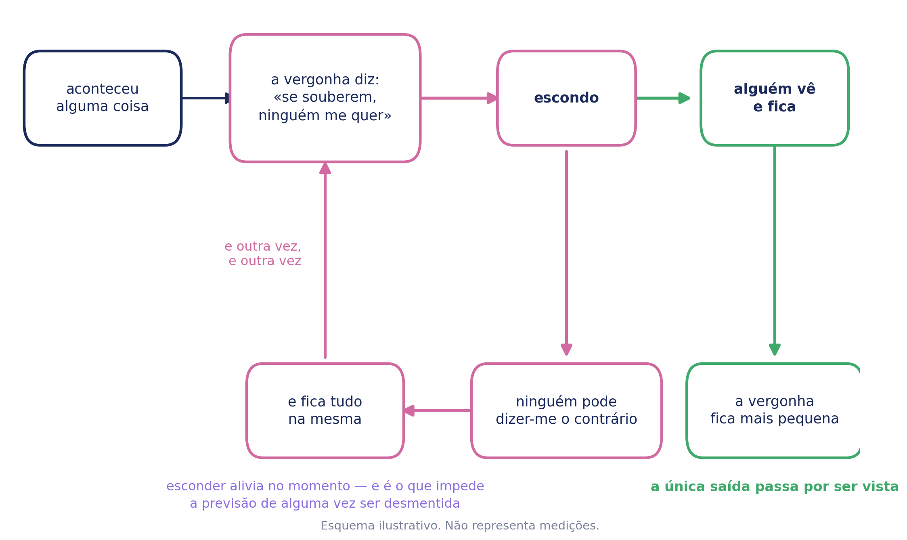

# Envergonhado — Caderno de aplicação

**ColorHugs · Ricardina Correia** · Material licenciado · Versão 0.1 (rascunho)

Acompanha o baralho *Como Me Sinto?*. Trata de uma família — a vergonha — e do
que a mantém.

**Licença de saúde.** Este caderno destina-se a psicólogos e terapeutas. A
licença de educação dá acesso às sete famílias e às palavras derivadas, mas não
a este caderno: contém perguntas exploratórias e dinâmicas que abrem, e material
que abre precisa de quem o receba (D-154, D-163).

**Três camadas, um documento.** O caderno é de quem aplica. A secção de
orientação a pais também é. Só o anexo se entrega.

> **Leia a secção 10 antes de aplicar qualquer ficha desta família.** É a única
> das sete em que aquilo de que a criança tem vergonha pode ser uma coisa que lhe
> foi feita, e há material aqui que não deve ser aplicado antes de isso estar
> considerado.

---

## 1. Enquadramento

**Sem referências bibliográficas.** Esta secção é síntese, não revisão. As
afirmações estão escritas de forma a poderem ser verificadas uma a uma antes de o
material ser licenciado.

### A vergonha é social e chega mais tarde

Ao contrário da zanga, do medo e da tristeza, a vergonha não está lá desde o
princípio: precisa de a criança saber que existe um ponto de vista sobre ela.
Aparece por volta dos dois ou três anos e ganha força com a escola, quando a
comparação com os outros se torna diária.

**Não é uma emoção inútil.** Regula o comportamento em grupo e liga-se ao
pertencer. O problema não é senti-la — é o que ela manda fazer.

### O que aconteceu não é quem eu sou

É a distinção que sustenta tudo o resto.

**A vergonha faz uma coisa que nenhuma das outras faz: generaliza da acção para a
pessoa.** A zanga diz *isto é injusto*. O medo diz *isto é perigoso*. A vergonha
diz **eu sou má** — e é por isso que não se resolve a explicar-lhe que o que fez
não foi assim tão grave.

**Foi recusada a distinção mais óbvia**, que seria *vergonha não é culpa*.
A distinção é sustentada por investigação: a culpa dirige-se ao acto e associa-
se a comportamento reparador; a vergonha dirige-se à pessoa e associa-se a
ocultação e evitamento. Mas é uma distinção da
taxonomia de quem estuda, não uma frase de criança, e nenhuma ficha pende dela.
Fica onde é útil — no enquadramento de quem aplica.

**E foi recusada uma segunda**, que era *o que eu fiz não é quem eu sou*.
Recusada pela sua própria premissa: **pressupõe que houve um acto.** Muita da
vergonha da infância não tem nenhum — ser gozada, fazer chichi na cama, ser a
mais pobre da turma, ter um pai que bebe, ter-lhe acontecido alguma coisa. Para
essas, a frase não chega, e sugere que ela fez alguma coisa.

**A versão da criança:** *a vergonha diz «tu és» — mas o que aconteceu não é quem
tu és.*

### O que mantém a vergonha é esconder

É o mecanismo desta família, como a evitação é a do medo, e funciona da mesma
maneira: **esconder alivia no momento e fecha o círculo.**

A vergonha faz uma previsão — *se souberem, ninguém me quer* — e depois manda
fazer a única coisa que garante que a previsão nunca é testada. A criança
esconde, ninguém a desmente, e a previsão fica de pé por não ter sido posta à
prova.

Daí a pergunta do ecrã, e daí a forma do esquema.

### O erro desta família chama-se rotular

*És malcriada. És preguiçosa. És mentirosa. Tu és sempre assim.*

Cada uma destas frases diz à criança exactamente aquilo que a vergonha já lhe
diz, e com a autoridade de um adulto por trás. A correcção é pequena e é toda:
**falar do que ela fez, e nunca de quem ela é.**

**Isto vale também para os elogios.** *És uma menina tão boazinha* prepara o
terreno para *então sou má*, porque instala a mesma equação. O elogio que não faz
isso é o que descreve o que ela fez.

### As cinco do ecrã, e porque nenhuma das antigas servia

Nenhuma das nove páginas já desenhadas serve. As cinco do zangado são de descida,
e a vergonha não sobe e desce assim. As seis do triste são de companhia — e **a
vergonha, ao contrário da tristeza, faz a criança querer estar sozinha, e essa
vontade é o problema e não a solução.**

A pergunta do ecrã é outra:

> **Quem é que continua a gostar de ti na mesma?**

A vergonha diz que se ela fosse vista assim ninguém a queria. **A pergunta não
discute isso — pede-lhe que nomeie**, e a contraprova é produzida por ela e não
por nós. E é a única coisa que se pode oferecer no ecrã sem abrir nada: nomear
pessoas fecha-se sobre si mesmo, ao contrário de contar, mostrar ou reparar.

### Onde isto assenta

Psicologia do desenvolvimento, no que respeita ao aparecimento tardio e à sua
natureza social. A distinção culpa–vergonha, no que respeita ao que cada uma
move. Aprendizagem, no que respeita ao papel do esconder. E princípios de
interacção pais-criança, no que respeita ao rotular.

**Não é psicoterapia.** É material psicoeducativo, para ser usado por quem tem
formação para o enquadrar.

---

## 2. O que a criança encontra

Escolhe a carta do coração rosa. Ouve ou lê uma linha sobre a vergonha em geral.
Escolhe uma de cinco pessoas ou coisas, se quiser. Fica com um desenho para
pintar.

**A linha que ela lê:**

> A vergonha aparece quando achamos que os outros nos viram por dentro e não vão
> gostar do que viram. Ela diz «tu és» — mas o que aconteceu não é quem tu és. E
> dá vontade de esconder, que é a única coisa que a faz ficar.

**As cinco não são estratégias.** São pessoas e coisas a nomear, e a que faz o
trabalho é ***alguém que já sabe***: nomear alguém que já viu e continua ali é a
previsão da vergonha a falhar. **O ecrã nunca pergunta o que essa pessoa sabe**,
só quem é.

***Uma coisa que continua igual* está lá por uma razão que não é de evidência.**
Uma criança que não consegue nomear pessoa nenhuma é precisamente a criança de
que esta família trata, e no ecrã, sem ninguém ao lado, não pode ficar a olhar
para um vazio. A cama, os chinelos, o caminho de sempre — existem para toda a
gente.

---

## 3. As cinco, e o que as sustenta

**Os três níveis de sustentação usados neste caderno.** A graduação é do
material e não da literatura, e existe para que quem o usa saiba o que pode
afirmar e o que não pode.

| | O que significa |
| --- | --- |
| **Estabelecido** | O mecanismo está descrito por investigação replicada e há consenso sobre a sua direcção. Pode ser afirmado a pais e a professores como facto. |
| **Razoável** | O mecanismo geral tem sustentação; **a aplicação concreta deste material não foi testada**. Apresenta-se como fundamentado, nunca como demonstrado. |
| **Prática** | Não há investigação directa nesta aplicação. Está no material por experiência clínica e por coerência com o que os outros níveis sustentam. **Não se afirma eficácia.** |

**Um nível diz respeito à afirmação, e não à utilidade.** Uma opção graduada como
prática pode ser a mais útil numa sessão concreta; o que a graduação limita é o
que se diz sobre ela.

| | Base | Grau |
| --- | --- | --- |
| Alguém cá de casa | vinculação, disponibilidade do cuidador | estabelecido como mecanismo |
| Alguém que já sabe | a revelação não confirmou a previsão | razoável |
| Um bicho | companhia sem julgamento | prática |
| Alguém que também já se enganou | normalização entre pares | razoável |
| Uma coisa que continua igual | continuidade e previsibilidade | prática |

### Alguém que já sabe

**A peça central, e a mais delicada de conduzir.** Serve porque a criança produz
ela própria a contraprova. Mas há uma cautela que não se pode perder: **se a
pessoa que já sabe é a pessoa que a envergonhou, esta figura está a apontar para
o problema e não para a saída.** Perguntar sempre quem é.

### Alguém que também já se enganou

A vergonha assenta em ser-se a única. Descobrir que não se é desmonta boa parte
dela — e é a razão pela qual o desenho tem **duas crianças e nenhuma delas a
apontar**: encenar a culpa entregaria à criança o sentimento em vez da saída.

### Alguém cá de casa · Um bicho

Companhia sem exigência. **O bicho tem aqui uma função que não tem nas outras
famílias:** é a única figura do conjunto que não pode pensar mal dela, e para uma
criança convencida de que qualquer pessoa pensaria, isso é o primeiro degrau
possível.

### Uma coisa que continua igual

Prática, e no conjunto por necessidade estrutural (secção 2). Clinicamente diz
alguma coisa: **uma criança que escolhe só esta está a dizer que não consegue
nomear ninguém**, e isso é a informação mais importante que a actividade pode
dar.

### O que não está aqui, de propósito

**Contar, mostrar e reparar** — as três coisas que efectivamente desfazem a
vergonha. Todas abrem, e todas pertencem à sessão. Estão nas fichas *Quem já sabe*, nas duas do arrependimento e nas dinâmicas.

---

## 4. O esquema do ciclo

**É o primeiro esquema deste projecto que não é um gráfico.** O da zanga é um
episódio no tempo; o da tristeza é um episódio carregado de duas maneiras; o do
medo é uma série de episódios. **O mecanismo da vergonha não tem eixo do tempo
que valha a pena desenhar** — é um círculo que se fecha sobre si próprio, e o que
o mantém fechado é a previsão nunca ser testada.

Quatro caixas, um ciclo, e uma seta que sai. **A seta que sai é a intervenção
inteira: alguém vê e fica.**

A ordem é o argumento, e vale a pena segui-la em voz alta com quem aplica:
aconteceu alguma coisa · a vergonha diz *se souberem, ninguém me quer* · escondo
· ninguém pode dizer-me o contrário · e fica tudo na mesma · e outra vez.

Duas formas de o usar. Com a criança, tapar a coluna verde e perguntar o que acha
que faria o círculo abrir-se. Com os pais, mostrá-lo inteiro antes de qualquer
conversa sobre ela não falar do assunto.

---

## 5. Perguntas exploratórias

**São para o clínico, não para o material da criança.** Na aplicação nada é
perguntado além do que sente. Aqui há quem receba.

### Depois de *alguém que já sabe*

- Como é que essa pessoa ficou a saber?
- O que é que aconteceu depois de ela saber?
- Ela mudou alguma coisa contigo?

> **Se ela não conseguir nomear ninguém, não insistir.** E se a pessoa que já
> sabe for a que a envergonhou, isso muda o trabalho todo — ver a secção 10.

### Depois de *alguém que também já se enganou*

- Já viste alguém fazer uma coisa parecida?
- O que é que os outros disseram a essa pessoa?
- E o que é que te disseram a ti?

### Depois de *alguém cá de casa* e *um bicho*

- Quem é que está lá mesmo nos dias maus?
- Há alguém em tua casa que nunca te chama nomes?

### Depois de *uma coisa que continua igual*

- O que é que continua igual mesmo nos dias maus?
- Isso ajuda como?

### Sobre cada uma das palavras finas

**Culpado**

- Foi uma coisa que fizeste, ou uma coisa que aconteceu?
- Alguém ficou magoado com isso?
- Se pudesses voltar atrás, o que fazias diferente?

> **A pergunta que separa esta família em duas é a primeira.** Culpa por um acto
> é trabalhável e leva à reparação. **Culpa por uma coisa que aconteceu — uma
> separação, uma doença, uma coisa que lhe foi feita — não é culpa, é vergonha
> mal arrumada**, e não se trabalha com reparação nenhuma.

**Arrependido**

- O que é que querias ter feito de outra maneira?
- Já fizeste alguma coisa para compor?
- Como é que ficaste depois?

> ***Arrependido* é a única carta do baralho que se estende na direcção de quem
> olha.** É a palavra que aponta para fora, e é a única desta família que já
> caminha na direcção da saída.

**Embaraçado**

- Isso passou depressa ou ficou?
- Alguém se riu? E hoje, ainda te lembras com o mesmo aperto?
- Já te aconteceu rires-te disso mais tarde?

> ***Embaraçado* não é vergonha, e o português esconde isso.** É social, leve e
> passageiro; a vergonha é global e fica. **É o *chateado* desta família**, e o
> mais pesado dos três encontrados até agora — *chateado* confunde três famílias
> de sentimento, *sozinho* confunde duas intensidades da mesma, e este confunde
> um momento no recreio com a emoção mais ligada ao esconder e ao que se faz a
> uma criança. A ficha *Embaraçado* existe para desfazer isto.

### Sobre a vergonha em geral

- Há alguma coisa que nunca contaste a ninguém? *(não perguntar o que é)*
- Se as pessoas soubessem, o que achas que aconteceria?
- Alguém já te chamou algum nome que ainda te lembras?
- Há alguém que gostavas que soubesse e ainda não sabe?

**O que não está aqui, e não deve estar:** perguntar o que é que ela esconde. **A
pergunta que se faz é sobre a previsão, não sobre o conteúdo** — *o que achas que
aconteceria* trabalha-se, *o que é que fizeste* é um interrogatório com outra
roupa. Se ela contar, recebe-se; não se vai buscar.

---

## 6. Dinâmicas

Prática clínica. Nada nesta secção tem estudo que a sustente neste uso concreto.

### Com a criança

**Ao contrário.** Perguntar-lhe de quem é que **ela** continua a gostar, sabendo
o que sabe dessas pessoas. É a inversão da pergunta do ecrã, e é a dinâmica mais
forte desta família — foi deliberadamente guardada para aqui, porque precisa de
alguém a conduzi-la.

**O que dirias a um amigo.** Contar-lhe a situação dela como se fosse de outra
criança e perguntar o que lhe diria. Quase todas são muito mais generosas com os
outros, e reparar nisso é metade do trabalho.

**Duas colunas.** *O que eu fiz* e *o que eu sou* — e ver quais das frases que
ela usa sobre si própria pertencem a cada uma.

**A carta que ninguém lê.** Escrever ou desenhar o que nunca contou, sem entregar
nada a ninguém. **O papel fica com ela.**

**Tapar a coluna verde.** Mostrar só o ciclo e perguntar o que faria abri-lo.

### Com a família na sala

**Como falam dela.** Reparar nas frases que usam: *ela é…* contra *ela fez…*. É a
intervenção desta família e faz-se sem uma única acusação, só notando.

**Uma vez em que os adultos passaram vergonha.** Pedir-lhes que contem uma, à
frente dela. Muda o que se pode dizer a seguir mais do que qualquer explicação.

**O elogio que descreve.** Combinar com eles trocar *és uma menina tão boazinha*
por *hoje esperaste pela tua vez e isso foi difícil*. A mesma quantidade de
carinho, sem a equação por baixo.

### Entre sessões

**Uma pessoa que já sabe.** Nada a fazer, nada a contar: só reparar em como essa
pessoa a trata durante a semana.

**Levar a página escolhida impressa.**

**A mesma pergunta numa sessão posterior.** O que interessa é se a lista de
pessoas cresceu.

---

## 7. Ficha clínica

Para as notas de quem aplica. **Não é instrumento, não pontua, e não se preenche
com a criança à frente.** Não substitui o processo clínico.

**Sem nome.** Identifique por código ou pelo seu próprio processo.

### Sessão

| Campo | Registo |
| --- | --- |
| Código / processo | |
| Data | |
| Sessão n.º | |
| Presentes | criança · adulto(s) · outro |

### O que foi usado

| Campo | Registo |
| --- | --- |
| Actividade digital | sim · não |
| Fichas aplicadas | |
| Páginas para colorir | |
| Carta entregue aos pais | sim · não |

### Observação

| Área | Registo |
| --- | --- |
| Figuras que escolheu | |
| Conseguiu nomear pessoas — quantas | |
| Escolheu apenas *uma coisa que continua igual* | sim · não |
| Quem já sabe, e como reagiu | |
| Origem: acto · acontecimento · não claro | |
| Rótulos que repete sobre si própria | |
| Rótulos ouvidos na sala | |
| Palavras finas que reconheceu | |
| Distingue embaraço de vergonha | sim · não |
| Postura durante a tarefa | |

### Leitura

| Campo | Registo |
| --- | --- |
| Hipótese de trabalho | |
| O que confirma | |
| O que contraria | |
| A verificar na próxima | |

### Plano

| Campo | Registo |
| --- | --- |
| Combinado com a criança | |
| Combinado com os adultos | |
| Material entregue | |
| Próxima sessão — foco | |

**Três linhas são próprias desta família.** *Escolheu apenas uma coisa que
continua igual* — porque significa que não conseguiu nomear ninguém. *Origem:
acto ou acontecimento* — porque decide se há reparação a fazer ou não há. E
*rótulos ouvidos na sala*, que costuma ser a linha mais útil da folha.

---

## 8. As palavras derivadas

Dentro da família da vergonha, o vocabulário fino em português europeu é
**culpado · arrependido · embaraçado**.

*Culpado* olha para o acto, e é por isso que é a mais trabalhável das três: o que
olha para o acto pode ser reparado. **Mas em crianças aparece muitas vezes sem
acto nenhum** — culpa pela separação dos pais, pela doença de alguém, por uma
coisa que lhe foi feita. Nesses casos não é culpa, é vergonha com o nome errado,
e a reparação não tem onde pegar.

*Arrependido* é culpa já em movimento. **É a única carta de todo o baralho que se
estende na direcção de quem olha** — as outras trinta fecham-se sobre si próprias
— e é o que a torna a peça mais esperançosa desta família.

**Tem duas fichas e não uma**, porque carrega duas coisas que uma criança pode
conseguir separadamente: imaginar o que teria feito de outra maneira, e dizer
alguma coisa a quem ficou magoado. **A primeira é dela sozinha; a segunda precisa
de outra pessoa aceitar.** Juntas numa folha, uma criança que não consegue a
segunda sai a achar que também falhou a primeira.

*Embaraçado* **não pertence a esta família e está nela porque o português o
obriga**. É uma emoção social, leve e passageira. Uma criança que diz *estou
envergonhada* pode estar a viver um momento trivial no recreio ou uma condenação
global de si própria.

**A tensão desta família é diferente de todas as outras.** No zangado as palavras
distinguiam-se por intensidade; no triste por causa e alvo; no assustado por
tempo. **Aqui distinguem-se por alcance**: o embaraço alcança um momento, a culpa
alcança um acto, a vergonha alcança a pessoa inteira. Ordená-las por tamanho
seria quase acertar e errar no essencial — não é o tamanho do sentimento que
muda, é o tamanho daquilo que ele condena.

**Falta uma palavra**, e é a que faz mais falta de todas as sete famílias: **não
há uma palavra portuguesa de criança para a vergonha que não vem de nada que ela
tenha feito.** *Humilhado* é de adulto e implica alguém a humilhar. Fica sem nome
exactamente a vergonha que mais precisa de ser dita.

---

## 9. Fichas — orientação de aplicação

Uma página por ficha. **As fichas em si não estão aqui**: vivem no caderno de
exploração da criança, e uma licença dá acesso aos dois ficheiros — imprimi-las
duas vezes só produz duas cópias que podem ficar desencontradas.

Cada página diz para que serve a ficha, como se aplica, o que perguntar, o que
notar e o que evitar, e tem espaço para o registo da sessão em que foi usada.
**Por código, nunca por nome.**

### Ficha 1 — A Vergonha

| Orientação | |
| --- | --- |
| **Idade** | 6 aos 9 anos |
| **Base** | Psicoeducação. Sem nível próprio: reformula em linguagem infantil o que a secção 1 sustenta. |
| **Objectivo** | Dar-lhe o enquadramento e mostrar-lhe o ciclo. Nada para preencher. |
| **Como aplicar** | Ler com ela em voz alta e seguir o círculo com o dedo, pela ordem. Tapar a coluna verde e perguntar o que acha que faria o círculo abrir-se. |
| **A notar** | **Ela diz «tu és»** costuma ser a frase que provoca reconhecimento — muitas crianças nunca ouviram ninguém descrever aquilo que se passa dentro delas. |
| **Cuidados** | Não usar esta página para perguntar o que ela esconde. É para explicar o mecanismo, e o mecanismo explica-se sem conteúdo nenhum. |

**Questões de exploração**

- O que achas que faria o círculo abrir-se?
- Já te aconteceu alguém saber de uma coisa e continuar igual?

**Dinâmicas a partir desta ficha**

| | |
| --- | --- |
| 4–6 | **A carta e o espelho.** Pôr a carta do envergonhado ao lado do espelho da primeira página e perguntar se são parecidos. |
| 6–8 | **Seguir o círculo com o dedo.** Percorrer as caixas por ordem, em voz alta, e parar em *escondo* para perguntar o que acontecia se ali fosse ao contrário. |
| 8–9 | **Tapar a coluna verde.** Mostrar só o ciclo e pedir que invente a saída antes de a ver. |
| qualquer | **Guardar para o fim.** Reler esta página na última sessão e perguntar se o círculo dela mudou. |

| Aplicação | |
| --- | --- |
| Código / processo | |
| Idade | |
| Data | |

| Registo da sessão |
| --- |
| |
| |
| |

### Ficha 2 — A Vergonha vem visitar

| Orientação | |
| --- | --- |
| **Idade** | 4 aos 7 anos |
| **Base** | Externalização, terapia narrativa. **Prática**, com pouca investigação controlada. |
| **Objectivo** | Pôr a Vergonha fora dela como personagem — o que nesta família vale mais do que em qualquer outra, porque a vergonha diz precisamente que ela **é** aquilo. |
| **Como aplicar** | Desenho primeiro, perguntas depois. A última — *isso que ela diz é verdade?* — só se faz se o desenho já estiver feito. |
| **A notar** | As frases que ela põe na boca da personagem. **Costumam ser frases ouvidas**, e muitas vezes ouvidas em casa ou na escola, palavra por palavra. |
| **Cuidados** | Não corrigir a personagem com factos. Se ela desenhar uma Vergonha enorme, a resposta não é dizer que não é assim tão grande — é perguntar onde é que ela a manda ir. |

**Questões de exploração**

- Onde é que ela te manda ir?
- O que é que ela te diz ao ouvido sobre ti?
- Isso que ela diz é verdade?

**Dinâmicas a partir desta ficha**

| | |
| --- | --- |
| 4–6 | **Dar-lhe voz.** Escrever ao lado do desenho o que a Vergonha diz, palavra por palavra como ela a disser. |
| 4–7 | **Onde é que ela manda ir.** Pedir que desenhe o sítio para onde a Vergonha a manda. Costuma ser o quarto, e costuma ser sozinha. |
| 6–8 | **Quem é que fala como ela.** Perguntar se alguém que ela conhece diz coisas parecidas com as da personagem. **Perguntar, não sugerir.** |
| 7–9 | **A Vergonha de outra pessoa.** Pedir que desenhe a Vergonha de um adulto da casa. Costuma dizer mais do que a dela. |

| Aplicação | |
| --- | --- |
| Código / processo | |
| Idade | |
| Data | |

| Registo da sessão |
| --- |
| |
| |
| |

### Ficha 3 — O que eu fiz e o que eu sou

| Orientação | |
| --- | --- |
| **Idade** | 7 aos 9 anos |
| **Base** | Distinção acto–pessoa. **Razoável** quanto ao efeito da atribuição global; a ficha é prática. |
| **Objectivo** | Separar as duas colunas que a vergonha cola. **É a distinção da família transformada em tabela.** |
| **Como aplicar** | A coluna da direita é a que interessa, e é a que ela preenche mais depressa. A pergunta final — *o que dirias a um amigo* — faz-se depois de as três linhas estarem escritas, nunca antes. |
| **A notar** | **A diferença entre o que ela diz a si própria e o que diria a um amigo.** Quase todas são muito mais generosas com os outros, e reparar nisso vale mais do que qualquer explicação nossa. |
| **Cuidados** | Não discutir a coluna da direita. Argumentar contra um rótulo global costuma reforçá-lo — o que o desfaz é ela própria ouvir-se a dizer outra coisa a outra pessoa. |

**Questões de exploração**

- Se um amigo teu dissesse isso sobre ele, o que lhe dizias?
- Alguma dessas frases foi alguém que ta disse?
- Há alguma linha em que as duas colunas não combinam?

**Dinâmicas a partir desta ficha**

| | |
| --- | --- |
| 7–9 | **Ler a coluna da direita em voz alta.** Ela lê, e depois lê outra vez como se fosse sobre outra pessoa. A diferença de tom é o material. |
| 7–9 | **Quem disse isto primeiro.** Ao lado de cada frase da direita, marcar se foi ela que a inventou ou se a ouviu. |
| 8–9 | **A frase que sobra.** Escolher a que ela nunca conseguiria dizer a um amigo, e trabalhar só essa. |
| com a família | **Como falam dela.** Reparar, na sala, nas frases que usam: *ela é…* contra *ela fez…*. Faz-se sem uma única acusação, só notando. |

| Aplicação | |
| --- | --- |
| Código / processo | |
| Idade | |
| Data | |

| Registo da sessão |
| --- |
| |
| |
| |

### Ficha 4 — Quem continua a gostar de mim na mesma

| Orientação | |
| --- | --- |
| **Idade** | 4 aos 7 anos |
| **Base** | Vinculação e desconfirmação da previsão. **Estabelecido** quanto à disponibilidade do cuidador; o resto é razoável e prática. |
| **Objectivo** | Pedir-lhe que nomeie — e não argumentar com a previsão da vergonha. As cinco figuras são as que ela viu no ecrã. |
| **Como aplicar** | Deixar assinalar quantas quiser, e não sugerir nenhuma. A caixa do fim é para alguém que não esteja nas figuras. |
| **A notar** | **Quantas pessoas consegue nomear, e se consegue alguma.** Uma criança que só assinala *uma coisa que continua igual* está a dizer que não consegue nomear ninguém — e essa é a informação mais importante que esta actividade pode dar. |
| **Cuidados** | Se ela não conseguir nomear ninguém, **não preencher por ela e não insistir**. Nomear alguém para lhe fazer a vontade produz uma lista falsa e fecha o assunto. |

**Questões de exploração**

- Quem é que está lá mesmo nos dias maus?
- Há alguém teu que não esteja nas figuras?
- Alguma destas pessoas já te viu num dia mau?

**Dinâmicas a partir desta ficha**

| | |
| --- | --- |
| 4–6 | **As figuras em cima da mesa.** Imprimir as cinco e deixar pegar, sem dizer nada. |
| 4–7 | **Trazer uma prova.** Pedir que traga na próxima sessão uma coisa dessa pessoa — uma fotografia, um desenho, um objecto. |
| 6–9 | **Ao contrário.** Perguntar de quem é que **ela** continua a gostar, sabendo o que sabe dessas pessoas. **É a dinâmica mais forte desta família**, e foi guardada para aqui porque precisa de alguém a conduzi-la. |
| com a família | **Os adultos adivinham.** Pedir-lhes que escolham as figuras que acham que são dela antes de verem. A diferença é a conversa. |

| Aplicação | |
| --- | --- |
| Código / processo | |
| Idade | |
| Data | |

| Registo da sessão |
| --- |
| |
| |
| |

### Ficha 5 — As palavras finas

| Orientação | |
| --- | --- |
| **Idade** | 7 aos 9 anos |
| **Base** | Vocabulário emocional. **Razoável** quanto a diferenciação emocional; o conjunto é do ColorHugs. |
| **Objectivo** | Mostrar que as três se distinguem **por alcance**: o embaraço alcança um momento, a culpa alcança um acto, a vergonha alcança a pessoa inteira. |
| **Como aplicar** | Uma caixa por palavra, sem ordem. Se uma ficar vazia, deixá-la vazia. |
| **A notar** | Se usa *culpado* para coisas que não fez. É frequente, e abre directamente a ficha seguinte. |
| **Cuidados** | **Não ordenar por tamanho.** Aqui não é o tamanho do sentimento que muda, é o tamanho daquilo que ele condena — e ordenar por intensidade seria quase acertar e errar no essencial. |

**Questões de exploração**

- Qual destas dizes mais vezes?
- Qual delas passa depressa e qual é que fica?
- Alguma delas é sobre uma coisa que tu fizeste?

**Dinâmicas a partir desta ficha**

| | |
| --- | --- |
| 7–9 | **Por alcance.** Pôr as três cartas por ordem daquilo que cada uma condena: um momento, uma coisa que fiz, eu toda. |
| 7–9 | **Qual passa.** Separar as três em *passa* e *fica*, e ver onde ela põe cada uma. |
| 8–9 | **A palavra que falta.** Perguntar-lhe que palavra usaria para a vergonha que não vem de nada que ela tenha feito. **Não há nenhuma em português, e ela costuma inventar uma boa.** |
| com a família | **Cada um escolhe a sua.** Os adultos escolhem também, e contam uma vez em que a sentiram. |

| Aplicação | |
| --- | --- |
| Código / processo | |
| Idade | |
| Data | |

| Registo da sessão |
| --- |
| |
| |
| |

### Ficha 6 — Culpado

| Orientação | |
| --- | --- |
| **Idade** | 7 aos 9 anos |
| **Base** | Distinção entre culpa por acto e culpa por acontecimento. **Razoável** quanto à distinção; a aplicação é prática. |
| **Objectivo** | Fazer a pergunta que parte esta família em duas: **foi uma coisa que fizeste, ou uma coisa que aconteceu?** |
| **Como aplicar** | A segunda caixa é a ficha toda. Dar tempo, e não sugerir a resposta — a criança que se culpa de um acontecimento costuma demorar a dizê-lo. |
| **A notar** | **Culpa por um acontecimento não é culpa, é vergonha mal arrumada**, e não se trabalha com reparação nenhuma. Separação dos pais, doença de alguém, uma coisa que lhe foi feita — são as três mais frequentes. |
| **Cuidados** | Se a resposta for *aconteceu*, **não seguir para a ficha *Arrependido***. Pedir reparação por uma coisa que lhe aconteceu confirma-lhe a culpa que ela já sente. |

**Questões de exploração**

- Isso foi uma coisa que tu fizeste, ou uma coisa que aconteceu?
- Alguém alguma vez te disse que a culpa era tua?
- Se tivesse acontecido a outra criança, a culpa era dela?

**Dinâmicas a partir desta ficha**

| | |
| --- | --- |
| 7–9 | **Duas pilhas.** Escrever cinco coisas de que se sente culpada e separá-las: as que fez e as que aconteceram. |
| 7–9 | **Se fosse outra criança.** Contar a situação como se fosse de outra pessoa e perguntar de quem era a culpa. |
| 8–9 | **Quem mais estava lá.** Nas que aconteceram, listar todas as pessoas envolvidas e ver quanto sobra para ela. Costuma sobrar muito pouco. |
| com a família | **Dizer em voz alta.** Se for uma separação ou uma doença, pedir aos adultos que lhe digam explicitamente, à frente de quem aplica, que a culpa não foi dela. **Ela precisa de o ouvir deles, não de nós.** |

| Aplicação | |
| --- | --- |
| Código / processo | |
| Idade | |
| Data | |

| Registo da sessão |
| --- |
| |
| |
| |

### Ficha 7 — O que querias ter feito de outra maneira

| Orientação | |
| --- | --- |
| **Idade** | 6 aos 9 anos |
| **Base** | Geração de alternativas. **Razoável** — o treino de resolução de problemas tem investigação consolidada nesta idade; esta aplicação concreta não foi testada. |
| **Objectivo** | Transformar o arrependimento em alternativa. **É a metade virada para a frente**, e está separada da reparação porque uma criança pode conseguir esta e não a outra. |
| **Como aplicar** | **Só depois da ficha *Culpado*, e só se a resposta lá tiver sido *uma coisa que eu fiz*.** Nunca no dia. |
| **A notar** | Se a alternativa é dela ou é a nossa. **A dela vale mais**, mesmo quando é pior — é a única que vem com a situação dela dentro. |
| **Cuidados** | **Nunca perguntar *o que é que devias ter feito*.** É uma repreensão disfarçada de ficha, e a criança percebe à primeira. A pergunta é sobre o que **ela** queria. Não se aplica onde não houve acto. |

**Questões de exploração**

- O que é que tu querias ter feito em vez disso?
- Se voltasse a acontecer amanhã, o que farias?
- Isso que querias fazer, dava mesmo para fazer?

**Dinâmicas a partir desta ficha**

| | |
| --- | --- |
| 6–8 | **Experimentar na sala.** Fazer ali mesmo a alternativa que ela escreveu, a brincar e sem estar em apuros. Ensaiar a frio é metade do trabalho. |
| 6–9 | **Onde é que dava.** Verificar se aquilo que ela queria ter feito era mesmo possível naquele momento — havia tempo, havia sítio, estava lá alguém. Muitas vezes não era, e isso alivia. |
| 8–9 | **Três em vez de uma.** Pedir três alternativas em vez de uma, mesmo que duas sejam más. Ter escolha vale mais do que ter a resposta certa. |
| com a família | **A alternativa dos adultos.** Perguntar-lhes o que **eles** queriam ter feito de outra maneira naquele dia. Muda a sala inteira, e é raro alguém lho ter perguntado. |

| Aplicação | |
| --- | --- |
| Código / processo | |
| Idade | |
| Data | |

| Registo da sessão |
| --- |
| |
| |
| |

### Ficha 8 — O que querias dizer a quem ficou magoado

| Orientação | |
| --- | --- |
| **Idade** | 6 aos 9 anos |
| **Base** | Reparação. **Prática**: sem investigação nesta aplicação. A fundamentação decorre da distinção entre culpa e vergonha. |
| **Objectivo** | Escolher o que dizer a quem ficou magoado, e prever o caso de a outra pessoa não querer ouvir já. |
| **Como aplicar** | Depois da ficha anterior, e **nunca no mesmo dia do acontecimento** — enquanto a coisa ainda está quente, compor não é possível. |
| **A notar** | Se escreve sobre o que fez ou sobre o que sentiu. **Uma criança que só consegue explicar-se ainda não chegou à outra pessoa** — e isso é informação, não falha. |
| **Cuidados** | **A palavra *desculpa* não aparece na ficha e não deve ser sugerida**: um pedido de desculpa mandado produz obediência, não reparação. E não se aplica onde não houve acto. |

**Questões de exploração**

- O que queres dizer a essa pessoa?
- E se ela não quiser falar já, o que podes dizer mais tarde?
- Há alguma coisa que queiras fazer em vez de dizer?

**Dinâmicas a partir desta ficha**

| | |
| --- | --- |
| 6–8 | **Ensaiar em voz alta.** Dizer o que escreveu no balão, ao clínico, antes de dizer a quem é. |
| 6–9 | **Reparar sem falar.** Procurar uma coisa que se faça em vez de se dizer. Para crianças a quem as palavras custam. |
| 8–9 | **Se correr mal.** Preparar o que fazer se a outra pessoa não aceitar. Evita que uma tentativa falhada feche o assunto. |
| com a família | **Os adultos também compõem.** Perguntar se algum deles se lembra de ter composto alguma coisa com ela. |

| Aplicação | |
| --- | --- |
| Código / processo | |
| Idade | |
| Data | |

| Registo da sessão |
| --- |
| |
| |
| |

### Ficha 9 — Embaraçado

| Orientação | |
| --- | --- |
| **Idade** | 6 aos 9 anos |
| **Base** | Distinção entre embaraço e vergonha. **Estabelecido** quanto às duas serem emoções diferentes; a ficha é prática. |
| **Objectivo** | Desfazer o que o português cola. Uma passa em cinco minutos, a outra fica — e saber qual é qual muda o que se faz a seguir. |
| **Como aplicar** | A primeira caixa antes da segunda, sempre. Uma vez que já não faz nada é fácil de contar, e é ela que torna a segunda perguntável. |
| **A notar** | **Se a segunda caixa fica vazia, isso não quer dizer que não haja nada** — quer dizer que ainda não é para aqui que vem. E se ela conta as duas com o mesmo tom, ainda não distingue as duas coisas. |
| **Cuidados** | Não perguntar o que é a coisa da segunda caixa. **A ficha pergunta se ainda dá aperto, não pergunta o que é.** |

**Questões de exploração**

- Essa primeira, hoje ainda te faz alguma coisa?
- Já te riste disso mais tarde?
- E a outra, é do mesmo tamanho que era?

**Dinâmicas a partir desta ficha**

| | |
| --- | --- |
| 6–8 | **A história engraçada.** Pedir aos adultos ou ao clínico que contem um embaraço antigo de que hoje se riem. Mostra o *passa* em vez de o explicar. |
| 6–9 | **Quanto tempo faz.** Nas duas caixas, escrever há quanto tempo foi cada uma. A diferença costuma ser visível. |
| 8–9 | **O que faria passar.** Na segunda, perguntar o que teria de acontecer para deixar de doer. Quase sempre a resposta envolve outra pessoa. |
| com a família | **Não repetir a história.** Combinar com os adultos não contarem o embaraço dela a terceiros como anedota. É frequente, é afectuoso, e é exactamente o mecanismo. |

| Aplicação | |
| --- | --- |
| Código / processo | |
| Idade | |
| Data | |

| Registo da sessão |
| --- |
| |
| |
| |

### Ficha 10 — Quem já sabe

| Orientação | |
| --- | --- |
| **Idade** | 6 aos 9 anos |
| **Base** | Desconfirmação da previsão. **Razoável** quanto ao efeito da revelação recebida; a ficha é prática. |
| **Objectivo** | Encontrar uma prova de que a previsão da vergonha já falhou uma vez. **É a única ficha do projecto em que a criança vê uma previsão sua a não se cumprir.** |
| **Como aplicar** | **Perguntar primeiro quem é a pessoa, e só depois seguir.** A ficha só faz sentido se essa pessoa tiver recebido bem. |
| **A notar** | O que mudou depois. **Se ela disser que não mudou nada, é isso a prova** — e vale a pena nomeá-la em voz alta, porque sozinha ela não a lê como prova. |
| **Cuidados** | **Não se aplica sem se saber quem é a pessoa.** Se quem já sabe for quem a envergonhou, esta ficha aponta para o problema e não para a saída, e o trabalho é outro — ver a secção 10. Se ela não conseguir nomear ninguém, a ficha não se aplica de todo. |

**Questões de exploração**

- Como é que essa pessoa ficou a saber?
- O que aconteceu depois de ela saber?
- Ela mudou alguma coisa contigo?

**Dinâmicas a partir desta ficha**

| | |
| --- | --- |
| 6–8 | **Nomear a prova.** Depois de ela responder, dizer em voz alta: *a Vergonha disse que ia acontecer uma coisa, e não aconteceu.* Sozinha ela não lê aquilo como prova. |
| 6–9 | **Mais alguém.** Perguntar se há mais alguém que poderia saber e continuar igual. Não para contar — só para nomear. |
| 8–9 | **O que ela esperava.** Perguntar o que ela achava que ia acontecer quando essa pessoa soube, e comparar com o que aconteceu. |
| com a família | **Continuar igual.** Se a pessoa que já sabe estiver na sala, o combinado é não voltar ao assunto de propósito e tratá-la como sempre. **A prova constrói-se com dias normais.** |

| Aplicação | |
| --- | --- |
| Código / processo | |
| Idade | |
| Data | |

| Registo da sessão |
| --- |
| |
| |
| |

---

## 10. Limites

> **Esta secção é para ler antes de aplicar, e não depois.**

**É a única das sete famílias em que aquilo de que a criança tem vergonha pode
ser uma coisa que lhe foi feita.** Maus-tratos, negligência, exposição, abuso — a
vergonha é a emoção que os acompanha com mais frequência, e é também a razão pela
qual não são contados.

**O que isso implica, em concreto:**

- **Nunca perguntar o que ela esconde.** As perguntas desta família são sobre a
  previsão — *o que achas que aconteceria se soubessem* — e nunca sobre o
  conteúdo. Se ela contar, recebe-se; não se vai buscar.
- **A ficha *Quem já sabe* não se aplica sem se saber quem é a pessoa.** Pode
  ser quem a envergonhou, e nesse caso a figura aponta para o problema e não para
  a saída.
- **As duas fichas do arrependimento não se aplicam se não houve acto** —
  *O que querias ter feito de outra maneira* e *O que querias dizer a quem ficou
  magoado*. Pedir reparação a uma criança por uma coisa que lhe aconteceu é
  confirmar-lhe a culpa que ela já sente.
- **Se aparecer suspeita de perigo para a criança, este caderno pára ali.** O que
  se segue é o dever legal de comunicar e o procedimento da instituição, e nada
  disto é substituto de nenhum dos dois.

**Este material não distingue vergonha comum de vergonha crónica e não faz
rastreio.** Vergonha que se estende a tudo, que impede a criança de participar,
ou que aparece com retraimento marcado, é matéria de avaliação clínica.

**A distinção culpa–vergonha é do enquadramento e não das fichas.** É bem
apoiada, e a sua aplicação a crianças pequenas é razoável e não estabelecida.
Nenhuma ficha pede à criança que classifique o que sente numa das duas.

**Nada aqui trata da vergonha do adulto**, e ela está muitas vezes na sala. Um
pai envergonhado do filho, ou de si próprio, é o contexto mais frequente do
rotular — e é trabalho de intervenção familiar, não deste caderno.

> **Antes de licenciar:** as referências que sustentam os níveis *estabelecido* e
> *razoável* devem ser verificadas e citadas nominalmente.

---

## 11. O que este material não faz

Não avalia, não classifica, não pontua e não guarda nada.

**Não pergunta o que a criança esconde**, em ecrã nenhum e em ficha nenhuma.

Não pede reparação sem haver acto, e não classifica sentimentos como culpa ou
vergonha.

Nada do que a criança faz é visível aos pais e nada fica registado.

Não serve para rastreio, triagem, classificação diagnóstica ou monitorização de
sintomas, e **não substitui os procedimentos de protecção de crianças em risco**.

---

## Anexo — o baralho

Trinta e uma cartas para imprimir, cortar e manusear. `docs/materials/baralho/`.

**90 × 120 mm**, e o verso é igual em todas.

**Sobre ordenar por intensidade**, ver a secção 8: aqui a diferença é de alcance
e não de tamanho. Ordenações que este caderno propõe:

- **Por alcance.** O que é que cada uma condena: um momento, uma coisa que fiz,
  ou eu.
- **Por quem sabe.** Quais é que alguém já sabe, quais é que ninguém sabe.
- **Por facilidade de dizer.**
- **Por reconhecimento.** Quais reconhece no corpo, quais só de nome.

## Anexo — as cinco páginas para colorir

Para imprimir de uma vez: no banco · no chão · o cão · os blocos · o quarto de
manhã. **As fichas da criança não estão em anexo** — estão no caderno de
exploração.

Três delas são partilhadas com outras famílias.

---

*Criado e revisto clinicamente por Ricardina Correia. Ferramenta psicoeducativa:
não diagnostica, não avalia e não substitui acompanhamento psicológico.*
