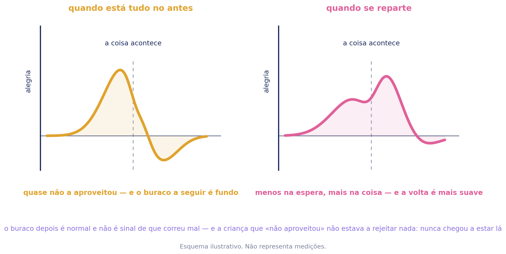

# Feliz — Caderno de aplicação

**ColorHugs · Ricardina Correia** · Material licenciado · Versão 0.1 (rascunho)

Acompanha o baralho *Como Me Sinto?*. Trata da alegria — e do que se faz com
ela.

**Licença de saúde.** Este caderno destina-se a psicólogos e terapeutas.

> **Este caderno e o do calmo aplicam-se primeiro.** São os que constroem o
> depósito de que as outras cinco vão precisar. Aplicados no fim, chegam tarde.

---

## 1. Enquadramento

**Sem referências bibliográficas.** Esta secção é síntese, não revisão.

### A única família que a criança já reconhece

De todas as sete, esta é a que ninguém precisa de aprender a notar. **A calma
não faz barulho e por isso escapa. A alegria faz barulho** — o corpo ri,
mexe-se, quer contar.

**O que esta família trabalha não é reparar: é reter.** A alegria acontece à
vista de toda a gente e não deixa nada atrás a não ser que alguém tenha parado
nela.

### A alegria acontece — e o que fizeres com ela é que fica

É a frase que governa esta família.

**Não diz nada sobre quanto tempo dura**, e essa ausência é deliberada. Uma
versão anterior dizia *a alegria passa depressa*, e não há base para o afirmar:
a tristeza pode durar semanas, a zanga minutos, e a alegria varia como as
outras. **Era atmosfera a passar por informação**, e este material não faz isso
nas outras seis famílias.

O que tem sustentação é outra coisa: **um mau momento
repete-se sozinho na cabeça, e um bom momento tem de ser segurado.** Mas dito
assim a uma criança é uma frase triste — diz-lhe que o bom é frágil — e por isso
não é a frase dela.

**A versão da criança:** *a alegria vai e vem — o que ficar guardado, ficaste tu
que guardaste.*

### O que a separa do calmo

As duas são positivas e distinguem-se pela **activação** (D-274).

| | Corpo | O que faz |
| --- | --- | --- |
| **Calmo** | desactivado — quer ficar | **recolhe** o que já lá estava e não se via |
| **Feliz** | activado — quer partilhar, mexer, contar | **guarda** o que estava à vista e ia passar |

**Um é reparar, o outro é reter**, e é daí que saem duas prosas diferentes em
vez de uma repetida.

**E a localização no corpo é a diferença mais visível.** A calma é desactivação
geral e não tem sítio (D-276). **A alegria tem** — o peito, a barriga, as pernas
que não param. Nesta família o mapa corporal é usado a sério, e a criança que
não localiza nada é a excepção, e não o contrário.

### As quatro camadas

1. **Nomear** — os graus e os tipos: contente, entusiasmado, orgulhoso,
   aliviado. É a camada que o vocabulário fino já serve.
2. **Guardar** — contar, guardar uma coisa que lembre, desenhar, repetir com
   alguém, lembrar antes de dormir. **E agradecer**, que é uma forma de guardar e
   não uma boa maneira.
3. **Reactivar** — memórias e planos. **É a única família que olha para a
   frente:** fazer planos é alegria antecipada, e é uma capacidade, não um
   passatempo.
4. **Estar no momento** — a camada que dá peso clínico a este caderno, e a
   secção seguinte é toda dela.

### Estar no momento: duas queixas, um mecanismo

**São o mesmo problema em dois tempos, e por isso vivem numa secção só.**

**O vazio depois do pico.** A festa que acabou, as férias que acabaram, o domingo
à noite. A criança fica em baixo depois de uma coisa boa, e é quase sempre mal
lido: ou lhe dizem que não tem motivos, ou se conclui que a coisa boa correu mal.
**Nenhuma das duas leituras é verdadeira. O buraco é normal.**

**E a alegria que nunca chega a ser habitada.** É a queixa mais frequente que os
pais trazem sobre esta família, e chega quase sempre com as mesmas palavras:
*ela quer muito uma coisa, fica entusiasmada, e quando chega parece que não
aproveita e já quer saber o que vem a seguir.*

**O entusiasmo comeu a alegria.** A carga estava toda na antecipação, e a
antecipação acabou no momento em que a coisa chegou.

**A leitura dos pais está compreensivelmente errada.** *Nunca está satisfeita com
nada* lê aquilo como carácter — ingratidão, exigência, mimo. **Mas a criança não
está a rejeitar a coisa: ela nunca esteve presente na coisa.**

### O erro desta família chama-se ingratidão

*Nunca estás satisfeita. Não há nada que te chegue. Tanto que querias e agora é
assim.*

É o rótulo desta família, como *és malcriada* é o do envergonhado, e corrige-se
da mesma maneira: **falar do que aconteceu e nunca de quem ela é.**

### A ligação à ansiedade

**O corpo entusiasmado e o corpo ansioso fazem quase o mesmo:** aceleram,
apertam, não deixam dormir. Os dois vivem no que vem a seguir e não no que está.

**Uma criança que se antecipa muito é frequentemente a mesma que se preocupa
muito**, e é a ligação mais fina que este material carrega. Para uma criança
ansiosa, o entusiasmo pode ser vivido como ameaça — e uma família positiva pode
ser, nesse caso, a porta mais fácil para trabalhar activação.

**Grau: razoável.** A sobreposição do substrato de activação entre antecipação
positiva e ansiedade está descrita na investigação sobre emoção; a aplicação
clínica desta ligação em crianças não foi testada.

### Onde isto assenta

Psicologia da emoção, no que respeita ao afecto positivo activado e à
antecipação. A literatura sobre saboreio e sobre partilha de acontecimentos
positivos, que é a que sustenta a camada de guardar. Nos restantes pontos, a fundamentação
é de prática clínica.

**Não é psicoterapia.**

---

## 2. O que a criança encontra

Escolhe a carta do coração amarelo. Ouve ou lê uma linha sobre a alegria. E o
ecrã faz-lhe uma pergunta que nenhuma outra família faz:

> **O que é que queres guardar disto?**

**É a única pergunta do produto que lhe pede que faça alguma coisa** em vez de
escolher entre coisas. As outras seis perguntam o que sente, o que lhe faz
companhia, o que quer experimentar. Esta pede uma acção — e é o eixo da família
transformado em pergunta.

**As cinco respostas são maneiras de guardar**, e nenhuma precisou de arte nova:

| | A figura |
| --- | --- |
| Contar a alguém | o banco |
| Guardar uma coisa que me lembre | a prateleira |
| Desenhar | a mesa com o papel em branco |
| Fazer outra vez com essa pessoa | o jogo |
| Lembrar-me antes de dormir | o quarto |

**Não é reaproveitamento por economia.** A prateleira foi desenhada para guardar
coisas que lembram alguém e é literalmente isso; a mesa tem uma folha em branco
que agora é para o desenho dela; o banco é contar.

**As outras três camadas vivem no caderno**, onde está alguém — e a quarta, o
estar no momento, não podia estar no ecrã de todo: uma criança sozinha ao
telemóvel não tem quem receba a conversa sobre o buraco depois da festa.

---

## 3. As cinco maneiras de guardar

**Os três níveis de sustentação usados neste caderno.** A graduação é do
material e não da literatura, e existe para que quem o usa saiba o que pode
afirmar e o que não pode.

| | O que significa |
| --- | --- |
| **Estabelecido** | O mecanismo está descrito por investigação replicada e há consenso sobre a sua direcção. Pode ser afirmado a pais e a professores como facto. |
| **Razoável** | O mecanismo geral tem sustentação; **a aplicação concreta deste material não foi testada**. Apresenta-se como fundamentado, nunca como demonstrado. |
| **Prática** | Não há investigação directa nesta aplicação. Está no material por experiência clínica e por coerência com o que os outros níveis sustentam. **Não se afirma eficácia.** |

**Um nível diz respeito à afirmação, e não à utilidade.** Uma opção graduada como
prática pode ser a mais útil numa sessão concreta; o que a graduação limita é o
que se diz sobre ela.

**Só uma tem base própria, e é preciso dizê-lo:**

| | Base | Grau |
| --- | --- | --- |
| Contar a alguém | partilha de acontecimentos positivos | **razoável**, e a melhor do conjunto |
| Guardar uma coisa que me lembre | objecto como âncora de memória | prática |
| Desenhar | elaboração da memória | prática |
| Fazer outra vez com essa pessoa | repetição e vínculo | prática |
| Lembrar antes de dormir | revisão do dia | prática |

**Contar a alguém é a que faz o trabalho**, e tem uma cautela que não se pode
perder: **depende de quem recebe.** Uma criança que conta uma coisa boa e é
recebida com desinteresse fica pior do que se não tivesse contado. É a única das
cinco cujo resultado não está nas mãos dela — e é por isso que a orientação da
ficha manda escolher a pessoa antes de mandar contar.

**Agradecer entra dentro de *contar a alguém*** e não como sexta opção. Dito à
pessoa, é partilha; escrito num diário, é registo. **Como boa maneira, não é
nada** — e este material não ensina cortesia.

---

## 4. O esquema das duas formas

**É o único esquema deste material que desenha um sentimento positivo**, e existe
por causa da secção 1: as duas queixas são o mesmo mecanismo em dois tempos.

**No primeiro painel a carga está toda no antes.** A subida é longa, a coisa em
si é um solavanco pequeno, e a descida a seguir vai abaixo da linha de onde
partiu. **É o que as famílias lêem duas vezes mal**: primeiro como *não
aproveitou*, depois como *afinal não gostou*.

**O segundo painel não é a maneira certa.** Não há técnica nenhuma prometida
aqui. É o que se vê quando a carga se reparte — menos na espera, mais na coisa, e
um regresso mais suave.

**A linha de base está desenhada de propósito**, porque o essencial do depois é
que passa abaixo de onde começou e depois volta. **O buraco é normal.**

Duas formas de o usar. Com a criança, tapar o segundo painel e perguntar-lhe qual
das partes é a maior na cabeça dela. Com os pais, mostrar os dois antes de
qualquer conversa sobre *nunca está satisfeita* — a frase de baixo faz mais do
que qualquer explicação.

---

## 5. Perguntas exploratórias

**São para o clínico, não para o material da criança.**

### Depois de *contar a alguém*

- A quem contas as coisas boas?
- Já contaste uma coisa boa e a pessoa não ligou nenhuma?
- Há alguém que fica contente por ti mesmo quando não lhe aconteceu nada?

### Depois de *guardar uma coisa que me lembre*

- Tens alguma coisa guardada de um dia bom?
- Onde é que a guardas?

### Depois de *fazer outra vez com essa pessoa*

- Há alguma coisa que só é boa com aquela pessoa?
- E há coisas que ficam melhores sozinha?

### Sobre esperar e sobre depois

- Quando estás à espera de uma coisa boa, como é que fica o corpo?
- O que é que costumas fazer enquanto esperas?
- E quando a coisa acaba, como é que ficas?

> **É aqui que a secção 6 começa.** Se aparecer *fico triste quando acaba* ou
> *depois já não me apetece nada*, não corrigir e não tranquilizar — anotar, e
> mostrar-lhe o esquema.

### Sobre cada uma das palavras finas

**Contente**

- Contente é o mesmo que muito feliz, ou é diferente?
- Contente costuma acontecer com quem?

> ***Contente* é a alegria em tamanho normal**, e a mais frequente de todas.
> Muitas crianças só têm palavras para os extremos — e uma criança sem palavra
> para o bom pequeno acaba a achar que os dias normais não contam.

**Entusiasmado**

- O entusiasmo é antes ou durante?
- Já te aconteceu ficar tão entusiasmada que não conseguiste dormir?
- E quando a coisa chegou, foi como esperavas?

> ***Entusiasmado* é a palavra desta família que aponta para a frente**, e a que
> partilha o corpo com a ansiedade. **A última pergunta é a que abre a secção 6**
> e é a mais reveladora das três.

**Orgulhoso**

- Orgulhosa de uma coisa que fizeste, ou de quem és?
- Alguém ficou orgulhoso de ti? Como é que soubeste?

> ***Orgulhoso* é o oposto exacto de *envergonhado***, e a distinção entre acto e
> pessoa vale nos dois sentidos. **Orgulho de um acto constrói-se; orgulho de si
> própria sem acto nenhum é frágil e cai com o primeiro erro.**

**Aliviado**

- Aliviada de quê?
- É preciso ter estado mal antes para se ficar aliviada?

> ***Aliviado* tem sempre um antes**, como o *descansado* do calmo. **É a única
> desta família que precisa que outra coisa tenha acabado**, e é frequentemente a
> primeira emoção positiva que uma criança ansiosa consegue nomear.

### Em geral

- O que é que costuma correr bem nos teus dias?
- Alguém em tua casa conta as coisas boas em voz alta?
- Há coisas boas que te acontecem e que não contas a ninguém? Porquê?

---

## 6. Dinâmicas

Prática clínica.

### Com a criança

**A coisa pequena.** Procurar deliberadamente a coisa boa mais pequena do dia. As
grandes não precisam de ajuda para serem notadas, e são as pequenas que fazem o
depósito.

**Contar devagar.** A mesma coisa boa duas vezes, a segunda mais devagar. É a
lentidão que é o exercício.

**A espera e a coisa.** Desenhar dois quadrados: como foi esperar, e como foi
quando chegou. **Se o primeiro estiver mais cheio, está encontrado o padrão da
secção 1.**

**Fazer um plano.** Combinar uma coisa boa pequena para a semana, e planeá-la com
pormenor. **Reparar em quanto do prazer está no planear**, e dizê-lo em voz alta
é metade do trabalho.

**Depois da festa.** Falar de uma vez em que uma coisa boa acabou e ela ficou em
baixo. **Nomear que isso é normal costuma ser suficiente**, e é raro alguém lho
ter dito.

**As quatro palavras em cima da mesa.** Uma vez para cada. A que falta diz alguma
coisa — e a que falta mais vezes é *contente*.

### Com a família na sala

**Uma coisa boa cada um.** À vez, devagar. É das poucas dinâmicas deste material
que uma família repete sozinha.

**Como recebem.** Reparar no que os adultos fazem quando ela conta uma coisa boa.
É a intervenção desta família e faz-se sem uma única acusação.

**Trocar a frase.** Se aparecer *nunca estás satisfeita*, oferecer a leitura:
**ela não estava a rejeitar nada, não chegou a estar lá.** Costuma mudar a sala.

**Contar a espera.** Perguntar-lhes se reparam que ela fica mais entusiasmada
antes do que durante. Quase todos reparam, e quase nenhum tinha nome para isso.

### Entre sessões

**Uma coisa boa por dia, dita a alguém.** Sem registo e sem tabela.

**Guardar uma coisa.** Um objecto de um dia bom, guardado num sítio combinado.

**Levar a página escolhida impressa.**

---

## 7. Ficha clínica

Para as notas de quem aplica. **Não é instrumento e não pontua.**

**Sem nome.** Identifique por código ou pelo seu próprio processo.

### Sessão

| Campo | Registo |
| --- | --- |
| Código / processo | |
| Data | |
| Sessão n.º | |
| Presentes | criança · adulto(s) · outro |

### O que foi usado

| Campo | Registo |
| --- | --- |
| Actividade digital | sim · não |
| Fichas aplicadas | |
| Páginas para colorir | |
| Carta entregue aos pais | sim · não |

### Observação

| Área | Registo |
| --- | --- |
| Maneiras de guardar que escolheu | |
| A quem conta as coisas boas | |
| Já contou e não foi recebida | sim · não |
| Onde sente a alegria no corpo | |
| Espera cheia · coisa cheia · as duas | |
| O que descreve depois de acabar | |
| Palavras finas que reconheceu | |
| Tem palavra para o bom pequeno | sim · não |
| Rótulos ouvidos na sala | |

### Leitura

| Campo | Registo |
| --- | --- |
| Hipótese de trabalho | |
| O que confirma | |
| O que contraria | |
| A verificar na próxima | |

### Plano

| Campo | Registo |
| --- | --- |
| Combinado com a criança | |
| Combinado com os adultos | |
| Material entregue | |
| Próxima sessão — foco | |

**Quatro linhas são próprias desta família.** *Espera cheia ou coisa cheia* —
porque é o padrão da secção 1 reduzido a uma marca. *O que descreve depois de
acabar*. *Tem palavra para o bom pequeno*, porque a sua ausência é frequente e
consequente. E *já contou e não foi recebida*, porque decide se a melhor das
cinco maneiras de guardar está disponível para ela.

---

## 8. As palavras derivadas

Dentro da família da alegria, o vocabulário fino em português europeu é
**contente · entusiasmado · orgulhoso · aliviado**.

*Contente* é a alegria em tamanho normal, e a mais frequente de todas. **É também
a que mais falta faz quando falta:** uma criança que só tem palavras para os
extremos acaba a achar que os dias normais não contam.

*Entusiasmado* aponta para a frente. É a única das quatro que acontece **antes**,
e a que partilha o corpo com a ansiedade.

*Orgulhoso* é o oposto exacto de *envergonhado*, e a distinção entre acto e
pessoa vale nos dois sentidos.

*Aliviado* tem sempre um antes. **É a única desta família que precisa que outra
coisa tenha acabado**, e é frequentemente a primeira emoção positiva que uma
criança ansiosa consegue nomear.

**A tensão desta família.** No zangado as palavras distinguiam-se por
intensidade; no triste por causa e alvo; no assustado por tempo; no envergonhado
por alcance; no tédio pelo que falta; no calmo pelo que veio antes. **Aqui
distinguem-se por *para onde apontam*:** o entusiasmo aponta para a frente, o
alívio para trás, o orgulho para ela própria, e o contente para o que está a
acontecer.

**Falta uma palavra**, e é a que mais custa a esta família: **não há em português
uma palavra de criança para a alegria partilhada** — aquela que só existe porque
outra pessoa está a senti-la ao mesmo tempo. *Cumplicidade* é de adulto e
*convívio* é de folheto. **Fica sem nome exactamente a alegria que a única maneira de guardar com
investigação própria — contar a alguém — existe para produzir.**

---

## 9. Fichas — orientação de aplicação

Uma página por ficha. **As fichas em si não estão aqui**: vivem no caderno de
exploração da criança, e uma licença dá acesso aos dois ficheiros — imprimi-las
duas vezes só produz duas cópias que podem ficar desencontradas.

Cada página diz para que serve a ficha, como se aplica, o que perguntar, o que
notar e o que evitar, e tem espaço para o registo da sessão em que foi usada.
**Por código, nunca por nome.**

### Ficha 1 — A Alegria

| Orientação | |
| --- | --- |
| **Idade** | 6 aos 9 anos |
| **Base** | Psicoeducação. Sem nível próprio. |
| **Objectivo** | Dizer-lhe que a alegria se guarda, e mostrar-lhe as duas formas que uma coisa boa pode ter. Nada para preencher. |
| **Como aplicar** | Ler com ela. Tapar o segundo painel e perguntar qual das partes é maior na cabeça dela. |
| **A notar** | **Se reconhece o primeiro painel.** Muitas crianças reconhecem-se ali imediatamente, e é a primeira vez que alguém lhes descreve aquilo sem ser como defeito. |
| **Cuidados** | **O segundo painel não é a maneira certa**, e não deve ser apresentado como tal. Não há técnica nenhuma prometida aqui. |

**Questões de exploração**

- Qual das partes é maior na tua cabeça — esperar ou a coisa?
- Já te aconteceu ficares esquisita depois de uma coisa boa acabar?

**Dinâmicas a partir desta ficha**

| | |
| --- | --- |
| 4–6 | **A carta e o espelho.** Pôr a carta do feliz ao lado do espelho da primeira página e perguntar se são parecidos. |
| 6–8 | **Tapar o segundo painel.** Mostrar só o primeiro e perguntar se se reconhece ali. |
| 8–9 | **Desenhar a sua forma.** Pedir que desenhe a forma que a alegria dela costuma ter, em vez de escolher uma das duas. |
| qualquer | **Guardar para o fim.** Reler esta página na última sessão da família. |

| Aplicação | |
| --- | --- |
| Código / processo | |
| Idade | |
| Data | |

| Registo da sessão |
| --- |
| |
| |
| |

### Ficha 2 — Onde é que eu sinto

| Orientação | |
| --- | --- |
| **Idade** | 5 aos 8 anos |
| **Base** | Consciência interoceptiva. **Razoável.** |
| **Objectivo** | Localizar a alegria no corpo — **e é a única família positiva em que isso faz sentido** (ver o calmo, D-276). |
| **Como aplicar** | Com o mapa corporal ao lado. A segunda pergunta — se o entusiasmo é no mesmo sítio que o contente — é a que abre a ficha 7. |
| **A notar** | Se distingue os dois sítios. **E se descreve o entusiasmo em palavras que também serviriam para a ansiedade** — acelerar, apertar, não dormir. É a ligação da secção 1 a aparecer sozinha. |
| **Cuidados** | Não sugerir sítios. Se ela não localizar nada, anotar: aqui é a excepção e não o esperado. |

**Questões de exploração**

- O que é que o corpo faz primeiro?
- O entusiasmo é no mesmo sítio que o contente?
- Já ficaste tão entusiasmada que não conseguiste dormir?

**Dinâmicas a partir desta ficha**

| | |
| --- | --- |
| 5–7 | **Duas cores no mapa.** Marcar o contente com uma cor e o entusiasmado com outra, e ver se ficam no mesmo sítio. |
| 5–8 | **Comparar com outra família.** Se já tiver feito o mapa do medo ou da zanga, pôr os dois lado a lado. **Costumam coincidir mais do que se espera.** |
| 8–9 | **As palavras do corpo.** Pedir palavras para o corpo entusiasmado e ver quantas serviriam também para o corpo nervoso. |
| com a família | **Onde é que eles sentem.** Perguntar aos adultos. Costuma ser a primeira vez que alguém lhes faz essa pergunta. |

| Aplicação | |
| --- | --- |
| Código / processo | |
| Idade | |
| Data | |

| Registo da sessão |
| --- |
| |
| |
| |

### Ficha 3 — O que eu quero guardar disto

| Orientação | |
| --- | --- |
| **Idade** | 4 aos 7 anos |
| **Base** | Saboreio e partilha. **Razoável** para *contar a alguém*, prática para as outras quatro. |
| **Objectivo** | Mostrar que a alegria se guarda de maneiras diferentes, e descobrir as dela. |
| **Como aplicar** | Deixar assinalar quantas quiser. A caixa do fim é para uma maneira que não esteja nas figuras. |
| **A notar** | Se alguma das que escolhe depende de outra pessoa estar disponível. **E se escolhe só as que faz sozinha** — pode ser preferência, e pode ser que contar não lhe tenha corrido bem. |
| **Cuidados** | Nenhuma é melhor do que outra na folha dela, mesmo que uma tenha investigação própria e as outras não. **A hierarquia é do caderno e não da criança.** |

**Questões de exploração**

- Alguma destas já fazes sem ninguém te dizer?
- Há alguma maneira tua que não esteja aqui?
- Qual delas é mais fácil?

**Dinâmicas a partir desta ficha**

| | |
| --- | --- |
| 4–6 | **As cinco em cima da mesa.** Imprimir e deixar pegar, sem dizer nada. |
| 4–7 | **Fazer uma agora.** Escolher uma das maneiras e usá-la na sessão, com uma coisa boa da semana. |
| 6–9 | **Precisa de quem.** Separar as figuras em duas pilhas: as que ela faz sozinha e as que precisam de outra pessoa. |
| com a família | **A caixa das coisas boas.** Combinar uma caixa em casa onde ela guarde objectos de dias bons. |

| Aplicação | |
| --- | --- |
| Código / processo | |
| Idade | |
| Data | |

| Registo da sessão |
| --- |
| |
| |
| |

### Ficha 4 — Contar a alguém

| Orientação | |
| --- | --- |
| **Idade** | 6 aos 9 anos |
| **Base** | Partilha de acontecimentos positivos. **Razoável**, e a única opção desta família com investigação própria. |
| **Objectivo** | **Escolher a pessoa antes de contar.** É a única maneira de guardar cujo resultado não está nas mãos dela. |
| **Como aplicar** | Pela ordem em que está: primeiro quem, depois como se percebe, e só no fim a coisa que ainda não contou. |
| **A notar** | **A segunda pergunta é a que interessa.** Uma criança que não consegue dizer como sabe que a pessoa ficou contente pode não ter tido essa experiência. |
| **Cuidados** | **Não mandar contar antes de a pessoa estar escolhida.** Contar uma coisa boa e ser recebida com desinteresse deixa a criança pior do que se não tivesse contado — e ensina-a a não contar. |

**Questões de exploração**

- Quem fica mesmo contente quando te corre bem?
- Como é que sabes que essa pessoa ficou contente?
- Já contaste uma coisa boa e não ligaram nenhuma?

**Dinâmicas a partir desta ficha**

| | |
| --- | --- |
| 6–8 | **Contar aqui primeiro.** Contar uma coisa boa ao clínico e reparar em como é ser ouvida. |
| 6–9 | **A lista das pessoas.** Fazer a lista de quem recebe bem e de quem não recebe. **Sem julgar nenhuma delas.** |
| 8–9 | **Como se recebe.** Perguntar-lhe o que faz quando alguém lhe conta uma coisa boa. Treina o outro lado. |
| com a família | **Parar, olhar, perguntar mais uma coisa.** Combinar isto explicitamente com os adultos. **Três segundos, e é a intervenção desta família.** |

| Aplicação | |
| --- | --- |
| Código / processo | |
| Idade | |
| Data | |

| Registo da sessão |
| --- |
| |
| |
| |

### Ficha 5 — As palavras finas

| Orientação | |
| --- | --- |
| **Idade** | 7 aos 9 anos |
| **Base** | Vocabulário emocional. **Razoável.** |
| **Objectivo** | Mostrar que as quatro se distinguem **para onde apontam** — para a frente, para trás, para si própria, ou para agora. |
| **Como aplicar** | Uma caixa por palavra, sem ordem. |
| **A notar** | **Qual fica por preencher — e a que falta mais vezes é *contente*.** Uma criança que só tem palavras para os extremos acaba a achar que os dias normais não contam. |
| **Cuidados** | Não ordenar por tamanho. *Contente* não é uma alegria pequena: é uma alegria de outro tipo. |

**Questões de exploração**

- Qual destas dizes mais vezes?
- Qual delas é antes, e qual é depois?
- Alguma delas é sobre ti e não sobre o que aconteceu?

**Dinâmicas a partir desta ficha**

| | |
| --- | --- |
| 7–9 | **Para onde apontam.** Pôr as quatro cartas em quatro direcções: para a frente, para trás, para si, para agora. |
| 7–9 | **A que falta.** Se uma ficou vazia, trabalhar só essa na sessão seguinte. |
| 8–9 | **As palavras dos outros.** Perguntar qual das quatro usaria a mãe, o pai, um amigo. |
| com a família | **Cada um escolhe a sua.** Os adultos escolhem também, e contam quando foi a última vez. |

| Aplicação | |
| --- | --- |
| Código / processo | |
| Idade | |
| Data | |

| Registo da sessão |
| --- |
| |
| |
| |

### Ficha 6 — Contente

| Orientação | |
| --- | --- |
| **Idade** | 6 aos 9 anos |
| **Base** | Vocabulário e saboreio do quotidiano. **Prática.** |
| **Objectivo** | Recuperar a alegria de tamanho normal. **É a que faz o depósito**, porque é a que acontece mais vezes. |
| **Como aplicar** | Três coisas pequenas, e insistir no *pequenas*. Se ela trouxer coisas grandes, aceitar e pedir mais três menores. |
| **A notar** | Se consegue encontrar três. **Uma criança que só encontra acontecimentos grandes tem o depósito dependente de coisas que acontecem poucas vezes por ano.** |
| **Cuidados** | Não corrigir o tamanho do que ela traz. O que se pede é mais pequenas, não que as dela não contem. |

**Questões de exploração**

- Alguma delas foi tão pequena que não contaste a ninguém?
- Há coisas boas que acontecem todos os dias?
- Precisas de dizer a alguém para contar como boa?

**Dinâmicas a partir desta ficha**

| | |
| --- | --- |
| 6–8 | **A caça às pequenas.** Durante a sessão, encontrar cinco coisas boas pequenas que aconteceram naquele dia. |
| 6–9 | **Uma por dia, dita a alguém.** Sem registo e sem tabela. É das poucas coisas deste material que uma família repete sozinha. |
| 8–9 | **O dia normal.** Descrever um dia sem nada de especial e procurar o que esteve bom nele. |
| com a família | **Cada um diz a sua.** À mesa, à vez. **Mostra à criança que os adultos também têm dias normais bons.** |

| Aplicação | |
| --- | --- |
| Código / processo | |
| Idade | |
| Data | |

| Registo da sessão |
| --- |
| |
| |
| |

### Ficha 7 — Entusiasmado

| Orientação | |
| --- | --- |
| **Idade** | 7 aos 9 anos |
| **Base** | Antecipação. **Razoável** quanto à sobreposição do substrato de activação com a ansiedade; esta aplicação não foi testada. |
| **Objectivo** | Ver o entusiasmo como alegria que aponta para a frente — e **preparar a ficha 10**, que é onde o padrão se vê. |
| **Como aplicar** | A terceira pergunta — se foi como esperava — faz-se sem tom nenhum. **Não é uma pergunta armadilhada.** |
| **A notar** | **Se descreve o corpo entusiasmado em palavras de ansiedade.** Para uma criança ansiosa, saber que o corpo faz o mesmo nas duas costuma ser um alívio grande. |
| **Cuidados** | Não sugerir que se entusiasme menos. **O entusiasmo não é o problema** — o problema é não sobrar nada para o momento. |

**Questões de exploração**

- Como ficou o corpo enquanto esperavas?
- Foi como estavas à espera?
- Isso que o corpo faz, já o fez antes de uma coisa difícil?

**Dinâmicas a partir desta ficha**

| | |
| --- | --- |
| 7–9 | **A véspera.** Descrever o corpo na véspera de uma coisa boa e na véspera de uma difícil, e comparar. |
| 7–9 | **Guardar um bocado.** Combinar deixar deliberadamente uma parte da espera por gastar — não contar tudo antes, não planear ao pormenor. |
| 8–9 | **O entusiasmo dos outros.** Perguntar como se percebe que outra pessoa está entusiasmada. |
| com a família | **Dizer quanto falta.** Se a espera for longa, combinar dizer-lhe o tempo em vez de a manter em suspenso. |

| Aplicação | |
| --- | --- |
| Código / processo | |
| Idade | |
| Data | |

| Registo da sessão |
| --- |
| |
| |
| |

### Ficha 8 — Orgulhoso

| Orientação | |
| --- | --- |
| **Idade** | 7 aos 9 anos |
| **Base** | Distinção acto–pessoa. **Razoável**, e é a mesma do envergonhado vista do outro lado. |
| **Objectivo** | Orgulho de uma coisa feita, e não de quem se é. **A distinção do envergonhado vale nos dois sentidos.** |
| **Como aplicar** | A segunda pergunta — o que foi o mais difícil — é a que ancora o orgulho num acto. |
| **A notar** | **Orgulho de si própria sem acto nenhum é frágil e cai com o primeiro erro**, exactamente como o elogio global prepara a vergonha (ver o envergonhado). |
| **Cuidados** | Não elogiar por cima. A ficha é para ela reconhecer, não para nós confirmarmos. |

**Questões de exploração**

- O que foi o mais difícil?
- Alguém ficou orgulhoso de ti? Como soubeste?
- É de uma coisa que fizeste, ou de como tu és?

**Dinâmicas a partir desta ficha**

| | |
| --- | --- |
| 7–9 | **A lista do difícil.** Três coisas que ela consegue hoje e não conseguia há um ano. |
| 7–9 | **Orgulho sem plateia.** Procurar uma coisa de que ela se orgulha e que ninguém viu. |
| 8–9 | **O elogio que descreve.** Pedir-lhe que diga a si própria o que fez, em vez de dizer o que é. |
| com a família | **Trocar o elogio.** Combinar com os adultos dizer *hoje fizeste isto e foi difícil* em vez de *és tão boa aluna*. **É a mesma correcção do envergonhado.** |

| Aplicação | |
| --- | --- |
| Código / processo | |
| Idade | |
| Data | |

| Registo da sessão |
| --- |
| |
| |
| |

### Ficha 9 — Aliviado

| Orientação | |
| --- | --- |
| **Idade** | 6 aos 9 anos |
| **Base** | Vocabulário. **Prática.** |
| **Objectivo** | É a única desta família que precisa que outra coisa tenha acabado — **e é frequentemente a primeira emoção positiva que uma criança ansiosa consegue nomear.** |
| **Como aplicar** | Se as outras fichas desta família tiverem corrido mal, **começar por aqui**: pede menos do que as outras. |
| **A notar** | A terceira pergunta liga esta ficha à curva do zangado e ao *tranquilo* do calmo: **o corpo demora a perceber que já passou.** |
| **Cuidados** | Não tratar o alívio como alegria menor. Para algumas crianças é a mais frequente que têm. |

**Questões de exploração**

- O que é que tinha acabado?
- O que estavas a sentir antes?
- O corpo percebeu logo, ou demorou?

**Dinâmicas a partir desta ficha**

| | |
| --- | --- |
| 6–8 | **Antes e depois.** Dois quadrados: como estava antes de acabar, como ficou depois. |
| 6–9 | **O alívio que ainda não chegou.** Procurar uma coisa que está a acontecer agora e cujo fim ela está à espera. |
| 8–9 | **Quanto demorou o corpo.** Ligar à curva do zangado, se já a tiver visto. |
| com a família | **Reparar no alívio.** Pedir aos adultos que reparem quando ela fica aliviada, porque costuma passar despercebido. |

| Aplicação | |
| --- | --- |
| Código / processo | |
| Idade | |
| Data | |

| Registo da sessão |
| --- |
| |
| |
| |

### Ficha 10 — A espera e a coisa

| Orientação | |
| --- | --- |
| **Idade** | 7 aos 9 anos |
| **Base** | Antecipação e presença. **Prática**, e é a concretização da queixa mais frequente desta família. |
| **Objectivo** | Ver, em dois quadrados, onde é que a alegria dela esteve. **É o esquema da secção 4 reduzido a uma coisa que ela própria preenche.** |
| **Como aplicar** | Os dois quadrados ao mesmo tempo, e a pergunta de qual ficou mais cheio faz-se **depois** de os dois estarem desenhados. |
| **A notar** | **Se o quadrado da espera ficou mais cheio, está encontrado o padrão** — e é o que se leva aos pais, porque é o que desmonta o *nunca está satisfeita*. |
| **Cuidados** | **Nunca dizer que ela devia ter aproveitado mais.** É a versão de consultório do rótulo desta família, e a criança percebe à primeira. |

**Questões de exploração**

- Qual dos dois ficou mais cheio?
- Se voltasse a acontecer, querias mudar alguma coisa?
- Alguém reparou que estavas mais entusiasmada antes?

**Dinâmicas a partir desta ficha**

| | |
| --- | --- |
| 7–9 | **Uma coisa que aí vem.** Repetir a ficha com uma coisa boa que ainda não aconteceu, e voltar a ela depois de acontecer. |
| 7–9 | **Guardar para o momento.** Se o quadrado da espera ficou mais cheio, escolher uma parte da espera para deixar por gastar. |
| 8–9 | **Perguntar durante.** Combinar que alguém lhe pergunte, no meio da coisa boa, como está a ser. **Trazer a atenção ao presente sem lho explicar.** |
| com a família | **A leitura nova.** Dizer-lhes à frente dela: ela não estava a rejeitar nada, não chegou a estar lá. **Muda a sala, e é raro alguém ter dito isto.** |

| Aplicação | |
| --- | --- |
| Código / processo | |
| Idade | |
| Data | |

| Registo da sessão |
| --- |
| |
| |
| |

### Ficha 11 — Quando acaba

| Orientação | |
| --- | --- |
| **Idade** | 6 aos 9 anos |
| **Base** | Regresso após acontecimento positivo. **Prática**: descrita com frequência na clínica, sem investigação sistemática em crianças. |
| **Objectivo** | **Nomear o buraco, e dizer que é normal.** Muitas vezes é tudo o que é preciso, e é raro alguém lho ter dito. |
| **Como aplicar** | Sem alarme e sem consolo. A ficha descreve; não trata. |
| **A notar** | O que lhe disseram. **Se alguém lhe disse que não tinha motivos, isso é a peça que falta** — e é o que se corrige com os adultos e não com ela. |
| **Cuidados** | **O buraco é normal, mas nem sempre.** Se durar dias, se aparecer a cada acontecimento positivo, ou se vier com perda de interesse generalizada, deixa de ser o que esta ficha descreve — ver a secção 10. |

**Questões de exploração**

- Como ficaste no dia a seguir?
- Alguém percebeu? O que te disseram?
- Já te aconteceu mais vezes?

**Dinâmicas a partir desta ficha**

| | |
| --- | --- |
| 6–8 | **Desenhar o dia a seguir.** Em vez de o contar. |
| 6–9 | **Uma coisa pequena para o dia seguinte.** Combinar, antes de a coisa boa acontecer, uma coisa pequena para o dia a seguir. **Não é para tapar o buraco — é para haver alguma coisa.** |
| 8–9 | **Quantas vezes.** Procurar três vezes em que isto aconteceu, e ver se foram todas depois de coisas boas. |
| com a família | **Não dizer que não tem motivos.** É a frase a retirar, e substitui-se por *pois, acabou, e era bom*. **Nomear chega quase sempre.** |

| Aplicação | |
| --- | --- |
| Código / processo | |
| Idade | |
| Data | |

| Registo da sessão |
| --- |
| |
| |
| |

---

## 10. Limites

**Este material não produz alegria e não a mede.** Não há registo de dias bons,
não há contagem e não há comparação entre sessões — porque um depósito medido
deixa de ser um depósito e passa a ser um objectivo.

**Ausência persistente de alegria não é matéria deste caderno.** Uma criança que
não consegue nomear uma única coisa boa, ou que perdeu o interesse por coisas de
que gostava, é matéria de avaliação clínica — e é a mesma linha que a família do
tédio traça a propósito do *sem vontade*.

**A ligação entre entusiasmo e ansiedade é graduada como razoável e não como
estabelecida.** A sobreposição do substrato de activação está descrita; a
aplicação clínica em crianças não foi testada, e este caderno não afirma que
trabalhar uma melhore a outra.

**Contar a alguém depende de quem recebe**, e isso está fora do alcance da
criança e deste material. **Não é uma técnica que ela possa aplicar sozinha com
garantia**, e a orientação diz para escolher a pessoa antes de mandar contar.

**O buraco depois de uma coisa boa é normal — mas nem sempre.** Se durar dias,
se aparecer a cada acontecimento positivo, ou se vier com perda de interesse
generalizada, deixa de ser o que esta secção descreve.

> **Antes de licenciar:** as referências devem ser verificadas e citadas
> nominalmente.

---

## 11. O que este material não faz

Não avalia, não classifica, não pontua e não guarda nada.

**Não ensina a criança a estar contente**, e não sugere que ela devia estar.

Não mede alegria, não conta dias bons e não compara sessões.

**Não afirma nada sobre quanto tempo a alegria dura**, e a frase que governa esta
família foi reescrita para retirar exactamente essa afirmação.

Não substitui avaliação nem intervenção quando o que falta é a capacidade de
sentir alguma coisa boa.

---

## Anexo — o baralho

Trinta e uma cartas. `docs/materials/baralho/`. **90 × 120 mm**, verso igual em
todas.

**Sobre ordenar por intensidade**, ver a secção 8: aqui a diferença é para onde
apontam. Ordenações que este caderno propõe:

- **Para onde apontam.** Para a frente, para trás, para si própria, ou para o
  agora.
- **Por quem lá está.** Quais precisam de outra pessoa.
- **Por frequência.** Quais diz mais vezes, quais nunca disse.
- **Por reconhecimento.** Quais reconhece no corpo, quais só de nome.

## Anexo — as páginas para colorir

**Esta família não tem páginas próprias**, e é a única das sete de que isso se
pode dizer sem ser uma falta: as cinco figuras do ecrã **são maneiras de
guardar**, e cada uma já existia porque outra família precisou dela primeiro.

Para imprimir de uma vez: no banco · a prateleira · na mesa · o jogo · o quarto
de manhã.

---

*Criado e revisto clinicamente por Ricardina Correia. Ferramenta psicoeducativa:
não diagnostica, não avalia e não substitui acompanhamento psicológico.*
