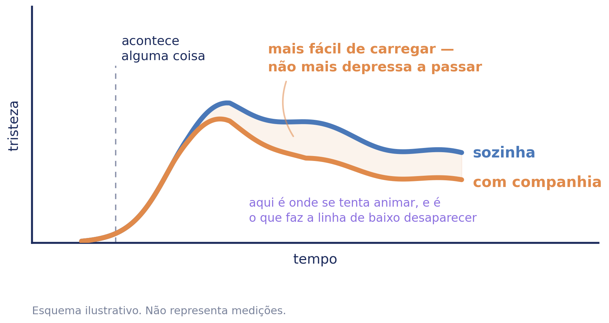

# Triste — Caderno de aplicação

**ColorHugs · Ricardina Correia** · Material licenciado · Versão 0.1 (rascunho)

Acompanha o baralho *Como Me Sinto?*. Trata de uma família — a tristeza — e das
seis coisas que lhe fazem companhia.

**Licença de saúde.** Este caderno destina-se a psicólogos e terapeutas. A
licença de educação dá acesso às sete famílias e às palavras derivadas, mas não
a este caderno: contém perguntas exploratórias e dinâmicas que abrem, e material
que abre precisa de quem o receba (D-154, D-163).

**Três camadas, um documento.** O caderno é de quem aplica. A secção de
orientação a pais também é — é o que dizer aos pais, não material para lhes
entregar. Só o anexo se entrega: folhas que se fecham sozinhas e que a família
leva.

---

## 1. Enquadramento

**Sem referências bibliográficas.** Esta secção é síntese, não revisão. As
afirmações estão escritas de forma a poderem ser verificadas uma a uma antes de
o material ser licenciado, e nenhuma referência é dada por verificada enquanto
o não estiver.

### A tristeza aparece cedo e serve para alguma coisa

A tristeza é das emoções que a criança reconhece mais cedo em si e nos outros, e
tem função: sinaliza uma perda. Alguma coisa que existia deixou de existir — uma
pessoa, um sítio, uma rotina, um objecto, ou uma ideia do que ia acontecer.

**A função da tristeza não é resolver a perda.** É travar, abrandar, e chamar
alguém. Ao contrário da zanga, que mobiliza para agir, a tristeza desmobiliza —
e essa quietude não é avaria, é o que a emoção faz.

**O objectivo do material não é reduzir a tristeza.** É dar-lhe nome, e mostrar
à criança que ela pode ser acompanhada.

### A tristeza não se tira, acompanha-se

É a distinção que sustenta tudo o resto neste caderno.

Na zanga, o erro mais comum é confundir a emoção com o comportamento — tratar a
zanga como se fosse a agressão. Na tristeza o erro é outro, e é do adulto:
**confundir consolo com animação**. *Não fiques triste. Olha, vamos fazer uma
coisa gira. Já passou.*

Nenhuma destas frases é má intenção. São todas tentativas de ajudar, e todas
comunicam a mesma coisa por baixo: *isso que sentes não devia estar aí*. A
criança aprende depressa, e o que aprende é a esconder.

**O que este material faz em vez disso** é perguntar o que lhe faz companhia. Não
o que a faz sentir melhor — o que lhe faz companhia. A diferença está no verbo, e
é toda.

### A regulação começa por ser de duas pessoas

Nos primeiros anos, a criança regula-se **com** um adulto e não sozinha. A
regulação autónoma constrói-se sobre essa experiência repetida, não em vez dela.

Nesta família isso pesa ainda mais do que na zanga, porque a coisa mais bem
apoiada de todo o conjunto — alguém ao pé, sem ter de falar — é a que menos
depende de técnica nenhuma e mais depende de haver ali uma pessoa.

### Onde é que esta família acaba

O arco do zangado fecha a olhar para a frente — *da próxima vez* e *compor as
coisas*. Aqui nenhuma das duas serve: uma pede à criança que resolva a tristeza,
e a outra não tem o que reparar.

**Mas acabar em descrição também é uma mensagem, e a mensagem seria *não há nada
que possas fazer*.** Não é isso que a distinção diz. Ela diz que a tristeza não
se tira — não diz que a criança fica sem papel nenhum.

O que fecha esta família é **pedir**. A ficha 3 descobre o que lhe faz
companhia; quase nada disso depende só dela, e uma criança que sabe que o que
ajuda é a mãe sentada ao lado sem dizer nada continua sem o ter, porque não sabe
pedi-lo — e o que os adultos fazem espontaneamente costuma ser a outra coisa.
**A última ficha fecha a distância entre o que ela descobriu e o que ela
recebe**, e fá-lo sem prometer nada: pedir não faz a tristeza passar, faz com que
a companhia chegue.

### As seis não são estratégias, e a diferença importa

Na zanga o passo do meio é *qual queres experimentar*, e as cinco opções são
formas de descer: sair, contar, respirar, mexer, ir ter com alguém. Fazem
sentido porque a activação sobe e tem de baixar.

**Quatro dessas cinco não sobrevivem a esta família.** Respirar devagar, contar
devagar e mexer o corpo, oferecidos a uma criança triste, são exactamente o
*vamos fazer uma coisa gira* que este caderno diz aos pais para não fazerem.
Só *ir ter com alguém* atravessa, e atravessa porque acompanha em vez de tirar.

Por isso a pergunta muda de natureza:

> **O que te faz companhia quando estás triste?**

Junta o *quem* e o *o quê* numa resposta só, que é como isto vive na cabeça de
uma criança — a manta e a mãe são a mesma resposta. E não promete nada, por isso
não pode falhar: uma criança que escolhe a manta e continua triste teve
exactamente o que pediu.

### Onde isto assenta

Psicologia do desenvolvimento, no que respeita à função da tristeza e à
passagem da regulação externa para a interna. Terapia focada nas emoções, no que
respeita a tratar a emoção como informação em vez de como coisa a gerir.
Abordagens sistémicas, no que respeita ao que acontece em casa à volta de uma
criança triste. E princípios de interacção pais-criança, no que respeita ao que
o adulto faz a seguir.

**Não é psicoterapia.** É material psicoeducativo, para ser usado por quem tem
formação para o enquadrar.

---

## 2. O que a criança encontra

Escolhe a carta do coração azul. Ouve ou lê uma linha sobre a tristeza em geral.
Escolhe uma de seis coisas que lhe fazem companhia, se quiser. Fica com um
desenho para pintar, no ecrã ou impresso.

**A linha que ela lê:**

> A tristeza costuma aparecer quando perdemos alguma coisa de que gostávamos, ou
> quando as coisas não foram como esperávamos. Instala-se devagar e fica um
> bocado. Com alguém ao pé, não passa mais depressa — mas é mais fácil de
> carregar.

**A última frase é a mais importante do material inteiro, e foi a mais difícil
de escrever.** A versão calorosa e falsa estava à mão: *falar faz passar*. A
literatura não a sustenta — é consistente quanto ao laço ficar mais forte e
equívoca quanto ao sentimento aliviar. E o custo de a escrever assim não se vê
logo: uma criança a quem se promete que falar faz passar, e que fala e continua
triste, conclui que fez mal ou que há qualquer coisa estragada nela.

*Mais fácil de carregar* é o que se pode prometer. E chega.

**As seis são oferecidas, não prescritas.** A criança escolhe, ou não escolhe
nenhuma e sai por *agora não*.

---

## 3. As seis, e o que as sustenta

O material distingue três níveis de sustentação. A distinção é do material, não
da literatura, e existe para que quem o usa saiba o que pode afirmar.

**A evidência separa três destas seis, e depois pára.** Vale a pena dizê-lo antes
do quadro, porque a alternativa era apresentar seis com o mesmo ar de coisa
apoiada, e três delas não o são.

### Alguém ao pé de mim, sem falar

**Base estabelecida, aplicação prática.** Que a criança pequena regula com um
adulto e não sozinha é das coisas mais consistentes da psicologia do
desenvolvimento, e é a melhor base de todo este conjunto. Que a **presença
silenciosa** em concreto seja a forma que ajuda é prática, não demonstrado.

É a opção que os adultos menos fazem, e por isso a que mais precisa de estar
desenhada. Um adulto ao pé de uma criança triste tende a preencher o silêncio, e
o que a criança recebe é uma conversa que não pediu.

**O desenho mostra-os virados para o mesmo lado, e não um para o outro.** Dois de
frente um para o outro são uma conversa, e a conversa já é a opção seguinte.

### Contar a alguém

**Base razoável, com uma ressalva que não pode perder-se.** É a única das cinco
da zanga que atravessa esta família.

A ressalva: a literatura sobre partilha social da emoção é consistente quanto ao
**laço** ficar mais forte e equívoca quanto ao **sentimento** aliviar. Isso não é
fraqueza da opção — **é a distinção desta família a chegar-nos pela evidência em
vez de por nós**.

Consequência prática para quem aplica: não dizer à criança que falar faz passar.
Dizer que com alguém é mais fácil de carregar.

### Uma coisa macia

**Base razoável, a verificar.** Objecto de conforto. A origem teórica é
psicodinâmica, que este material exclui como base — por isso é carregada aqui
como achado empírico e não como teoria.

**É a mais universal das seis**, e a única que não depende de haver alguém
disponível. Para uma criança que fica triste ao deitar, quando a casa já está
quieta, é muitas vezes a única que existe.

### Um bicho

**Prática.** E prática quer dizer *não foi bem estudado*, não quer dizer *não
funciona* — a literatura sobre companhia animal é fina e metodologicamente
frágil.

Está no conjunto porque, numa escolha que é da criança e não nossa, o que as
crianças dizem vale mais do que uma literatura fina. E as crianças dizem o cão
constantemente.

**O desenho não tem raça, coleira nem sinais**, para que o animal de nenhuma
criança seja contrariado por ele.

### Uma coisa que me lembra alguém

**Prática.** Uma representação de quem não está.

Está no conjunto por uma razão de vocabulário e não de evidência: é a única das
seis que dá casa ao **com saudades**, que é uma das quatro palavras finas desta
família e de outro modo não teria onde aterrar.

**Deliberadamente não é um memorial.** As figuras dentro da moldura estão calmas
e são banais, e não há vela, nem flores, nem fita ao canto. Uma criança com
saudades da avó que mudou de casa e uma criança com saudades da avó que morreu
escolhem a mesma figura, e o desenho não pode decidir qual delas é.

### Um bocadinho no meu sítio

**Prática.** Solidão construtiva.

Está no conjunto por necessidade estrutural: **sem ela, a actividade prescreve
companhia**, e uma criança triste que quer estar sozinha ficaria sem resposta
verdadeira no ecrã.

**Cuidado, e é o único do conjunto.** Se a criança escolheu *sozinho* como palavra
fina e escolheu depois esta figura, isso é informação e não é a ficha a funcionar
mal. Vale a pena reparar; não vale a pena corrigi-la.

---

## 4. O esquema dos dois caminhos

Não é a curva da activação, e não podia ser. A zanga sobe depressa e desce
devagar, e a tristeza não faz isso — desenhá-la com aquela forma diria uma coisa
falsa antes de se ler uma palavra.

O que este esquema mostra é **a mesma tristeza carregada de duas maneiras**:
sozinha e com companhia. Uma chegada, um fim.

**As duas linhas acabam juntas, de propósito.** Uma figura em que a companhia faz
a tristeza terminar mais cedo prometia exactamente o que a secção 2 diz que não
se pode prometer. O que difere é a altura a que se carrega, não o momento em que
acaba.

Os eixos não têm números nem escala. Um gráfico com marcas parece dados, e não há
dados nenhuns por trás desta forma.

Duas formas de o usar. Com a criança, mostrar as duas linhas e perguntar-lhe qual
das duas se parece mais com a semana dela. Com os pais, mostrá-lo inteiro antes
de qualquer conversa sobre *nós tentamos animá-la e não resulta*.

---

## 5. Perguntas exploratórias

Agrupadas pela figura que as puxa, porque uma pergunta solta serve menos do que
uma pergunta ligada ao que a criança acabou de escolher.

**Estas perguntas são para o clínico, não para o material da criança.** Na
aplicação nada é perguntado à criança além do que sente, precisamente porque uma
pergunta abre e uma criança sozinha não tem quem a receba. Aqui há.

### Depois de *alguém ao pé de mim*

- Quem é a pessoa que consegue estar ao pé sem dizer nada?
- E alguém que tenta ajudar a falar, e não resulta?
- Já houve alguma vez em que quiseste que alguém ficasse e não pediste?

### Depois de *contar a alguém*

- A quem contas primeiro?
- Há alguma coisa que nunca contaste a ninguém? *(não perguntar o que é)*
- Como é que sabes que podes contar a essa pessoa?
- E na escola, quem é?

### Depois de *uma coisa macia*

- O que é essa coisa? Desde quando?
- Vai contigo para fora de casa?
- Alguém já disse que já estás crescida para isso?

### Depois de *um bicho*

- Ele percebe quando estás triste? Como é que se vê?
- O que é que ele faz?
- Há algum animal de que tenhas saudades?

### Depois de *uma coisa que me lembra alguém*

- Quem é que essa coisa te lembra?
- Vês essa pessoa? Quando?
- Há mais alguma coisa tua que te lembre alguém?

### Depois de *um bocadinho no meu sítio*

- Onde é o teu sítio?
- Quando lá estás, gostas que saibam onde estás?
- Alguém já foi lá ter contigo? Ficaste contente ou preferias que não?

### Sobre cada uma das palavras finas

**Desiludido**

- O que é que tu achavas que ia acontecer?
- Alguém prometeu, ou foste tu que pensaste?
- Já aconteceu com a mesma pessoa mais do que uma vez?

> **A desilusão é a distância entre o que se esperava e o que houve.** Uma
> criança que se desilude muitas vezes ou espera de mais, ou está a viver com
> alguém que promete de mais. São coisas diferentes e o caderno não decide qual.

**Sozinho**

- Onde é que te sentes assim? E quando?
- Estás sozinha nessas alturas, ou está lá gente?
- Há sítios onde nunca te sentes assim?

> ***Sozinho* em português é duas coisas na mesma palavra**: estar sem ninguém e
> sentir-se só no meio de gente. A segunda é clinicamente muito mais pesada e a
> língua não a separa. **A pergunta que separa é *está lá gente?***, e é a que
> costuma ficar por fazer.

**Com saudades**

- De quem, ou de quê?
- Isso é de uma pessoa, de um sítio, ou de um tempo?
- Ter saudades faz-te sentir bem ou mal? Ou as duas?

> **A saudade não é só má, e é a única desta família que não é.** Uma criança que
> diz que tem saudades e sorri não se está a contradizer. Reparar se é de uma
> pessoa, de um sítio ou de um tempo: **uma criança com saudades de uma versão da
> própria família que já não existe está a dizer outra coisa** — e é frequente
> depois de uma separação, de uma mudança ou de um nascimento.

**Magoado**

- Quem é que te magoou?
- Essa pessoa sabe?
- Foi a fazer de propósito?

> ***Magoado* é a única das quatro que aponta para alguém.** É também a que em
> português serve para o corpo e para o resto, e uma criança pequena usa-a
> indiferentemente — vale a pena não assumir qual é. **Uma criança que diz que a
> pessoa não sabe está a dizer duas coisas ao mesmo tempo**: que foi magoada, e
> que não conseguiu dizê-lo.

### Sobre a tristeza em geral

- Quando é que ela costuma aparecer? De manhã, à noite, aos domingos?
- Como é que sabes que estás triste — o que é que o corpo faz primeiro?
- Alguém em tua casa fica triste? Como é que se percebe?
- O que é que as pessoas fazem que ajuda? E o que é que não ajuda nada?
- Há alguma coisa que gostavas que te dissessem e ninguém diz?

**O que não está aqui, e não deve estar:** perguntas sobre por que razão ela está
triste, feitas a direito. *Porque é que estás triste* põe a criança a
explicar-se, e uma criança que não sabe explicar inventa uma causa para
satisfazer quem perguntou. **É a razão pela qual a ficha 2 procura *quando* e não
*porquê*.**

---

## 6. Dinâmicas

Prática clínica. Nada nesta secção tem estudo que a sustente neste uso concreto.

### Com a criança

**As seis em cima da mesa.** Imprimir as seis páginas e pô-las à frente, sem
dizer nada. Deixar pegar.

**Ordenar por quem está lá.** Pedir que separe as que precisam de outra pessoa
das que consegue sozinha. Diz mais do que perguntar quem tem por perto.

**As quatro palavras em cima da mesa.** As quatro cartas finas e uma vez para
cada. Costuma faltar uma, e a que falta diz alguma coisa.

**A que já usa sem saber.** Perguntar qual destas coisas já faz às vezes.
Reconhecê-la vale mais do que aprender três novas.

**As duas linhas.** Mostrar o esquema e perguntar qual das duas se parece com a
semana dela.

**O que não ajuda.** Pedir-lhe que diga uma coisa que as pessoas dizem e que não
ajuda nada. É a dinâmica que costuma render mais, e é preciso não a defender —
se ela disser uma frase que o clínico também diz, isso é o material a funcionar.

### Com a família na sala

**Cada um escolhe a sua carta.** Incluindo os adultos. Muda o que se pode dizer a
seguir.

**Perguntar aos pais o que fazem quando ela está assim** — antes de ela dizer o
que ajuda. A distância entre as duas respostas é a intervenção.

**Mostrar o esquema aos pais.** É a peça que muda a conversa sobre *nós tentamos
animá-la e não resulta*, porque explica que a tentativa não é inútil, é a linha
errada.

**Quem consegue estar ao pé sem falar.** Perguntar à família quem é essa pessoa.
Às vezes não é nenhum dos pais, e isso é informação e não é acusação.

### Entre sessões

**Levar a página escolhida impressa**, para pintar durante a semana. O papel
fica; o ecrã não guarda nada.

**Uma coisa por semana que fez companhia.** Sem registo, sem tabela, sem
contagem — para contar na sessão seguinte.

**A mesma página numa sessão posterior.** O que interessa é o que mudou no que
ela diz, não no desenho.

---

## 7. Ficha clínica

Para as notas de quem aplica. **Não é instrumento, não pontua, e não se preenche
com a criança à frente como se fosse um teste.** Não substitui o processo
clínico: é uma folha de trabalho por sessão, para não se perder o que se viu.

**Sem nome.** Identifique por código ou pelo seu próprio processo — uma folha de
trabalho não precisa de identificar ninguém.

### Sessão

| Campo | Registo |
| --- | --- |
| Código / processo | |
| Data | |
| Sessão n.º | |
| Presentes | criança · adulto(s) · outro |

### O que foi usado

| Campo | Registo |
| --- | --- |
| Actividade digital | sim · não |
| Fichas aplicadas | |
| Páginas para colorir | |
| Carta entregue aos pais | sim · não |

### Observação

| Área | Registo |
| --- | --- |
| Figuras que escolheu | |
| Precisam de outra pessoa · consegue sozinha | |
| Alguma que já usava | |
| Palavras finas que reconheceu | |
| Palavra que evitou ou não conhecia | |
| Pessoas nomeadas — casa | |
| Pessoas nomeadas — fora de casa | |
| Quando disse que costuma aparecer | |
| O que disse que não ajuda | |
| Zona do corpo assinalada | |
| Postura durante a tarefa | |

### Leitura

| Campo | Registo |
| --- | --- |
| Hipótese de trabalho | |
| O que confirma | |
| O que contraria | |
| A verificar na próxima | |

### Plano

| Campo | Registo |
| --- | --- |
| Combinado com a criança | |
| Combinado com os adultos | |
| Material entregue | |
| Próxima sessão — foco | |

**Quatro blocos, e a ordem não é arbitrária:** o que se fez, o que se viu, o que
disso se lê, e o que fica combinado. A leitura fica separada da observação de
propósito — o que a criança disse e o que isso significa são coisas diferentes,
e misturá-las na mesma linha é como se perde a diferença.

---

## 8. As palavras derivadas

Dentro da família da tristeza, o vocabulário fino em português europeu é
**desiludido · sozinho · com saudades · magoado**.

Na aplicação, esta camada é opcional e só aparece depois de a actividade já ter
fechado, para que a criança que não lê não fique com uma versão incompleta. No
material profissional está incluída por inteiro.

**O que cada uma carrega:**

*Desiludido* é a única das quatro que olha para trás a partir de um futuro que
não houve. Não é perda do que existia, é perda do que se esperava — e é por isso
que serve tanto para a festa que foi desmarcada como para o adulto que faltou
outra vez.

*Sozinho* carrega duas coisas que a língua não separa: estar sem ninguém, e
sentir-se só no meio de gente. A segunda é clinicamente muito mais pesada, e uma
criança que diz *estou sozinha* pode estar em qualquer uma. **É o equivalente,
nesta família, à ambiguidade do *chateado* na zanga.**

*Com saudades* é a palavra que o português tem e a maioria das línguas não, e é a
única de toda a família que não é inteiramente má. Aponta para alguém ou alguma
coisa ausente e pode ser doce ao mesmo tempo que dói. Uma criança que diz que tem
saudades e sorri não se contradiz.

*Magoado* é a única que aponta para outra pessoa. É também a que em português
serve para o corpo e para o resto, e uma criança pequena usa-a sem distinguir.

**Uma tensão que o material assume**, e é diferente da da zanga. Ali, as três
palavras distinguiam-se em boa parte por intensidade, e havia o risco de
reintroduzir uma escala. Aqui não: estas quatro distinguem-se por **causa** e por
**alvo**, não por tamanho. *Sozinho* não é mais nem menos do que *magoado* — é
outra coisa. **É por isso que esta família é a que melhor sustenta a recusa de
ordenar por intensidade**: aqui essa ordenação nem sequer teria sentido.

**Falta uma palavra, e não é a mesma que falta na zanga.** Falta o nome da
tristeza que não tem causa. Uma criança que está triste e não sabe porquê não
tem palavra nenhuma para isso — e o que acontece a seguir é que inventa uma
causa, porque lhe perguntaram. *Melancolia* e *abatimento* são de adulto.
**A ausência desta palavra é a razão clínica pela qual este caderno pergunta
*quando* e não *porquê*.**

---

## 9. Fichas — orientação de aplicação

*(Gerada por `scripts/build-sheet-guides.py`. Ainda por escrever para esta
família.)*

---

## 10. Limites

**A evidência separa três das seis, e três ficam em prática.** A base de uma
chega a estabelecido — que a criança pequena regula com outra pessoa — e a
aplicação de nenhuma chega. As três de prática estão no conjunto por razões
declaradas: uma porque as crianças a escolhem, uma porque dá casa a uma palavra
fina, e uma porque sem ela o material prescreveria companhia.

**A melhor evidência do conjunto aponta para fora do ecrã**, e mais nesta família
do que na zanga. A coisa mais bem apoiada aqui presente é que uma criança triste
precisa de outra pessoa ao pé. Um material digital que o diz honestamente está a
apontar para si, e não para si próprio.

**Sobre contar a alguém, a ressalva outra vez.** É a única afirmação deste
caderno que seria fácil sobrevalorizar, e a única cuja sobrevalorização magoa
directamente uma criança. Consistente quanto ao laço, equívoca quanto ao alívio.

**Este material não distingue tristeza de depressão e não faz rastreio.** Não
tem escalas, não conta episódios e não produz nada comparável ao longo do tempo,
e nenhuma dessas ausências é um defeito a corrigir. Uma tristeza que não levanta,
que retira a criança de tudo o que gostava, que dura semanas, ou que aparece com
alterações do sono, do apetite ou do rendimento escolar, é matéria de avaliação
clínica e não deste caderno.

**Luto não está aqui.** Uma criança em luto precisa de mais do que este material,
e algumas das figuras podem tocar-lhe de perto — sobretudo a moldura. Isso não
desaconselha usá-las; desaconselha usá-las sem enquadramento.

**A pergunta *o que te faz companhia* pressupõe que exista alguma coisa.** Para
uma criança que não consegue nomear nada, as seis figuras podem ser uma folha em
branco com testemunhas. **Uma criança que não escolhe nenhuma está a dizer alguma
coisa**, e a saída *agora não* existe precisamente para que ela o possa dizer sem
ficar presa.

> **Antes de licenciar:** as referências que sustentam os níveis *estabelecido* e
> *razoável* devem ser verificadas e citadas nominalmente. Este rascunho descreve
> o estado da evidência sem as listar.

---

## 11. O que este material não faz

Não avalia, não classifica, não pontua e não guarda nada. Não há resposta certa e
não há escala de intensidade.

Não promete que falar faz passar. Nesta família isso não é uma omissão de
cortesia — é a afirmação central do material, e está escrita na linha que a
criança lê.

Nada do que a criança faz é visível aos pais e nada fica registado. O que pinta
no ecrã perde-se quando sai; o PDF descarrega-se em branco, para ser pintado à
mão.

Não serve para rastreio, triagem, classificação diagnóstica ou monitorização de
sintomas, e não produz dados comparáveis entre crianças nem ao longo do tempo.

---

## Anexo — o baralho

Trinta e uma cartas para imprimir, cortar e manusear: as sete famílias e as vinte
e quatro palavras finas. `docs/materials/baralho/baralho-pt-PT.pdf`.

**90 × 120 mm**, maiores do que uma carta de jogar, porque quem as segura são
mãos pequenas.

**O verso é igual em todas** — se variasse por família, uma criança distinguia uma
carta virada para baixo, e isso estraga em silêncio qualquer dinâmica que dependa
de virar uma.

**Sobre ordenar por intensidade**, ver a secção 8: nesta família a ordenação por
tamanho nem sequer tem sentido, porque as quatro palavras não se distinguem por
tamanho. Ordenações que este caderno propõe:

- **Por quem lá está.** Quais acontecem com gente à volta, quais sozinha.
- **Por facilidade de dizer.** Qual custa mais admitir em voz alta.
- **Por frequência.** Quais diz mais vezes, quais nunca disse.
- **Por reconhecimento.** Quais reconhece no corpo, quais só de nome.

## Anexo — as seis páginas para colorir

Para imprimir de uma vez: no banco · almofadas · no chão · a manta e o urso · o
cão · a prateleira. **As fichas da criança não estão em anexo** — estão no
caderno de exploração, que acompanha este.

Duas delas são partilhadas com a família da zanga e não estão repetidas aqui.

---

*Criado e revisto clinicamente por Ricardina Correia. Ferramenta psicoeducativa:
não diagnostica, não avalia e não substitui acompanhamento psicológico.*
