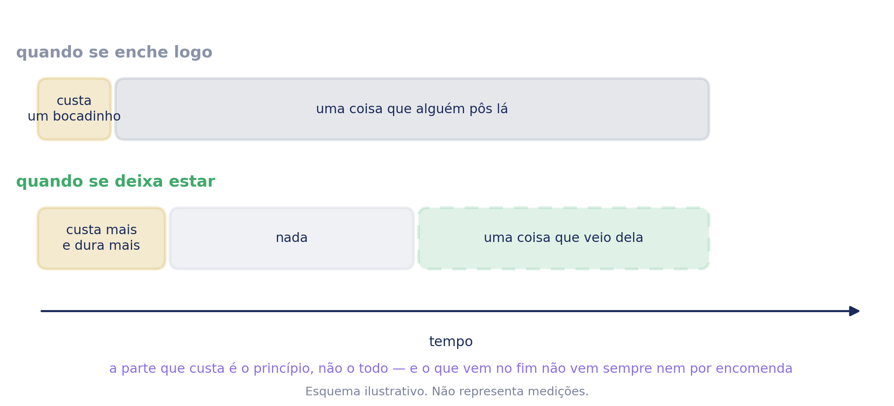

# Tédio — Caderno de aplicação

**ColorHugs · Ricardina Correia** · Material licenciado · Versão 0.1 (rascunho)

Acompanha o baralho *Como Me Sinto?*. Trata de uma família — o tédio — e de uma
distinção que o português apagou.

**Licença de saúde.** Este caderno destina-se a psicólogos e terapeutas. A
licença de educação dá acesso às sete famílias e às palavras derivadas, mas não
a este caderno.

**É o mais curto dos cinco, e isso é honesto.** As outras famílias tinham um
mecanismo a explicar — descer, acompanhar, aproximar, sair do círculo. Esta tem
sobretudo uma coisa a pedir aos adultos, e o resto do peso está nas palavras.

---

## 1. Enquadramento

**Sem referências bibliográficas.** Esta secção é síntese, não revisão.

### É a única família em que o sentimento, quase sempre, está bem

Das cinco famílias difíceis, esta é a que menos precisa de nós. A zanga precisa
de ser contida, a tristeza de ser acompanhada, o medo de ser atravessado, a
vergonha de ser vista. **O tédio precisa sobretudo de ser deixado em paz.**

Não é falta de nada. É sub-estimulação — o organismo a assinalar que o que está a
acontecer não chega — e é um sinal útil, não uma avaria de funcionamento.

### O tédio não é um problema para resolver

É a distinção que sustenta o resto.

**O erro desta família é encher.** O adulto ouve *estou aborrecida* e responde
com uma sugestão, uma tarefa, ou — quase sempre, hoje — um ecrã. Cada uma dessas
respostas resolve o minuto e retira à criança a coisa que o tédio lhe estava a
oferecer.

**Foi recusada a distinção mais óbvia**, que seria *tédio não é preguiça*. Defende
a criança de um rótulo e nomeia o erro do adulto, mas é uma frase sobre o que ela
não é: depois de a dizer, não sobra ficha nenhuma.

### O que sai do vazio

Uma criança que nunca se aborrece nunca precisa de inventar nada. É do tempo sem
nada marcado que costumam sair as soluções que são dela — o jogo inventado, a
história, a construção improvisada com o que havia à mão.

**Grau: razoável, e vale a pena dizê-lo com cuidado.** A literatura que liga
tédio a criatividade existe, é modesta e é sobretudo com adultos em laboratório.
É uma ideia bonita de mais para se afirmar sem reservas, e um caderno que a
afirme como estabelecida perde crédito no ponto onde mais precisava dele.

**O que se pode dizer com segurança é a metade negativa**, e essa chega: encher o
vazio imediatamente garante que nada sai dele.

### E o que não é tédio

Aqui está o trabalho clínico desta família, e está numa ficha e não no eixo.

**O português mete duas coisas muito diferentes dentro de *aborrecido*:**

- **não há nada para fazer** — sub-estimulação. Não se trata; suporta-se.
- **não consigo começar** — que pode ser ansiedade, humor baixo, evitamento de
  uma tarefa, dificuldade de atenção, ou uma tarefa mal calibrada.

**A segunda não é tédio, e é a única coisa desta família que pede intervenção.**
Uma criança que diz *estou aborrecida* pode estar em qualquer uma das duas, e
distingui-las é quase todo o valor clínico do material.

**Porque é ficha e não eixo.** Um eixo de *são duas coisas diferentes* deixaria
desprotegida a criança que se aborrece e inventa alguma coisa — que é o melhor
que o tédio faz. E um eixo de *deixa estar* sozinho daria à criança que não
consegue começar o conselho que era para a outra. **Um eixo e uma correcção**,
como no envergonhado.

### Onde isto assenta

Psicologia do desenvolvimento, no que respeita ao papel do tempo não estruturado.
Aprendizagem e motivação, no que respeita à sub-estimulação. E a clínica, no que
respeita a tudo o que se disfarça de tédio.

**Não é psicoterapia.**

---

## 2. O que a criança encontra

Escolhe a carta do coração caqui. Ouve ou lê uma linha sobre o tédio. **E depois
não lhe aparece nada.**

**A linha que ela lê:**

> Não faz mal nenhum não ter nada para fazer. Não tens de encontrar já uma coisa.

**As sugestões existem e estão escondidas atrás de um botão** que diz *ainda estou
aborrecida*. Só aparecem se ela o tocar.

**É a única família do produto cujo passo do meio tem de ser pedido**, e a razão é
de coerência: este caderno diz aos pais que encher o vazio imediatamente é o erro
desta família. Um ecrã que oferecesse uma grelha de coisas para fazer no mesmo
minuto em que ela diz que está aborrecida estaria a fazer exactamente isso — uma
linha abaixo de uma frase a dizer-lhe que não tem de encontrar já nada.

**O botão diz *ainda estou aborrecida*, e não *quero ideias*.** A segunda
formulação faz dela alguém que pede ajuda; a primeira deixa-a a descrever o que
sente, que é tudo o que esta actividade lhe pede em qualquer outra família.

**Quem inventa alguma coisa nunca chega às sugestões**, e sai pela mesma porta
que toda a gente. Nada lhe diz que fez melhor.

**As seis, quando aparecem, carregam dois eixos ao mesmo tempo.** O nome é o tipo
de coisa; uma linha por baixo diz de que precisa. Juntas cobrem os dois: cada
tipo aparece uma vez, e os materiais vão de *nada* a *outra pessoa*.

| | Precisa de |
| --- | --- |
| Não fazer nada de propósito | nada |
| Inventar uma história | nada |
| Fazer uma coisa com as mãos | papel, lápis, uma caixa de coisas |
| Mexer o corpo | espaço |
| Ir lá para fora | lá fora |
| Uma coisa com outra pessoa | alguém |

**A primeira é a mais importante das seis**, e é a que nenhuma lista de sugestões
costuma ter. Pôr *não fazer nada de propósito* dentro de uma lista de coisas para
fazer é a distinção da família dentro do próprio ecrã — e é a única figura que
diz à criança que aquilo em que ela já está é uma das opções.

---

## 3. As seis, e o que as sustenta

**Nenhuma destas seis tem base de evidência própria, e é a única família de que
isso se pode dizer.** São actividades, não estratégias, e não há literatura que
compare fazer uma coisa com as mãos com ir lá para fora. **Prática, todas.**

O que as torna um conjunto em vez de uma lista é a cobertura dos dois eixos, e é
só isso que se pode afirmar sobre elas.

**O que interessa clinicamente não é qual ela escolhe, é o quê:**

- **Se escolhe alguma coisa que precisa de outra pessoa** e não a tem
  disponível, é informação sobre a casa e não sobre o tédio.
- **Se só escolhe as que precisam de material**, vale a pena ver se ela consegue
  imaginar alguma coisa sem objectos.
- **Se escolhe *não fazer nada de propósito*** — reparar se é escolha ou
  desistência. As duas parecem-se e não são a mesma coisa.
- **Se não carrega no botão de todo**, isso é a resposta mais interessante que a
  actividade pode dar, e o material foi feito para a tornar possível.

---

## 4. O esquema do tempo

**A quarta forma diferente em cinco famílias.** A da zanga é um episódio no
tempo; a da tristeza é um episódio carregado de duas maneiras; a do medo é uma
série de episódios; a da vergonha é um círculo. Aqui o que importa é **o que
preenche um bocado de tempo vazio**, por isso a figura é uma tira de tempo com
blocos dentro.

Duas tiras. Na primeira, o vazio é preenchido mal aparece e o desconforto acaba
logo — e nada que seja dela chega a acontecer. Na segunda, o desconforto dura
mais um bocado, há um pedaço de nada, e depois uma coisa que veio dela.

**O último bloco está desenhado a tracejado de propósito.** Não se pode prometer
que a invenção aparece — não aparece sempre, e a evidência é fina. A linha do
clínico di-lo: *a parte que custa é o princípio, não o todo — e o que vem no fim
não vem sempre nem por encomenda.*

Duas formas de o usar. Com a criança, tapar a segunda tira e perguntar o que acha
que acontece se ninguém puser nada. Com os pais, mostrar as duas antes de
qualquer conversa sobre ecrãs.

---

## 5. Perguntas exploratórias

**São para o clínico, não para o material da criança.**

### Depois de *não fazer nada de propósito*

- Já ficaste a olhar para o tecto de propósito?
- O que é que te vem à cabeça quando estás assim?
- Alguém em tua casa acha isso mal?

### Depois de *inventar uma história* e *fazer uma coisa com as mãos*

- Isso foi ideia tua ou alguém te disse?
- Precisaste de alguma coisa que não tinhas?

### Depois de *uma coisa com outra pessoa*

- Quem é que costuma estar disponível?
- E quando não está ninguém, o que fazes?

### Sobre cada uma das palavras finas

**Aborrecido**

- Isso é não haver nada para fazer, ou é não conseguires começar?
- Há coisas que gostavas de fazer e mesmo assim não começas?

> **É a pergunta que parte esta família em duas.** Se a resposta for *não consigo
> começar*, saímos do tédio — e o que se procura a seguir é o que está a impedir.

**Farto**

- Farto de quê, ou de quem?
- Quanto tempo é que aguentaste antes de ficares assim?

> ***Farto* tem alvo, e o tédio não tem.** É a palavra desta família que está mais
> perto da zanga: é saturação de alguma coisa concreta, e muitas vezes de uma
> pessoa. **Se ela nomeia sempre o mesmo, é o mesmo achado da ficha do
> *irritado*.**

**Impaciente**

- Estás à espera de quê?
- É pior quando sabes quanto tempo falta, ou quando não sabes?

> **A impaciência é tédio com uma coisa à vista.** É a única das quatro que tem
> fim previsto, e por isso a única em que o material pode dizer honestamente que
> passa.

**Sem vontade**

- Não te apetece nada, ou não te apetece isso?
- Há quanto tempo é assim?
- Houve alguma coisa de que gostavas e de que já não gostas?

> ***Sem vontade* é a que mais precisa de atenção, e a que menos parece.**
> Recusa geral, prolongada, e perda de interesse por coisas de que gostava não é
> tédio. **A terceira pergunta é a que separa uma tarde de uma coisa a avaliar**,
> e a secção 10 diz o que fazer com a resposta.

### Sobre o tédio em geral

- Quando é que costumas ficar aborrecida?
- O que é que costuma acontecer a seguir?
- Alguém te dá logo uma coisa para fazer?
- Já te aconteceu inventares uma coisa por não haver nada?

---

## 6. Dinâmicas

Prática clínica.

### Com a criança

**Dez minutos de nada.** Na sessão, sem ecrã e sem material, e ver o que
acontece. É a dinâmica mais desconfortável deste caderno **para quem aplica**, e
é a que mais rende.

**Duas pilhas.** Escrever seis situações e separar: as que são *não há nada para
fazer* e as que são *não consigo começar*.

**A coisa que inventei.** Procurar uma vez em que ela tenha inventado alguma
coisa por não haver nada. Costuma haver, costuma estar esquecida, e vale mais do
que qualquer explicação nossa.

**Tapar a segunda tira.** Mostrar só o que acontece quando se enche logo, e
perguntar o que acha que vem do outro lado.

**As quatro palavras em cima da mesa.** Uma vez para cada. A que falta diz
alguma coisa.

### Com a família na sala

**O que fazem quando ela diz que está aborrecida.** Perguntar antes de dizer
seja o que for. A resposta costuma ser imediata e costuma ser um ecrã, e é melhor
que apareça deles.

**O tédio dos adultos.** Perguntar-lhes quando foi a última vez que estiveram sem
nada para fazer. Muda a conversa, e é raro alguém ter uma resposta pronta.

**Combinar um bocado por dia.** Um período curto, combinado, sem ecrã e sem
actividade proposta. Curto de propósito — o que se aguenta é o que se repete.

### Entre sessões

**Levar a página escolhida impressa.**

**Reparar no que aparece.** Sem registo e sem tabela: só notar se apareceu
alguma coisa dela durante a semana, para contar na sessão seguinte.

---

## 7. Ficha clínica

Para as notas de quem aplica. **Não é instrumento, não pontua**, e não substitui
o processo clínico.

**Sem nome.** Identifique por código ou pelo seu próprio processo.

### Sessão

| Campo | Registo |
| --- | --- |
| Código / processo | |
| Data | |
| Sessão n.º | |
| Presentes | criança · adulto(s) · outro |

### O que foi usado

| Campo | Registo |
| --- | --- |
| Actividade digital | sim · não |
| Carregou em *ainda estou aborrecida* | sim · não |
| Fichas aplicadas | |
| Páginas para colorir | |
| Carta entregue aos pais | sim · não |

### Observação

| Área | Registo |
| --- | --- |
| Figuras que escolheu | |
| Precisam de material · de outra pessoa · de nada | |
| *Não há nada* ou *não consigo começar* | |
| Palavras finas que reconheceu | |
| *Sem vontade* — duração, abrangência | |
| Perda de interesse em coisas de que gostava | sim · não |
| O que a família faz quando ela diz | |
| Tempo sem ecrã referido pela família | |
| Postura durante a tarefa | |

### Leitura

| Campo | Registo |
| --- | --- |
| Hipótese de trabalho | |
| O que confirma | |
| O que contraria | |
| A verificar na próxima | |

### Plano

| Campo | Registo |
| --- | --- |
| Combinado com a criança | |
| Combinado com os adultos | |
| Material entregue | |
| Próxima sessão — foco | |

**Três linhas são próprias desta família.** *Carregou no botão* — porque não
carregar é a resposta mais interessante que a actividade dá. *Não há nada ou não
consigo começar* — porque decide se há alguma coisa a fazer. E *perda de interesse
em coisas de que gostava*, que é a única linha deste caderno que aponta para fora
dele.

---

## 8. As palavras derivadas

Dentro da família do tédio, o vocabulário fino em português europeu é
**aborrecido · farto · impaciente · sem vontade**.

*Aborrecido* é a palavra que a criança realmente diz, e a que carrega as duas
coisas que este caderno separa. É também a palavra que dá nome à família em
português — e a razão pela qual a família se chama *Tédio* no material dos
adultos e *Aborrecido* na carta que a criança vê.

*Farto* tem alvo. É saturação de alguma coisa concreta — a tarefa, o irmão, o
mesmo jogo — e é a que está mais perto da zanga.

*Impaciente* é tédio com uma coisa à vista. **É a única das quatro que tem fim
previsto**, e a única em que se pode dizer honestamente que passa.

*Sem vontade* **não pertence bem aqui e está aqui porque a língua a põe perto**.
Pode ser tédio, e pode ser humor baixo. É a única palavra de todas as sete
famílias que aponta directamente para uma avaliação.

**A tensão desta família.** No zangado as palavras distinguiam-se por intensidade;
no triste por causa e alvo; no assustado por tempo; no envergonhado por alcance.
**Aqui distinguem-se por *o que falta*:** ao aborrecido falta estímulo, ao farto
falta variedade, ao impaciente falta tempo, e ao sem vontade pode faltar outra
coisa qualquer. Ordená-las por tamanho não teria sentido nenhum.

**Falta uma palavra, e é a falta mais reveladora das sete famílias: não há em
português uma palavra de criança para o tempo vazio que é bom.** *Ócio*,
*sossego* e *lazer* são de adulto. Tudo o que uma criança tem para dizer que não
tem nada para fazer é negativo — e é difícil valorizar uma coisa para a qual a
única palavra disponível é uma queixa.

---

## 9. Fichas — orientação de aplicação

Uma página por ficha. **As fichas em si não estão aqui**: vivem no caderno de
exploração da criança, e uma licença dá acesso aos dois ficheiros — imprimi-las
duas vezes só produz duas cópias que podem ficar desencontradas.

Cada página diz para que serve a ficha, como se aplica, o que perguntar, o que
notar e o que evitar, e tem espaço para o registo da sessão em que foi usada.
**Por código, nunca por nome.**

### Ficha 1 — O Tédio

| Orientação | |
| --- | --- |
| **Idade** | 6 aos 9 anos |
| **Base** | Psicoeducação. Sem nível próprio: reformula em linguagem infantil o que a secção 1 sustenta. |
| **Objectivo** | Tirar a pressão antes de mais nada, e mostrar-lhe a tira do tempo. Nada para preencher. |
| **Como aplicar** | Ler com ela em voz alta. Tapar a segunda tira e perguntar o que acha que acontece se ninguém puser nada. |
| **A notar** | **Não faz mal nenhum não ter nada para fazer** costuma surpreender — muitas crianças ouvem o contrário todos os dias, e algumas ficam visivelmente aliviadas. |
| **Cuidados** | **Não prometer que a ideia vem.** A página diz *às vezes*, e esse *às vezes* é para ser lido como está. Uma criança que espera e não inventa nada não falhou. |

**Questões de exploração**

- O que achas que acontece se ninguém puser nada?
- Já tinhas pensado que estar aborrecida podia servir para alguma coisa?

**Dinâmicas a partir desta ficha**

| | |
| --- | --- |
| 4–6 | **A carta e o espelho.** Pôr a carta do aborrecido ao lado do espelho da primeira página e perguntar se são parecidos. |
| 6–8 | **Tapar a segunda tira.** Mostrar só o que acontece quando se enche logo e pedir que adivinhe o outro lado. |
| 8–9 | **Explicar aos pais.** Pedir que explique a tira a um adulto presente, por palavras dela. |
| qualquer | **Guardar para o fim.** Reler esta página na última sessão e perguntar se mudou alguma coisa em casa. |

| Aplicação | |
| --- | --- |
| Código / processo | |
| Idade | |
| Data | |

| Registo da sessão |
| --- |
| |
| |
| |

### Ficha 2 — Quando é que ele aparece

| Orientação | |
| --- | --- |
| **Idade** | 5 aos 8 anos |
| **Base** | Comportamental — padrão temporal. **Razoável** nesta forma. |
| **Objectivo** | Ver as horas que se repetem, e sobretudo **o que acontece a seguir**: se foi ela que arranjou alguma coisa ou se lhe deram. |
| **Como aplicar** | Uma linha de cada vez. A última coluna é a que interessa e é a que costuma ficar mais pobre — insistir um pouco nessa. |
| **A notar** | **Se a resposta é sempre *deram-me*.** Não é acusação a ninguém: é a medida da acomodação desta família, e aparece sem se ter perguntado pelos adultos. |
| **Cuidados** | Não transformar a tabela numa lista de queixas sobre a casa. O que se procura é o padrão, não o culpado. |

**Questões de exploração**

- Foste tu que arranjaste, ou foi alguém que te deu?
- Há alguma hora do dia em que aparece mais?
- E aos fins-de-semana?

**Dinâmicas a partir desta ficha**

| | |
| --- | --- |
| 5–7 | **A linha do dia.** Desenhar o dia numa tira de papel e marcar com um traço as horas em que aparece. |
| 6–8 | **Quem arranjou.** Ao lado de cada linha, marcar com um sinal se foi ela ou se foi outra pessoa. A coluna aparece sozinha. |
| 8–9 | **O domingo.** Olhar só para os fins-de-semana. É onde o tempo não estruturado vive, e onde os padrões são mais claros. |
| com a família | **O que fazemos quando ela diz.** Perguntar aos adultos antes de lhes dizer seja o que for. A resposta costuma ser imediata e costuma ser um ecrã. |

| Aplicação | |
| --- | --- |
| Código / processo | |
| Idade | |
| Data | |

| Registo da sessão |
| --- |
| |
| |
| |

### Ficha 3 — O que me apetece agora

| Orientação | |
| --- | --- |
| **Idade** | 4 aos 7 anos |
| **Base** | Sem base própria. **Prática.** São actividades, não estratégias, e não há literatura que compare umas com as outras. |
| **Objectivo** | Mostrar o que há, sem pedir que escolha. **A primeira conta como as outras**, e é a que dá a esta página o seu sentido. |
| **Como aplicar** | Pôr as seis à frente e não sugerir nenhuma. Se ela não assinalar nada, deixar assim. |
| **A notar** | De que precisam as que ela escolhe — material, outra pessoa, ou nada. **Se só escolhe as que precisam de material**, vale a pena ver se consegue imaginar alguma coisa sem objectos. **E se escolhe *não fazer nada de propósito*, reparar se é escolha ou desistência**: as duas parecem-se e não são o mesmo. |
| **Cuidados** | **Nenhuma é melhor do que outra**, e não fazer nada não é a pior. Se a caixa do fim ficar vazia, não a preencher por ela. |

**Questões de exploração**

- Alguma destas já fazes sem ninguém te dizer?
- Há alguma que precisa de uma coisa que não tens?
- Há alguma tua que não esteja aqui?

**Dinâmicas a partir desta ficha**

| | |
| --- | --- |
| 4–6 | **As seis em cima da mesa.** Imprimir e deixar pegar, sem dizer nada. |
| 4–7 | **A caixa de coisas.** Pedir que traga na próxima sessão uma caixa com cinco coisas de casa que não sejam brinquedos. |
| 6–9 | **Precisa de quê.** Separar as figuras em três pilhas: as que precisam de material, de outra pessoa, e de nada. Contar as pilhas com ela. |
| com a família | **Os adultos adivinham.** Escolherem as que acham que são dela antes de verem. A diferença é a conversa. |

| Aplicação | |
| --- | --- |
| Código / processo | |
| Idade | |
| Data | |

| Registo da sessão |
| --- |
| |
| |
| |

### Ficha 4 — A coisa que eu inventei

| Orientação | |
| --- | --- |
| **Idade** | 6 aos 9 anos |
| **Base** | Sem base própria. **Prática**, e ligada à afirmação graduada como razoável na secção 1. |
| **Objectivo** | Encontrar uma prova dela própria de que já saiu alguma coisa do tempo vazio. **Substitui a ficha de externalização**, que esta família não tem. |
| **Como aplicar** | Desenho primeiro, perguntas depois. Se ela não se lembrar de nada, perguntar aos adultos presentes — costumam lembrar-se de coisas que ela esqueceu. |
| **A notar** | Se foi sozinha ou acompanhada, e se voltou a fazer. **Uma criança que não se lembra de nada não é uma criança sem invenção** — é mais provável que seja uma criança cujo tempo vazio nunca durou o suficiente. |
| **Cuidados** | Não elogiar a invenção como desempenho. É uma prova, não uma prenda — e transformá-la em elogio põe pressão exactamente onde esta família a quer tirar. |

**Questões de exploração**

- Foi ideia tua ou de mais alguém?
- Voltaste a fazer?
- O que estavas a fazer mesmo antes de te lembrares disso?

**Dinâmicas a partir desta ficha**

| | |
| --- | --- |
| 4–6 | **Fazer outra vez.** Se a coisa inventada ainda for possível, fazê-la ali na sessão. |
| 6–8 | **A invenção dos adultos.** Perguntar-lhes o que inventavam quando eram pequenos e não havia nada. Costuma abrir a sala. |
| 8–9 | **Onde é que estavas.** Procurar o sítio e a hora em que essas coisas costumam aparecer. Costuma ser sempre o mesmo sítio. |
| com a família | **Guardar em vez de deitar fora.** Se a invenção existir em objecto, combinar guardá-la. Uma prova guardada vale mais do que uma prova contada. |

| Aplicação | |
| --- | --- |
| Código / processo | |
| Idade | |
| Data | |

| Registo da sessão |
| --- |
| |
| |
| |

### Ficha 5 — As palavras finas

| Orientação | |
| --- | --- |
| **Idade** | 7 aos 9 anos |
| **Base** | Vocabulário emocional. **Razoável** quanto a diferenciação; o conjunto é do ColorHugs. |
| **Objectivo** | Mostrar que as quatro se distinguem **pelo que falta**: estímulo, variedade, tempo, ou outra coisa. |
| **Como aplicar** | Uma caixa por palavra, sem ordem. |
| **A notar** | Se usa *aborrecido* para tudo. É frequente e é o que abre a ficha seguinte. |
| **Cuidados** | **Não ordenar por tamanho.** E se ela preencher *sem vontade* com facilidade e as outras com dificuldade, isso não é vocabulário — é sinal, e vê-se na ficha 9. |

**Questões de exploração**

- Qual destas dizes mais vezes?
- Qual delas passa depressa e qual é que fica?
- Alguma delas é de uma pessoa em concreto?

**Dinâmicas a partir desta ficha**

| | |
| --- | --- |
| 7–9 | **Pelo que falta.** Pôr as quatro cartas por ordem daquilo que falta em cada uma: estímulo, variedade, tempo, outra coisa. |
| 7–9 | **Qual passa.** Separar as quatro em *passa depressa* e *fica*, e ver onde ela põe cada uma. |
| 8–9 | **A palavra que falta.** Perguntar-lhe que palavra usaria para o tempo vazio que é bom. **Não há nenhuma em português, e a resposta dela costuma valer mais do que a nossa.** |
| com a família | **Cada um escolhe a sua.** Os adultos escolhem também, e dizem uma vez em que a sentiram. |

| Aplicação | |
| --- | --- |
| Código / processo | |
| Idade | |
| Data | |

| Registo da sessão |
| --- |
| |
| |
| |

### Ficha 6 — Aborrecido

| Orientação | |
| --- | --- |
| **Idade** | 7 aos 9 anos |
| **Base** | Distinção entre sub-estimulação e dificuldade de iniciação. **Razoável** quanto às duas serem coisas diferentes; a ficha é prática. |
| **Objectivo** | **É a única ficha desta família que leva a algum lado.** Separar *não há nada para fazer* de *não consigo começar*. |
| **Como aplicar** | A primeira caixa antes da segunda, sempre — a primeira é fácil e é ela que torna a segunda perguntável. A terceira faz-se devagar. |
| **A notar** | **A terceira caixa é a ficha toda.** O que ela nomeia como impedimento aponta o caminho: cansaço, medo de correr mal, não saber por onde, a tarefa ser grande de mais, ou nada que ela consiga dizer. |
| **Cuidados** | **Se a resposta for *não consigo começar*, saímos do tédio**, e o resto deste caderno não é o material indicado. O que vier a seguir depende do que estiver a impedir, e isso não está aqui. |

**Questões de exploração**

- Isso é não haver nada, ou é não conseguires começar?
- Há coisas de que gostas e que mesmo assim não começas?
- O que é que te parece estar a impedir?

**Dinâmicas a partir desta ficha**

| | |
| --- | --- |
| 7–9 | **Duas pilhas.** Escrever seis situações e separá-las: *não havia nada* e *havia e não comecei*. |
| 7–9 | **A tarefa cortada.** Pegar numa coisa que ela não consegue começar e cortá-la ao meio, e outra vez ao meio, até o primeiro passo caber num minuto. |
| 8–9 | **O que muda quando muda.** Procurar uma vez em que ela conseguiu começar aquilo mesmo, e ver o que estava diferente. |
| com a família | **Não é preguiça.** Se a resposta for *não consigo começar*, dizê-lo explicitamente aos adultos à frente dela. **É a correcção do rótulo, e tem de ser ouvida por ela.** |

| Aplicação | |
| --- | --- |
| Código / processo | |
| Idade | |
| Data | |

| Registo da sessão |
| --- |
| |
| |
| |

### Ficha 7 — Farto

| Orientação | |
| --- | --- |
| **Idade** | 6 aos 9 anos |
| **Base** | Saturação. **Prática** nesta forma. |
| **Objectivo** | Ver que farto tem alvo e o tédio não tem — e encontrar o alvo dela. |
| **Como aplicar** | A segunda pergunta, sobre quanto tempo aguentou, dá muitas vezes mais do que a primeira. |
| **A notar** | **Se nomeia sempre a mesma pessoa, é o achado da ficha do *irritado* noutra família** — e vale a pena não o tratar como tédio. Se nomeia sempre a mesma tarefa, pode ser calibração. |
| **Cuidados** | Não corrigir o alvo. *Mas tu gostas do teu irmão* fecha a conversa e ensina que aquilo não se diz. |

**Questões de exploração**

- Farto de quê, ou de quem?
- Quanto tempo aguentaste antes de ficares assim?
- Há alguma coisa que faça isso ficar melhor?

**Dinâmicas a partir desta ficha**

| | |
| --- | --- |
| 6–8 | **Quanto tempo dá.** Cronometrar, a brincar, quanto tempo ela aguenta a coisa de que se farta. Costuma ser mais do que ela pensa. |
| 6–9 | **Variar em vez de acabar.** Procurar uma pequena mudança que faça a mesma coisa aguentar-se mais tempo. |
| 8–9 | **Farto de quem.** Se o alvo for uma pessoa, trabalhar isso como relação e não como tédio. |
| com a família | **A tarefa que se repete.** Se o alvo for uma tarefa doméstica ou escolar, ver com os adultos se está bem calibrada. |

| Aplicação | |
| --- | --- |
| Código / processo | |
| Idade | |
| Data | |

| Registo da sessão |
| --- |
| |
| |
| |

### Ficha 8 — Impaciente

| Orientação | |
| --- | --- |
| **Idade** | 6 aos 9 anos |
| **Base** | Espera e tolerância à demora. **Razoável** quanto à ligação com a previsibilidade; a ficha é prática. |
| **Objectivo** | É o tédio com uma coisa à vista. **A única das quatro que tem fim previsto**, e a única em que se pode dizer honestamente que passa. |
| **Como aplicar** | A segunda pergunta — saber ou não saber quanto falta — é a que rende, e a resposta costuma surpreender os adultos. |
| **A notar** | Quase todas as crianças aguentam melhor uma espera medida do que uma indefinida. **Se ela disser o contrário, vale a pena perceber porquê.** |
| **Cuidados** | Não transformar isto em treino de espera. A ficha descreve; não é um exercício de tolerância. |

**Questões de exploração**

- Do que é que costumas estar à espera?
- É pior quando sabes quanto falta, ou quando não sabes?
- O que fazes enquanto esperas?

**Dinâmicas a partir desta ficha**

| | |
| --- | --- |
| 6–8 | **Uma espera medida.** Usar um relógio ou uma ampulheta numa espera pequena e ver se muda alguma coisa. |
| 6–9 | **A espera mais difícil.** Nomear a que custa mais, e ver se é longa ou se é indefinida. Quase sempre é indefinida. |
| 8–9 | **O que os adultos fazem.** Perguntar como é que as pessoas grandes esperam. Costuma ser com o telemóvel, e vale a pena que seja ela a dizê-lo. |
| com a família | **Dizer quanto falta.** Combinar dizer-lhe o tempo em vez de *já vai*. É pequeno e muda muito. |

| Aplicação | |
| --- | --- |
| Código / processo | |
| Idade | |
| Data | |

| Registo da sessão |
| --- |
| |
| |
| |

### Ficha 9 — Sem vontade

| Orientação | |
| --- | --- |
| **Idade** | 7 aos 9 anos |
| **Base** | Distinção entre tédio e desinteresse persistente. **Estabelecido** quanto às duas serem coisas diferentes; a ficha é de notar, não de trabalhar. |
| **Objectivo** | **Notar, não tratar.** Três perguntas: é de uma coisa ou de tudo, perdeu interesse por coisas de que gostava, e há quanto tempo. |
| **Como aplicar** | Sem pressa e sem alarme. As três perguntas fazem-se pela ordem em que estão, e a segunda é a que mais importa. |
| **A notar** | **Perda de interesse por coisas de que gostava é a resposta que muda o que se faz a seguir**, mais do que a duração. Recusa generalizada, prolongada, e que não varia com o sítio nem com a companhia, não é tédio. |
| **Cuidados** | **É a única ficha de criança das sete famílias que não se fecha sobre si mesma**: acaba a dizer-lhe para falar com um adulto em quem confie. Isso é deliberado — aquilo que ela pode estar a apanhar não é coisa que uma folha feche. Se as respostas apontarem nesse sentido, o caminho é avaliação e não mais fichas. |

**Questões de exploração**

- É de uma coisa em especial, ou é de tudo?
- Há alguma coisa de que gostavas muito e de que já não te apetece?
- Há quanto tempo é assim?

**Dinâmicas a partir desta ficha**

| | |
| --- | --- |
| 7–9 | **A lista do que gostava.** Escrever cinco coisas de que gostava há um ano e marcar as que ainda lhe apetecem. |
| 7–9 | **Varia com o sítio?** Ver se é igual em casa, na escola e em casa de outra pessoa. **Se for igual em todo o lado, não é tédio.** |
| 8–9 | **Há quanto tempo.** Situar o princípio num acontecimento, se houver. Muitas vezes há, e ninguém tinha ligado as duas coisas. |
| com a família | **Perguntar-lhes o mesmo.** O que é que ela deixou de querer fazer, e desde quando. **Se as respostas coincidirem, isto sai deste caderno** e passa a ser avaliação. |

| Aplicação | |
| --- | --- |
| Código / processo | |
| Idade | |
| Data | |

| Registo da sessão |
| --- |
| |
| |
| |

---

## 10. Limites

**Este material não faz rastreio, e nesta família isso importa de forma
particular.** *Sem vontade* prolongado, recusa generalizada, e sobretudo **perda
de interesse por coisas de que a criança gostava**, não são tédio. São matéria de
avaliação clínica, e a ficha do *sem vontade* existe para os notar, não para os
trabalhar.

**Tédio constante e em todo o lado não é tédio.** O tédio normal tem contexto —
uma tarde, uma aula, uma espera. Um tédio que não varia com o sítio nem com a
companhia é outra coisa.

**Tédio na escola tem pelo menos três explicações e este caderno não as
distingue:** matéria abaixo do que a criança consegue, matéria acima, e
dificuldade de atenção. As três produzem a mesma queixa e pedem coisas
diferentes.

**A ligação entre tédio e criatividade é razoável e não estabelecida.** O caderno
não a afirma como facto e a figura não a promete. Um material que a vendesse como
certa estaria a fazer com uma ideia bonita o que este projecto recusa fazer com
todas as outras.

**Nada aqui é sobre ecrãs enquanto tal.** O ecrã aparece porque é o que hoje
preenche o vazio mais depressa, não porque este caderno tenha uma posição sobre
tempo de ecrã — que é matéria de outro tipo de aconselhamento e de outra
literatura.

> **Antes de licenciar:** as referências que sustentam os níveis devem ser
> verificadas e citadas nominalmente.

---

## 11. O que este material não faz

Não avalia, não classifica, não pontua e não guarda nada.

**Não propõe uma actividade sem lhe ser pedido**, e essa é a única coisa que este
material faz ao contrário de todos os outros do género.

Não diz à criança que o tédio a vai tornar criativa.

Não trata do tempo de ecrã, não distingue tédio de desmotivação persistente, e
não serve para rastreio nem para monitorização.

---

## Anexo — o baralho

Trinta e uma cartas. `docs/materials/baralho/`. **90 × 120 mm**, verso igual em
todas.

**Sobre ordenar por intensidade**, ver a secção 8: aqui a diferença é *o que
falta*. Ordenações que este caderno propõe:

- **Pelo que falta.** Estímulo, variedade, tempo, ou outra coisa.
- **Por quanto dura.** Qual passa depressa e qual fica.
- **Por quem lá está.**
- **Por reconhecimento.** Quais reconhece no corpo, quais só de nome.

## Anexo — as seis páginas para colorir

Para imprimir de uma vez: no tapete · os bonecos · na mesa · aos saltos · lá fora
· o jogo. **As fichas da criança não estão em anexo.**

Uma delas é partilhada com a família da zanga.

---

*Criado e revisto clinicamente por Ricardina Correia. Ferramenta psicoeducativa:
não diagnostica, não avalia e não substitui acompanhamento psicológico.*
