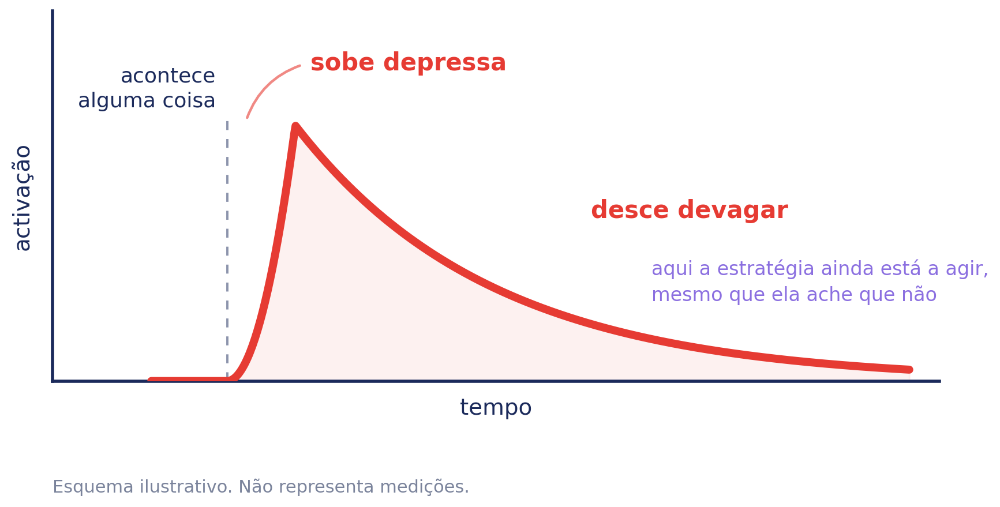

# Zangado — Caderno de aplicação

**ColorHugs · Ricardina Correia** · Material licenciado · Versão 0.1 (rascunho)

Acompanha o baralho *Como Me Sinto?*. Trata de uma família — a zanga — e das
cinco estratégias que lhe estão associadas.

**Licença de saúde.** Este caderno destina-se a psicólogos e terapeutas. A
licença de educação dá acesso às sete famílias e às palavras derivadas, mas não
a este caderno: contém perguntas exploratórias e dinâmicas que abrem, e material
que abre precisa de quem o receba (D-154, D-163).

**Três camadas, um documento.** O caderno é de quem aplica. A secção de
orientação a pais também é — é o que dizer aos pais, não material para lhes
entregar. Só o anexo se entrega: folhas que se fecham sozinhas e que a família
leva.

---

## 1. Enquadramento

**Sem referências bibliográficas.** Esta secção é síntese, não revisão. As
afirmações estão escritas de forma a poderem ser verificadas uma a uma antes de
o material ser licenciado, e nenhuma referência é dada por verificada enquanto
o não estiver.

### A zanga é normal, precoce e útil

A zanga aparece cedo no desenvolvimento — antes da vergonha, antes da culpa — e
tem função: sinaliza um objectivo bloqueado ou algo que se percebe como
injusto. Uma criança que se zanga está a assinalar que alguma coisa importa.

**O objectivo do material não é reduzir a zanga.** É dar-lhe nome e dar-lhe
alternativas de resposta.

### Zanga não é agressão

É a distinção que sustenta tudo o resto. A zanga é uma emoção; a agressão é um
comportamento. Uma criança pode estar furiosa e não bater, e pode bater sem
estar particularmente zangada.

Confundi-las leva ao erro mais comum na prática e nos materiais: tratar a
emoção como o problema a eliminar. Aqui, o que se trabalha é o que se faz a
seguir.

### A regulação começa por ser de duas pessoas

Nos primeiros anos, a criança regula-se **com** um adulto e não sozinha. A
regulação autónoma constrói-se sobre essa experiência repetida, não em vez
dela. É a razão pela qual *ir ter com alguém* é a única estratégia deste conjunto
cujo mecanismo é graduado como estabelecido — e a razão pela qual um material digital, sozinho, tem um tecto
que convém reconhecer.

### As cinco estratégias não são arbitrárias

Distribuem-se por famílias de regulação emocional reconhecidas, e é isso que
as torna um conjunto em vez de uma lista:

| Estratégia | Família de regulação |
| --- | --- |
| Sair dali | selecção e modificação da situação |
| Ir ter com alguém | modificação da situação, e apoio social |
| Contar devagar, olhar para outra coisa | desvio da atenção |
| Respirar devagar | modulação da resposta |
| Mexer o corpo | modulação da resposta |

**Falta uma família, de propósito: a mudança cognitiva.** A reavaliação — olhar
para a situação de outra maneira — é das estratégias mais estudadas em adultos
e está desenvolvimentalmente fora do alcance de uma criança pequena. A sua
ausência é uma escolha, não um esquecimento, e é um dos sítios onde o material
poderá crescer para idades mais altas.

### Onde isto assenta

Psicologia do desenvolvimento, no que respeita à trajectória da zanga e à
passagem da regulação externa para a interna. Aprendizagem socioemocional, no
que respeita a nomear e a distinguir estados. E a tradição comportamental e
contextual, no que respeita a trabalhar a resposta em vez do sentimento.

**Não é psicoterapia.** É material psicoeducativo, para ser usado por quem
tem formação para o enquadrar.

---

## 2. O que a criança encontra

Escolhe a carta do coração vermelho. Ouve ou lê uma linha sobre a zanga em
geral. Escolhe uma de cinco estratégias, se quiser. Fica com um desenho para
pintar, no ecrã ou impresso.

**A linha que ela lê:**

> A zanga costuma aparecer quando alguma coisa parece injusta, ou quando
> queríamos muito uma coisa e não conseguimos. Chega depressa, e demora mais
> tempo a ir-se embora do que a chegar.

A segunda frase não é enfeite. A activação sobe depressa e desce devagar, e uma
criança que sabe isso não conclui que a estratégia falhou por não resultar em
cinco segundos.

**As estratégias são oferecidas, não prescritas** — *qual queres experimentar?*
A criança escolhe, ou não escolhe nenhuma e sai.

---

## 3. As cinco estratégias, e o que as sustenta

**Os três níveis de sustentação usados neste caderno.** A graduação é do
material e não da literatura, e existe para que quem o usa saiba o que pode
afirmar e o que não pode.

| | O que significa |
| --- | --- |
| **Estabelecido** | O mecanismo está descrito por investigação replicada e há consenso sobre a sua direcção. Pode ser afirmado a pais e a professores como facto. |
| **Razoável** | O mecanismo geral tem sustentação; **a aplicação concreta deste material não foi testada**. Apresenta-se como fundamentado, nunca como demonstrado. |
| **Prática** | Não há investigação directa nesta aplicação. Está no material por experiência clínica e por coerência com o que os outros níveis sustentam. **Não se afirma eficácia.** |

**Um nível diz respeito à afirmação, e não à utilidade.** Uma opção graduada como
prática pode ser a mais útil numa sessão concreta; o que a graduação limita é o
que se diz sobre ela.

### Ir ter com alguém e dizer

**Base estabelecida, aplicação razoável.** Que a criança pequena regula *com* um
adulto, e não sozinha, é dos achados mais consistentes da investigação sobre regulação emocional na
infância. Que este gesto concreto ajude naquele momento é razoável, não
demonstrado.

Foi discutido retirá-la, por o produto não poder garantir que há alguém
disponível — e uma sugestão que falha ser pior do que nenhuma. Manteve-se com
uma leitura diferente: **a estratégia ensina que há sempre alguém a quem ir**,
em casa ou na escola, e isso vale mesmo num minuto em que a sala está vazia. O
desenho segue essa leitura: não duas pessoas em concreto, mas a ideia de que
alguém existe.

### Sair dali

**Razoável.** Modificar a situação em vez de a aguentar por dentro.

### Olhar para outra coisa, contar devagar

**Razoável, e provavelmente a mais forte deste conjunto aos quatro e cinco
anos.** O desvio da atenção é a estratégia de regulação com maior número de estudos em
crianças em idade pré-escolar e escolar — é o mecanismo que aparece na investigação clássica sobre
adiamento da gratificação.

**Contar é um sítio onde pôr a atenção, não um exercício.** O desenho da mão não
tem números, deliberadamente: uma criança que ainda não conta ficaria com uma
tarefa em vez de um descanso.

### Respirar devagar, a soltar o ar mais tempo do que a apanhá-lo

**Razoável em adultos, prática em crianças.** É a estratégia mais frequente em
produtos para crianças e a que tem menos investigação nesta idade: a
fundamentação fisiológica é sólida e os estudos disponíveis são sobretudo com
adultos.

Está graduada abaixo do que a maioria assume, e é a que mais beneficiaria de
verificação independente.

### Mexer o corpo — correr, saltar, subir

**Prática.** Sem estudo que a sustente neste uso.

**Mexer não é bater.** Bater numa almofada ou em qualquer coisa está
explicitamente excluído do material: a literatura sobre catarse aponta no
sentido contrário — descarregar assim aumenta a activação em vez de a baixar. É
a ideia mais difundida sobre lidar com a raiva, e é a que o material recusa.

---

## 4. O esquema da activação

Serve para mostrar à criança, aos pais, ou a ambos. Explica a coisa que quase
todas as famílias interpretam mal: **a estratégia continua a agir depois de a
criança achar que falhou.**

Os eixos não têm números nem escala, de propósito. Um gráfico com marcas parece
dados, e não há dados nenhuns por trás desta forma — é uma ilustração de uma
ideia, não uma medição.

Duas formas de o usar. Com a criança, tapar a parte da direita e perguntar-lhe
o que acha que vem a seguir. Com os pais, mostrá-lo inteiro antes de qualquer
conversa sobre *ela não me ouve quando está assim*.

---

## 5. Perguntas exploratórias

Agrupadas pela estratégia que as puxa, porque uma pergunta solta serve menos do
que uma pergunta ligada ao que a criança acabou de escolher.

**Estas perguntas são para o clínico, não para o material da criança.** Na
aplicação nada é perguntado à criança além do que sente, precisamente porque
uma pergunta abre e uma criança sozinha não tem quem a receba. Na sessão, essa
condição está satisfeita.

### Depois de *ir ter com alguém*

- Quem é a pessoa a quem vais quando isso acontece?
- E na escola, quem é?
- Já houve alguma vez em que quiseste ir e não foste? O que é que aconteceu?
- Como é que essa pessoa percebe que estás zangada?

### Depois de *sair dali*

- Para onde é que vais quando queres sair?
- Há algum sítio em casa que seja mesmo teu?
- O que é que acontece se não puderes sair?

### Depois de *contar devagar*

- Onde é que costumas estar quando ficas assim?
- É mais fácil em casa ou na escola?
- Quanto tempo achas que demora até passar?

### Depois de *respirar devagar*

- Já experimentaste? Como correu?
- Notaste alguma coisa diferente no corpo?

### Depois de *mexer o corpo*

- Quando estás cheia de energia, o que é que te apetece fazer?
- Já aconteceu essa energia sair de uma maneira que depois não gostaste?

### Sobre cada uma das palavras finas

A exploração não é só da família. Cada palavra derivada abre um caminho
diferente, e é aí que o vocabulário deixa de ser lista e passa a ser
instrumento.

**Chateado**

- Quando dizes que estás chateada, o que é que costuma ter acontecido?
- Há vezes em que dizes chateada e por dentro estás triste?
- E vezes em que estás chateada com alguém, e outras em que estás chateada
  com uma coisa?

*Atenção:* é a palavra mais ambígua do português europeu. Serve para zanga
leve, para tristeza e para tédio. Vale a pena não assumir qual das três é.

**Irritado**

- Quando ficas irritada, é com alguém ou com alguma coisa?
- É sempre com a mesma pessoa?
- Há alguma coisa que se repete e que te irrita de cada vez?

*Atenção:* é a que mais frequentemente tem um alvo próximo e repetido — o
irmão, o ruído, a tarefa. Se a criança nomear sempre a mesma pessoa, isso é o
achado.

**Furioso**

- Já estiveste furiosa alguma vez? Consegues contar-me essa vez?
- O que é que os outros fizeram quando viram?
- Alguém percebeu que era mesmo grande?

*Atenção:* uma criança usa esta palavra para pedir que se leve a sério, mais
do que para medir. A pergunta útil é sobre o que aconteceu a seguir, não sobre
o tamanho.

**Entre as três**

- Qual delas dizes mais vezes em casa? E na escola?
- Há alguma que nunca disseste em voz alta?
- Alguém em tua casa usa alguma destas palavras?

### Sobre a zanga em geral

- O que é que costuma acontecer antes?
- Como é que sabes que estás zangada — o que é que o corpo faz primeiro?
- Alguém em tua casa fica zangado? Como é que se percebe?
- O que é que os outros fazem que ajuda? E o que é que não ajuda nada?

**O que não está aqui, e não deve estar:** perguntas sobre por que razão ela
escolheu determinada carta, ou o que a escolha revela. A leitura é do clínico e
depende de tudo o resto que ele sabe.

---

## 6. Dinâmicas

Prática clínica. Nada nesta secção tem estudo que a sustente neste uso concreto.

### Com a criança

**As cinco em cima da mesa.** Imprimir as cinco páginas e pô-las à frente, sem
dizer nada. Deixar pegar. Muitas crianças escolhem sozinhas antes de haver
pergunta nenhuma.

**Ordenar por facilidade, não por qualidade.** Pedir que as ponha da que lhe
parece mais fácil para a mais difícil. É uma pergunta sobre ela, e não sobre as
estratégias — e evita a resposta que ela pensa que queremos ouvir.

**As três palavras em cima da mesa.** Escrever chateado, irritado e furioso em
três papéis e pedir que conte uma vez para cada. Costuma faltar uma das três, e
a que falta diz alguma coisa.

**A que já usa sem saber.** Perguntar qual destas coisas já faz às vezes.
Costuma haver uma, e reconhecê-la vale mais do que aprender três novas.

**Tapar a curva.** Mostrar o esquema até ao pico e perguntar o que vem a
seguir.

### Com a família na sala

**Cada um escolhe a sua carta.** Incluindo os adultos. Muda o que se pode dizer
a seguir.

**Quem é a pessoa a quem se vai** — e insistir para lá de casa. Uma criança que
só consegue nomear uma pessoa está numa situação diferente de uma que nomeia
três.

**A página do banco com os pais presentes.** Perguntar-lhes como sabem que ela
está zangada, antes de ela dizer.

### Entre sessões

**Levar a página escolhida impressa**, para pintar durante a semana. O papel
fica; o ecrã não guarda nada.

**A mesma página numa sessão posterior.** O que interessa é o que mudou no que
ela diz sobre a estratégia, não no desenho.

---

## 7. Ficha clínica

Para as notas de quem aplica. **Não é instrumento, não pontua, e não se preenche
com a criança à frente como se fosse um teste.** Não substitui o processo
clínico: é uma folha de trabalho por sessão, para não se perder o que se viu.

**Sem nome.** Identifique por código ou pelo seu próprio processo — uma folha de
trabalho não precisa de identificar ninguém.

### Sessão

| Campo | Registo |
| --- | --- |
| Código / processo | |
| Data | |
| Sessão n.º | |
| Presentes | criança · adulto(s) · outro |

### O que foi usado

| Campo | Registo |
| --- | --- |
| Actividade digital | sim · não |
| Fichas aplicadas | |
| Páginas para colorir | |
| Carta entregue aos pais | sim · não |

### Observação

| Área | Registo |
| --- | --- |
| Estratégias que escolheu | |
| Ordenou como mais fácil | |
| Alguma que já usava | |
| Palavras finas que reconheceu | |
| Palavra que evitou ou não conhecia | |
| Pessoas nomeadas — casa | |
| Pessoas nomeadas — fora de casa | |
| O que disse acontecer antes | |
| Zona do corpo assinalada | |
| Postura durante a tarefa | |

### Leitura

| Campo | Registo |
| --- | --- |
| Hipótese de trabalho | |
| O que confirma | |
| O que contraria | |
| A verificar na próxima | |

### Plano

| Campo | Registo |
| --- | --- |
| Combinado com a criança | |
| Combinado com os adultos | |
| Material entregue | |
| Próxima sessão — foco | |

**Quatro blocos, e a ordem não é arbitrária:** o que se fez, o que se viu, o que
disso se lê, e o que fica combinado. A leitura fica separada da observação de
propósito — o que a criança disse e o que isso significa são coisas diferentes,
e misturá-las na mesma linha é como se perde a diferença.

## 8. As palavras derivadas

Dentro da família da zanga, o vocabulário fino em português europeu é
**chateado · irritado · furioso**.

Na aplicação, esta camada é opcional e só aparece depois de a actividade já ter
fechado, para que a criança que não lê não fique com uma versão incompleta. No
material profissional está incluída por inteiro: quem aplica precisa do
vocabulário todo, mesmo que a criança encontre só uma parte.

**O que cada uma carrega:**

*Chateado* é a palavra mais usada por uma criança portuguesa e a mais ambígua
que existe: serve para zanga leve, para tristeza e para tédio. Uma criança que
diz *estou chateada* pode estar em qualquer uma das três, e vale a pena não
assumir. A sua colocação nesta família continua por decidir.

*Irritado* é zanga com um alvo, geralmente próximo e repetido — o irmão, o
ruído, a tarefa que não sai.

*Furioso* é a palavra que uma criança usa quando quer que se perceba que não é
uma zanga pequena. Vale menos como medida e mais como pedido de que se leve a
sério.

**Uma tensão que o material assume.** Estas três palavras distinguem-se em boa
parte por intensidade, e o produto excluiu deliberadamente qualquer escala de
intensidade — nada de *a minha zanga é 5*. A diferença é que aqui a criança
**nomeia** em vez de **graduar**: escolhe uma palavra que já existe na sua
língua, não um número numa régua. O efeito prático é próximo, e é honesto
reconhecê-lo.

**Falta uma palavra, e é a que mais falta faz.** A causa mais frequente da
zanga infantil é a injustiça, e o português europeu não tem para isso um termo
que uma criança de sete anos diga: *injustiçado* e *revoltado* são de adulto.
Esta família fica incompleta exactamente no ponto que a origina.

---

## 9. Fichas — orientação de aplicação

Uma página por ficha. **As fichas em si não estão aqui**: vivem no caderno de
exploração da criança, e uma licença dá acesso aos dois ficheiros — imprimi-las
duas vezes só produz duas cópias que podem ficar desencontradas.

Cada página diz para que serve a ficha, como se aplica, o que perguntar, o que
notar e o que evitar, e tem espaço para o registo da sessão em que foi usada.
**Por código, nunca por nome.**

### Ficha 1 — A Zanga

| Orientação | |
| --- | --- |
| **Idade** | 6 aos 9 anos |
| **Base** | Psicoeducação. Sem nível de evidência próprio: reformula em linguagem infantil o que a secção 1 sustenta. |
| **Objectivo** | Dar à criança um enquadramento antes de lhe pedir seja o que for. Três afirmações e um esquema; nada para preencher. |
| **Como aplicar** | Ler com ela, em voz alta, sem parar para perguntar. É a única página do caderno que não faz perguntas. |
| **A notar** | Se alguma das três afirmações a surpreende. *A zanga não é má* costuma ser a que provoca reacção — em crianças que já ouviram o contrário muitas vezes. |
| **Cuidados** | Não transformar a leitura numa lição. Se ela quiser falar a meio, a página fica onde está. |

**Questões de exploração**

- Já tinhas pensado que a zanga podia servir para alguma coisa?
- Alguma coisa aqui te parece diferente do que te costumam dizer?

**Dinâmicas a partir desta ficha**

| | |
| --- | --- |
| 4–6 | **A carta e o espelho.** Pôr a carta do zangado ao lado do espelho da primeira página e perguntar se são parecidos. Serve para ligar a personagem a ela própria sem ter de o dizer. |
| 6–8 | **Ler ao contrário.** Ler as três frases e perguntar, a cada uma, se alguém em casa diria o contrário. Traz o discurso da família para a sala sem perguntar pela família. |
| 8–9 | **Explicar a outra pessoa.** Pedir que explique a curva a um adulto presente, por palavras dela. Quem explica percebe melhor do que quem ouve. |
| qualquer | **Guardar para o fim.** Reler esta página na última sessão da família e perguntar se mudou alguma coisa. |

| Aplicação | |
| --- | --- |
| Código / processo | |
| Idade | |
| Data | |

| Registo da sessão |
| --- |
| |
| |
| |

### Ficha 2 — O que acontece antes

| Orientação | |
| --- | --- |
| **Idade** | 7 aos 9 anos |
| **Base** | Comportamental — análise de antecedentes. **Estabelecido** quanto à ligação entre situação e resposta; a aplicação nesta forma é razoável. |
| **Objectivo** | Procurar o padrão que a criança ainda não vê. Não é inventário: cinco linhas chegam. |
| **Como aplicar** | Uma linha de cada vez, sem ordem cronológica. Com crianças mais novas, o adulto escreve enquanto ela conta — que é o que acontece de facto numa sessão. |
| **A notar** | Se as linhas se parecem umas com as outras. **Um padrão que se repete é o achado; cinco situações sem nada em comum também é um achado, e diferente.** |
| **Cuidados** | Não corrigir a versão dela dos acontecimentos. O que interessa aqui é o que ela viu, não o que se passou. |

**Questões de exploração**

- O que estava a acontecer mesmo antes?
- Onde é que estavas? Quem é que lá estava?
- O que é que o corpo fez primeiro?
- Olha para as cinco: há alguma coisa parecida?

**Dinâmicas a partir desta ficha**

| | |
| --- | --- |
| 6–8 | **Só desenhos.** O adulto escreve as colunas e a criança desenha uma cara ou um sítio em cada linha. A tabela funciona sem uma palavra. |
| 7–9 | **Ordenar por facilidade.** Depois de preenchida, pedir que aponte a linha mais fácil de contar e a mais difícil. É informação sobre ela, não sobre as situações. |
| 8–9 | **A linha que falta.** Perguntar se há uma situação que não escreveu. A que fica de fora costuma ser a que interessa. |
| com a família | **A mesma tabela pelos pais.** Cada um preenche a sua e comparam-se. As diferenças são o material da conversa. |

| Aplicação | |
| --- | --- |
| Código / processo | |
| Idade | |
| Data | |

| Registo da sessão |
| --- |
| |
| |
| |

### Ficha 3 — A Zanga vem visitar

| Orientação | |
| --- | --- |
| **Idade** | 4 aos 7 anos |
| **Base** | Externalização, terapia narrativa. **Prática** — muito usada com crianças, com pouca investigação controlada. |
| **Objectivo** | Separar a criança do problema. A diferença é gramatical e é toda: não *estou zangada*, mas *a Zanga veio*. |
| **Como aplicar** | Dar a folha e o lápis e dizer pouco. O desenho é dela; as perguntas vêm depois de estar feito. |
| **A notar** | Se a Zanga desenhada é assustadora ou engraçada. As duas coisas são úteis e dizem coisas diferentes. Reparar também no tamanho relativo — uma Zanga que enche a moldura não é o mesmo que uma que cabe num canto. |
| **Cuidados** | **Externalizar não é responsabilizar a Zanga pelo que a criança fez.** Se ela disser *foi a Zanga que bateu*, a resposta é que a Zanga apareceu **e** a mão foi dela. |

**Questões de exploração**

- De que tamanho é? De que cor?
- Faz barulho?
- Como é que sabes que ela está a chegar?
- O que é que a faz ir embora?
- Ela vem mais a alguns sítios do que a outros?

**Dinâmicas a partir desta ficha**

| | |
| --- | --- |
| 4–6 | **Dar-lhe voz.** Perguntar o que a Zanga diria se pudesse falar, e escrever isso ao lado do desenho. |
| 4–7 | **Onde é que ela mora.** Pedir que desenhe onde a Zanga fica quando não está com ela. Externaliza um passo mais. |
| 6–8 | **A Zanga de outra pessoa.** Pedir que desenhe a Zanga de um adulto da casa. Costuma dizer mais do que a dela. |
| 7–9 | **O que a Zanga quer.** Perguntar o que a Zanga está a tentar conseguir. Aproxima da função sem usar a palavra. |

| Aplicação | |
| --- | --- |
| Código / processo | |
| Idade | |
| Data | |

| Registo da sessão |
| --- |
| |
| |
| |

### Ficha 4 — As palavras finas

| Orientação | |
| --- | --- |
| **Idade** | 7 aos 9 anos |
| **Base** | Vocabulário emocional. **Razoável** quanto ao valor de distinguir estados; a lista é do material e é por língua. |
| **Objectivo** | Apresentar as três palavras juntas e ligar cada uma a um momento real. |
| **Como aplicar** | As três cartas ficam à vista. Um momento por caixa, escrito, desenhado ou assinalado. |
| **A notar** | Se as três situações são com a mesma pessoa. E se alguma caixa fica vazia — a palavra que falta diz alguma coisa. |
| **Cuidados** | **A seta não é uma escala.** Diz que a zanga às vezes passa de uma palavra para outra; não pede à criança que se classifique. Se ela começar a graduar-se, voltar ao nome. |

**Questões de exploração**

- Qual destas dizes mais vezes? Em casa e na escola.
- Há alguma que nunca disseste em voz alta?
- Alguém em tua casa usa alguma destas palavras?

**Dinâmicas a partir desta ficha**

| | |
| --- | --- |
| 7–9 | **Ordenar por frequência.** Pôr as três cartas da mais dita à menos dita. Não é intensidade: é uso. |
| 7–9 | **Uma semana a marcar.** Levar as três cartas e assinalar a que usou cada dia. Voltar com o registo. |
| 8–9 | **As palavras dos outros.** Perguntar qual das três usaria a mãe, o pai, o professor. Mapeia o vocabulário da casa. |
| com a família | **Cada um escolhe a sua.** Os adultos escolhem também, e dizem uma vez em que a sentiram. |

| Aplicação | |
| --- | --- |
| Código / processo | |
| Idade | |
| Data | |

| Registo da sessão |
| --- |
| |
| |
| |

### Ficha 5 — Chateado

| Orientação | |
| --- | --- |
| **Idade** | 7 aos 9 anos |
| **Base** | Vocabulário emocional, específico do português europeu. **Prática.** |
| **Objectivo** | Desambiguar. *Chateado* serve para zanga leve, para tristeza e para tédio, e a criança que o diz pode estar em qualquer uma das três. |
| **Como aplicar** | As três cartas-mãe à frente dela — zangado, triste, aborrecido. Primeiro a última vez que disse; depois uma vez em que foi outra. |
| **A notar** | Se escolhe sempre a mesma. **Uma criança que usa *chateado* só para tristeza tem menos vocabulário de zanga do que parecia; uma que o usa só para zanga pode não estar a nomear a tristeza de todo.** |
| **Cuidados** | Não sugerir qual das três era. A escolha tem de ser dela, ou a ficha mede a nossa hipótese. |

**Questões de exploração**

- Quando dizes chateada, o que é que costuma ter acontecido?
- Há vezes em que dizes chateada e por dentro estás triste?
- É mais com alguém ou com alguma coisa?

**Dinâmicas a partir desta ficha**

| | |
| --- | --- |
| 7–9 | **Três montes.** Escrever cinco situações em papéis e pedir que as distribua pelas três cartas-mãe. Mostra-lhe a ambiguidade sem lha explicar. |
| 7–9 | **Trocar a palavra.** Escolher uma situação e procurar outra palavra que sirva melhor que *chateado*. |
| 8–9 | **Quando é que não serve.** Perguntar se há vezes em que dizer chateada não chega. Abre para as outras duas. |
| com a família | **O que ouvem quando ela diz.** Perguntar aos adultos o que percebem quando ela diz chateada. Muitas vezes percebem a errada. |

| Aplicação | |
| --- | --- |
| Código / processo | |
| Idade | |
| Data | |

| Registo da sessão |
| --- |
| |
| |
| |

### Ficha 6 — Irritado

| Orientação | |
| --- | --- |
| **Idade** | 7 aos 9 anos |
| **Base** | Comportamental — identificação de gatilhos repetidos. **Razoável.** |
| **Objectivo** | Encontrar o que se repete. A irritação costuma ter um alvo próximo e recorrente. |
| **Como aplicar** | Três perguntas curtas: o que irrita quase sempre, onde acontece mais, o que já ajudou. |
| **A notar** | **Se nomeia sempre a mesma pessoa, isso é o achado**, e muda a conversa seguinte — com ela e provavelmente com quem a traz. |
| **Cuidados** | Se o alvo repetido for um adulto de casa, a ficha passa a ser material de sessão e não de trabalho para casa. |

**Questões de exploração**

- O que é que te irrita quase sempre?
- Acontece mais em casa ou na escola?
- É sempre com a mesma pessoa?
- Há alguma coisa que já tenhas experimentado e que ajudou?

**Dinâmicas a partir desta ficha**

| | |
| --- | --- |
| 7–9 | **O mapa do dia.** Marcar numa linha do dia as horas em que a irritação costuma aparecer. Costuma haver duas. |
| 7–9 | **O que muda quando muda.** Procurar uma vez em que aquilo que costuma irritar não irritou, e ver o que estava diferente. |
| 8–9 | **Três coisas que já tentou.** Listar e classificar cada uma como *ajudou*, *não ajudou*, *não sei*. |
| com a família | **Combinar um sinal.** Escolher com os adultos um gesto que ela possa fazer antes de a irritação crescer. |

| Aplicação | |
| --- | --- |
| Código / processo | |
| Idade | |
| Data | |

| Registo da sessão |
| --- |
| |
| |
| |

### Ficha 7 — Furioso

| Orientação | |
| --- | --- |
| **Idade** | 7 aos 9 anos |
| **Base** | Narrativo. **Prática.** |
| **Objectivo** | Trabalhar o depois, não o tamanho. A criança usa esta palavra para pedir que se leve a sério. |
| **Como aplicar** | Uma vez contada, quem percebeu, o que aconteceu quando passou. |
| **A notar** | **Se alguém percebeu.** Uma criança que diz que ninguém percebeu está a dizer duas coisas ao mesmo tempo. |
| **Cuidados** | Não pedir a intensidade nem comparar com as outras duas palavras. A pergunta útil é o que se seguiu. |

**Questões de exploração**

- Consegues contar-me uma vez em que estiveste furiosa?
- Alguém percebeu que era mesmo grande? Quem?
- O que aconteceu depois de passar?

**Dinâmicas a partir desta ficha**

| | |
| --- | --- |
| 6–8 | **Desenhar o depois.** Em vez de contar a vez, desenhar o momento em que já tinha passado. |
| 7–9 | **Quem estava lá.** Marcar na folha quem estava presente e quem percebeu. Nem sempre são os mesmos. |
| 8–9 | **A versão do outro.** Contar a mesma vez do ponto de vista de quem lá estava. Exigente, e só quando a relação já aguenta. |
| com a família | **O que fizeram a seguir.** Perguntar aos adultos o que fizeram quando passou, não durante. |

| Aplicação | |
| --- | --- |
| Código / processo | |
| Idade | |
| Data | |

| Registo da sessão |
| --- |
| |
| |
| |

### Ficha 8 — Da próxima vez

| Orientação | |
| --- | --- |
| **Idade** | 6 aos 9 anos |
| **Base** | Resolução de problemas. **Das mais bem estudadas** para dificuldades de comportamento nesta idade — gerar alternativas e escolher uma. |
| **Objectivo** | Escolher uma resposta a experimentar, e registar depois como correu. |
| **Como aplicar** | Duas partes, em momentos diferentes: a escolha na sessão, o resultado depois de experimentar. |
| **A notar** | **Se escolhe uma das cinco ou inventa outra.** Uma ideia dela vale mais do que qualquer uma das nossas: é a única que já vem com a situação dela dentro. |
| **Cuidados** | **Nunca perguntar *o que é que devias ter feito*.** É uma repreensão disfarçada de ficha, e a criança percebe à primeira. A pergunta é para a frente. Também não é reavaliação cognitiva — é o que faz a seguir, não olhar para a situação de outra maneira. |

**Questões de exploração**

- Da próxima vez, o que queres experimentar?
- Achas que dá para fazer isso onde costuma acontecer?
- Precisas de alguém para te ajudar a fazer isso?

**Dinâmicas a partir desta ficha**

| | |
| --- | --- |
| 6–8 | **Experimentar na sala.** Fazer ali mesmo a estratégia escolhida, sem estar zangada. Ensaiar a frio é metade do trabalho. |
| 6–9 | **Onde é que dá.** Verificar se a estratégia escolhida é possível na escola, no carro, na sala de aula. Muitas não são. |
| 8–9 | **Plano B.** Escolher uma segunda para quando a primeira não der. |
| com a família | **Combinar quem ajuda.** Se a estratégia é *ir ter com alguém*, essa pessoa tem de saber que foi escolhida. |

| Aplicação | |
| --- | --- |
| Código / processo | |
| Idade | |
| Data | |

| Registo da sessão |
| --- |
| |
| |
| |

### Ficha 9 — Compor as coisas

| Orientação | |
| --- | --- |
| **Idade** | 6 aos 9 anos |
| **Base** | Reparação. **Prática**: sem investigação nesta aplicação. A fundamentação decorre da distinção entre culpa e vergonha. |
| **Objectivo** | Escolher o que dizer a quem ficou magoado, e prever o caso de a outra pessoa não querer ouvir já. |
| **Como aplicar** | **Não no dia.** Enquanto a activação desce, compor ainda não é possível. É material para a sessão seguinte. |
| **A notar** | Se escreve sobre o que fez ou sobre o que sentiu. **Uma criança que só consegue explicar-se ainda não chegou à outra pessoa** — e isso é informação, não falha. |
| **Cuidados** | **A palavra *desculpa* não aparece na ficha, e não deve ser sugerida.** Um pedido de desculpa mandado produz obediência, não reparação. |

**Questões de exploração**

- O que queres dizer a essa pessoa?
- E se ela não quiser falar já, o que podes dizer mais tarde?
- Há alguma coisa que queiras fazer em vez de dizer?

**Dinâmicas a partir desta ficha**

| | |
| --- | --- |
| 6–8 | **Ensaiar em voz alta.** Dizer o que escreveu no balão, à colega, antes de dizer a quem é. |
| 6–9 | **Reparar sem falar.** Procurar uma coisa que se faça em vez de se dizer. Para crianças a quem as palavras custam. |
| 8–9 | **Se correr mal.** Preparar o que fazer se a outra pessoa não aceitar. Evita que uma tentativa falhada feche o assunto. |
| com a família | **Os adultos também compõem.** Perguntar se algum deles se lembra de ter composto alguma coisa com ela. |

| Aplicação | |
| --- | --- |
| Código / processo | |
| Idade | |
| Data | |

| Registo da sessão |
| --- |
| |
| |
| |

---

## 10. Limites

**Nenhuma célula do quadro da secção 3 chega a *estabelecido*.** A base de uma
chega; a aplicação de nenhuma. Merece ser dito em voz alta, porque a literatura
sobre regulação emocional infantil compara sobretudo **estratégias** —
distracção, reavaliação, supressão — e não estabelece que estratégia serve que
emoção. O mapa emoção→estratégia é, em boa parte, extrapolação clínica.

**A melhor evidência do conjunto aponta para fora do ecrã.** A coisa mais bem
apoiada aqui presente é que uma criança pequena zangada regula com outra
pessoa. Um material digital que o diz honestamente está a apontar para si, e
não para si próprio.

**A reavaliação cognitiva não está incluída.** É das estratégias mais estudadas
em adultos e está desenvolvimentalmente fora do alcance de uma criança de cinco
anos.

**Falta uma palavra.** A causa mais frequente da zanga de uma criança é a
injustiça, e o português europeu não tem para isso uma palavra que uma criança
de sete anos diga — *injustiçado* e *revoltado* são de adulto. O vocabulário
desta família fica incompleto num ponto que importa.

> **Antes de licenciar:** as referências que sustentam os níveis *estabelecido*
> e *razoável* devem ser verificadas e citadas nominalmente. Este rascunho
> descreve o estado da evidência sem as listar.

---

## 11. O que este material não faz

Não avalia, não classifica, não pontua e não guarda nada. Não há resposta certa
e não há escala de intensidade — uma escala produz *a minha zanga é 5* sem nada
que se lhe siga, e transforma um instrumento de vocabulário em algo com a forma
de uma medida.

Nada do que a criança faz é visível aos pais e nada fica registado. O que pinta
no ecrã perde-se quando sai; o PDF descarrega-se em branco, para ser pintado à
mão.

Não serve para rastreio, triagem, classificação diagnóstica ou monitorização de
sintomas, e não produz dados comparáveis entre crianças nem ao longo do tempo.

---

## Anexo — o baralho

Trinta e uma cartas para imprimir, cortar e manusear: as sete famílias e as
vinte e quatro palavras finas. `docs/materials/baralho/baralho-pt-PT.pdf`.

**90 × 120 mm**, maiores do que uma carta de jogar, porque quem as segura são
mãos pequenas. São quatro por folha em vez de nove, e o baralho sai em dezasseis
folhas em vez de oito — vale a pena. Uma carta que uma criança de quatro anos
pega, vira e pousa sem derrubar o monte serve mais do que um baralho que imprime
com economia.

**O verso é igual em todas** — se variasse por família, uma criança distinguia
uma carta virada para baixo, e isso estraga em silêncio qualquer dinâmica que
dependa de virar uma.

**Sobre ordenar por intensidade.** É a dinâmica que ocorre primeiro a toda a
gente e é a que este material recusa em toda a linha: a versão digital não tem
escalas, e as fichas pedem que a criança **nomeie** em vez de **graduar**
(secção 8). Pôr as cartas em fila do mais pequeno ao maior reintroduz pela mão
aquilo que se tirou do ecrã.

Isto não impede ninguém de o fazer numa sessão — mas é uma escolha de quem
aplica, e não uma sugestão do material. Ordenações que este caderno propõe:

- **Por frequência.** Quais dizes mais vezes, quais nunca disseste.
- **Por facilidade de dizer.** Qual custa mais admitir em voz alta.
- **Por quem lá está.** Quais acontecem em casa, quais na escola, quais sozinha.
- **Por reconhecimento.** Quais reconhece no corpo, quais só de nome.

As três últimas dão informação clínica; a ordenação por tamanho dá um número.

## Anexo — as cinco páginas para colorir

Para imprimir de uma vez: no banco · almofadas · a minha mão · pena · aos
saltos. **As fichas da criança não estão em anexo** — estão no caderno de
exploração, que acompanha este.

---

*Criado e revisto clinicamente por Ricardina Correia. Ferramenta psicoeducativa:
não diagnostica, não avalia e não substitui acompanhamento psicológico.*
